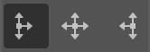

# Indentz

Colecție de scripturi InDesign pentru operații simple și repetitive. O bună parte dintre ele sunt gândite să fie rulate printr‑un shortcut (o sugestie de configurare găsiți în secțiunea [Shortcut‑uri](#shortcuturi)). Câteva pot fi rulate în scriptul [**`batch_convert.jsx`**](https://creativepro.com/files/kahrel/indesign/batch_convert.html) de Peter Kahrel.

## Descriere

### **Alignment/Proxy**

* **`AlignTo`** aliniază obiectele selectate la referința setării **Align To**:

  

* **`ToggleAlignTo.jsx`** comută alinierea între obiect, margini, pagină sau spread (rulați scriptul în mod repetat).

* **`ResetAlignTo.jsx`** o resetează la **Align to Selection**.

* **`SetRefPoint`** schimbă punctul de referință pentru transformări, similar cu selectarea pătrățelelor proxy în paleta **Transform**.

**Notă:** Ambele seturi ar trebui alocate tastaturii numerice (v. [Shortcut‑uri](#shortcuturi)).

### **Fitting**

* **`FitToPage`** redimensionează unul sau mai multe obiecte selectate, fără să le scaleze: dacă obiectul este mai mare decât pagina/marginile/bleed‑ul, va fi redus; dacă este mai mic dar intră într-o zonă „snap” de 5%, va fi mărit. Frame‑urile obișnuite sunt redimensionate pur și simplu. Pentru a nu le deforma, obiectele rotite, ovalurile, grupurile etc sunt incluse într‑un container *(clipping frame)* și acesta e redimensionat. **`FitToSpread`** fac același lucru pentru paginile grupate într‑un spread.

  **`FitTo...Forced.jsx`** redimensionează exact la dimensiunile respective.

* **`TextAutosize.jsx`** „strânge” chenarul la text și îi setează dimensionarea automată. Controlați referința pentru dimensionarea automată setând **Paragraph Alignment** pentru axa orizontală și **Text Frame Options > Vertical Justification** pentru axa verticală:

  | |  |  | 
  :---: | :---: | :---: | :---:
   |  |  | 
   |  |  | 
   |  |  | 

  Dacă textul are un singur rând, **Auto-Sizing Type** va fi setat *Height and width*. Dacă are mai multe rânduri, prima rulare îl va seta *Height only*, a doua *Height and width*.

### **Scaling**

Acestea scalează proporțional unul sau mai multe obiecte selectate, ca un bloc unitar.

* **`ScaleToPageSize.jsx`** și **`ScaleToPageMargins.jsx`** scalează la dimensiunile paginii sau marginii.

* Variantele **`H`** (height) și **`W`** (width) scalează la înălțimea, respectiv lățimea paginii sau marginii.

### **Print**

Fac câteva pregătiri pentru export și pot fi rulate în [**`batch_convert.jsx`**](https://creativepro.com/files/kahrel/indesign/batch_convert.html). Detectează layere alternative gen *visible*, *vizibil* pentru `safe area`, sau *diecut*, *die cut*, *cut lines*, *stanze* pentru `dielines`.

* **`PrepareForPrint.jsx`** ascunde layerul `safe area` și mută ștanțele și marcajele pentru alb și lac UV de pe `dielines` / `white` / `varnish` pe spreaduri separate.

* **`SafeArea.jsx`** creează un frame de dimensiunea marginilor paginii pe layerul `safe area`. Folosește swatch‑ul `Safe area`, care dacă nu există va fi creat cu valoarea `C=0 M=100 Y=0 K=0`.

* **`SafeAreaHideLayer.jsx`** și **`SafeAreaShowLayer.jsx`** ascund sau afișează `safe area`.

### **Setup**

* **`DocCleanup.jsx`** șterge culorile, layerele și paginile neutilizate, deblochează toate elementele, le resetează scalarea la 100% și setează câteva preferințe:

  > **Rulers:** Reset Zero Point \
  > **Rulers Units:** Millimeters \
  > **View:** Show Rulers \
  > **View:** Show Frame Edges \
  > **Document Intent:** Print \
  > **Transparency Blend Space:** CMYK \
  > **CMYK Profile:** ISO Coated v2 (ECI) \
  > **RGB Profile:** sRGB IEC61966-2.1 \
  > **Grids & Guides:** Show Guides \
  > **Grids & Guides:** Unlock Guides \
  > **Guides & Pasteboard: Margins:** H 150 mm, V 25 mm \
  > **Guides & Pasteboard: Preview Background:** Light Gray \
  > **Keyboard Increments: Cursor Key:** 0.2 mm \
  > **Keyboard Increments: Size/Leading:** 0.5 pt \
  > **Keyboard Increments: Baseline Shift:** 0.1 pt \
  > **Keyboard Increments: Kerning/Tracking:** 5/1000 em \
  > **Pages:** Allow Document Pages to Shuffle \
  > **Layers:** Ungroup Remembers Layers \
  > **Layers:** Paste Remembers Layers \
  > **Transform Reference Point:** Center \
  > **Type Options:** Use Typographer's Quotes \
  > **Type Options:** Apply Leading to Entire Paragraphs

* **`DocDefaults.jsx`** creează câteva culori speciale și layere, înlocuiește niște fonturi și setează dimensiunea și marginile paginii din numele fișierului. De fapt rulează unele dintre scripturile de mai jos și setează preferințele la fel ca **`DocCleanup.jsx`**.

* **`DefLayers.jsx`** creează un set de layere, preluându‑le proprietățile din [**`DefLayers.txt`**](setup/DefLayers.txt), care este un fișier TSV *(tab-separated values)* cu 6 coloane cu următorul format:

  Nume | Culoare | Vizibil | Printabil | Ordine | Variante
  :--- | :---: | :---: | :---: | :---: | :---
  dielines | Magenta | TRUE | TRUE | top | cut, cut lines, decoupe, die, die cut, stanze
  text and logos | Green | TRUE | TRUE | top | copy, text, textes, txt, type
  artwork | Light Blue | TRUE | TRUE | top | aw, elemente, layout, layouts
  bg | Red | TRUE | TRUE | bottom | background, hg, hintergrund
  ... |

  > **`Nume`**: numele layerului \
  > **`Culoare`**: culoarea layerului (v. [**`UIColors.txt`**](setup/UIColors.txt)) \
  > **`Vizibil`**: `TRUE` sau `FALSE` \
  > **`Printabil`**: `TRUE` sau `FALSE` \
  > **`Ordine`**: `top` sau `bottom` (deasupra sau sub layerele existente) \
  > **`Variante`**: o listă de layere care vor fi combinate cu layerul de bază (case insensitive)

  **`DefLayers.xlsx`** vă va ajuta la generarea fișierului TSV.

  **Note:** Prima linie (capul de tabel) și liniile care încep cu `;` sunt ignorate.

* **`DefSwatches.jsx`** creează un set de swatch‑uri din [**`DefSwatches.txt`**](setup/DefSwatches.txt), un fișier TSV cu 3 coloane cu următorul format:

  Name | Model | Values
  :--- | :--- | :---
  Rich Black | process | 60, 40, 40, 100
  Cut | spot | 0, 100, 0, 0
  ... |

  > **`Name`**: numele swatch‑ului \
  > **`Model`**: color model: `process` or `spot` \
  > **`Values`**: o listă de 3 (RGB) sau 4 (CMYK) valori

* **`CleanupSwatches.jsx`** convertește swatch‑urile RGB la CMYK, elimină duplicatele, le redenumește după formula `C= M= Y= K=` și le șterge pe cele nefolosite. Culorile spot rămân neschimbate.

* **`ReplaceFonts.jsx`** înlocuiește fonturi din [**`ReplaceFonts.txt`**](setup/ReplaceFonts.txt), un fișier TSV cu 4 coloane cu următorul format:

  Nume vechi | Stil | Nume nou | Stil
  :--- | :--- | :--- | :---
  Arial | Regular | Helvetica Neue | Regular
  Arial | Bold | Helvetica Neue | Bold
  ... |

  **Notă:** Puteți utiliza **`ShowFonts.jsx`** din **Misc** pentru a obține o listă a fonturilor pentru copy-paste.

* **`PageMarginsFromSelection.jsx`** setează marginile paginii la dimensiunile selecției.

* **`PageSizeFromFilename.jsx`** setează dimensiunea și marginile paginii preluând informațiile din numele fișierului:

  Fișier | Dimensiune | Safe area | Bleed
  :--- | :---: | :---: | :---:
  **Filename1\_`1400x400`\_`700x137`\_`10`mm\_QR.indd** | 1400x400 | 700x137 | 10
  **Filename2\_`597x517`\_`577x500.5`\_`3`mm V4\_QR.indd** | 597x517 | 577x500.5 | 3

  > Caută în numele fișierului perechi de numere de genul `000x000` (unde `000` înseamnă un grup de cel puțin o cifră, urmată sau nu de zecimale, și opțional de `mm` sau `cm`). Dacă găsește doar o pereche, aceasta va fi dimensiunea paginii. Dacă găsește două (de ex. `000x000_000x000`), perechea mai mare va fi dimensiunea paginii, iar perechea mai mică dimensiunea ariei vizibile. Dacă sunt urmate de o secvență de una sau două cifre, aceasta e considerată bleed.

* **`PageSizeFromMargins.jsx`** redimensionează fiecare pagină la marginile acesteia.

* **`PageSizeFromSelection.jsx`** redimensionează pagina curentă la obiectele selectate (similar cu **Artboards > Fit to Selected Art** din Illustrator).

### **Misc**

* **`CleanupLabels.jsx`**: uneori se refolosesc obiecte care au o etichetă atașată *(Script Label)*, și asta poate crea probleme ulterior. Scriptul șterge toate etichetele obiectelor selectate sau din întregul document dacă nu e selectat nimic.

* **`Clip.jsx`**: Pentru a manipula unele obiecte poate fi uneori util să le inserăm temporar într‑un container *(clipping frame)*. Scriptul inserează obiectele selectate într‑un container sau le restaurează dacă sunt deja inserate.

  **`ClipUndo.jsx`** restaurează unul sau mai multe obiecte simultan.

* **`PageRatios.jsx`** calculează rația fiecărei pagini și o afișează în colțul din stânga sus, pe layerul `info`.

* **`QR.jsx`** adaugă coduri QR în documentul activ sau creează fișiere separate într-un subfolder numit `QR Codes`.

  Mai întâi caută în folderul curent un document TSV cu 2 coloane numit **`QR.txt`**, din care preia o listă de coduri și fișierele corespunzătoare:

  Fișier | Cod
  :--- | :---
  Filename1 | CODE 1
  Filename2 | CODE 2
  ... |

  Dacă nu‑l găsește, solicită codul și îl adaugă pe fiecare pagină în colțul din stânga jos, sau îl salvează într‑un fișier cu numele documentului activ și `_QR` adăugat la coadă:

  

  **Notă:** Puteți insera `|` pentru împărțirea manuală a legendei în mai multe rânduri.

* **`ShowFonts.jsx`** afișează toate fonturile utilizate în documentul curent (util pentru **`ReplaceFonts.jsx`**).

* **`ShowProfiles.jsx`** afișează toate profilele de culori disponibile (util când *credeți* că aveți instalat un profil de culoare).

* **`ShowProperties.jsx`** afișează proprietățile și metodele unui obiect selectat (util pentru depanare).

* **`ZoomToSelection.jsx`** e asemănător cu **Fit Selection in Window** (⌥⌘=), dar cu câteva îmbunătățiri:

  * aduce selecția puțin mai aproape;
  * dacă cursorul e în text, face zoom la întreg cadrul;
  * fără nimic selectat face vizibil întreg spreadul.

## Shortcut‑uri

Rularea unui script folosit frecvent din panoul **Scripts** este destul de neplăcută. Dar puteți face asta instantaneu, atribuindu‑i o scurtătură din **Edit > Keyboard Shortcuts... > Product Area > Scripts**:

| Alignment               |       | Proxy                   |       | Fitting/Scale                    |       | Setup                     |      |
| :---------------------- | ----: | :---------------------- | ----: | :------------------------------- | ----: | :------------------------ | ----: |
| **`AlignToTL.jsx`**     |  Num7 | **`SetRefPointTL.jsx`** | ⌃Num7 | **`FitToPage.jsx`**              |   F11 | **`DocCleanup.jsx`**      |    F2 |
| **`AlignToL.jsx`**      |  Num4 | **`SetRefPointL.jsx`**  | ⌃Num4 | **`FitToPageMargins.jsx`**       |  ⌥F11 | **`DocDefaults.jsx`**     |   ⌥F2 |
| **`AlignToBL.jsx`**     |  Num1 | **`SetRefPointBL.jsx`** | ⌃Num1 | **`FitToPageBleed.jsx`**         |  ⇧F11 | **`CleanupSwatches.jsx`** |   ⇧F2 |
| **`AlignToT.jsx`**      |  Num8 | **`SetRefPointT.jsx`**  | ⌃Num8 | **`FitToPageBleedForced.jsx`**   | ⇧⌘F11 |                           |
| **`AlignToC.jsx`**      |  Num5 | **`SetRefPointC.jsx`**  | ⌃Num5 | **`FitToSpread.jsx`**            |   F12 | **Misc**                  |
| **`AlignToB.jsx`**      |  Num2 | **`SetRefPointB.jsx`**  | ⌃Num2 | **`FitToSpreadMargins.jsx`**     |  ⌥F12 | **`Clip.jsx`**            |  Num* |
| **`AlignToTR.jsx`**     |  Num9 | **`SetRefPointTR.jsx`** | ⌃Num9 | **`FitToSpreadBleed.jsx`**       |  ⇧F12 | **`ClipUndo.jsx`**        | ⌃Num* |
| **`AlignToR.jsx`**      |  Num6 | **`SetRefPointR.jsx`**  | ⌃Num6 | **`FitToSpreadBleedForced.jsx`** | ⇧⌘F12 | **`QR.jsx`**              |    F9 |
| **`AlignToBR.jsx`**     |  Num3 | **`SetRefPointBR.jsx`** | ⌃Num3 | **`ScaleToPageSize.jsx`**        |    F5 | **`ZoomToSelection.jsx`** |    F4 |
| **`ToggleAlignTo.jsx`** |  Num0 |                         |       | **`ScaleToPageMargins.jsx`**     |   ⌥F5 |                           |
| **`ResetAlignTo.jsx`**  | ⌃Num0 |                         |       | **`TextAutosize.jsx`**           |    F6 |                           |

## Instalare

1. Deschideți **Window > Utilities > Scripts**.
2. Faceți clic dreapta pe folderul **User** și selectați **Reveal in Finder/Explorer**.
3. Copiați fișierele în acest folder.

## Licență

<!-- Părți din codul din acest repository se bazează pe postări de pe bloguri, postări de pe forumuri sau din tutoriale de Marc Autret, Dave Saunders, Peter Kahrel, Peter Werner, Richard Harrington și alții. -->

Codul este publicat sub licența MIT ([LICENSE.txt](LICENSE.txt)). Trimiteți un e‑mail la Paul Chiorean \<jpeg AT basement.ro\> sau [raportați o problemă](https://github.com/pchiorean/Indentz/issues) pe Github dacă întâmpinați probleme sau aveți sugestii.

README-ro.md • 9 noiembrie 2020
