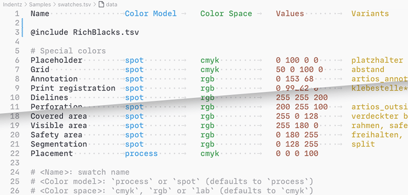
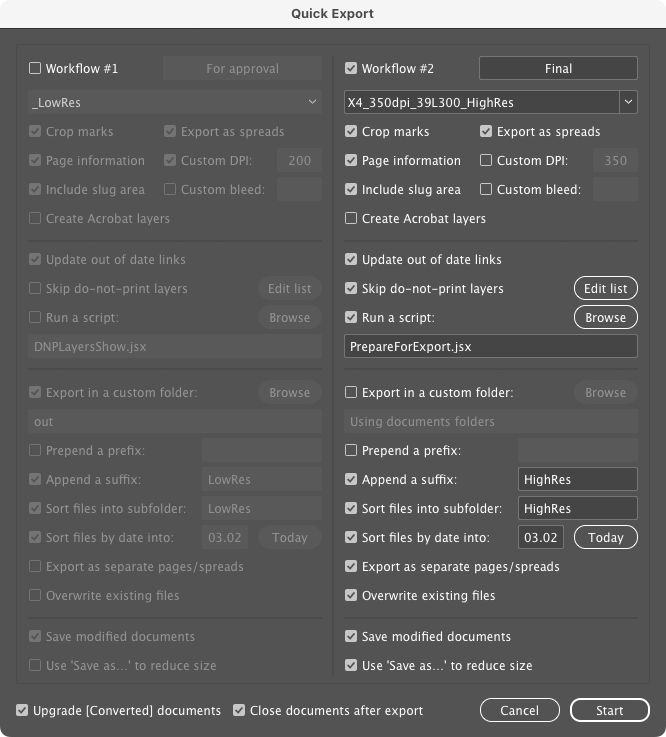

# Indentz

This is a collection of InDesign scripts that I use to improve my DTP workflow, which often involves repetitive, tedious, or time-consuming tasks. Designed primarily for single-page documents rather than long, text-heavy ones, these simple scripts run with minimal user interaction (except for essential warnings) and are designed to be triggered via [keyboard shortcuts](https://creativepro.com/assigning-keyboard-shortcuts-scripts/). Tested in Adobe InDesign CC 2020–2025 on Mac.

I'm a graphic designer, not a programmer (I started doing this at the beginning of the Covid-19 pandemic), so be prepared for some bugs and oversights (please create an [issue](https://github.com/pchiorean/Indentz/issues) if you encounter one, though!).

## Preliminaries

Most scripts require at least one open document, and some require at least one object to be selected.

**Data files:** Several scripts read data from TSV files, searching in this order: _local_ files (current or parent folder; local files starting with `_` are prioritized), then _default_ ones (on the desktop, in the script folder or **Indentz** root).

These TSV data files can have several non-standard features that will confuse Excel et al.:

- Blank lines are ignored; everything after a `#` is ignored (comments);
- Fields can be visually aligned using spaces that will be ignored during processing (I use [VS Code](https://code.visualstudio.com) with [Rainbow CSV](https://marketplace.visualstudio.com/items?itemName=mechatroner.rainbow-csv) to work with TSVs);
- A very long line can be split across multiple lines by adding a backslash (`\`) at the end of each segment;
- A line may also be a directive:
  - **`@includepath`** `base/path/` – sets a base path for subsequent `@include` directives with relative paths; the path may be absolute or relative to the data file folder;
  - **`@include`** `path/to/another.tsv` – includes another TSV file at this position; the path may be absolute or relative to the data file folder (or to a `base/path/` set previously);
  - **`@defaults`** – includes the _default_ data file (see above).

<strong>Sample</strong>

**Visible area** or **Safety area:** These are frames used to visually mark the visible part of a layout or its safety/type area; several scripts use them as reference for certain actions. The frames can be created manually (simply name them **\<visible area\>** or **\<safety area\>**), or automatically generated from the document name or page margins (details below). Some scripts in the [**Export**](#export) section can show or hide these frames.

**Libs:** Many scripts use dynamically linked functions from `lib/`, so the folder structure should be maintained after downloading the repository. If you download [releases](https://github.com/pchiorean/Indentz/releases)[^1] (which are statically linked), you can use each script independently.

The scripts are organized into three categories based on their scope: document/spread/page-level, object-level, and miscellaneous, making it easier to navigate through the large number of files.

## Document

_Scripts that operate at the document, spread or page level._

### Assets

_Layers, swatches, fonts, links etc._

#### **AddLayers**

Adds a set of layers defined in a 7-columns [TSV data file](#tsv) named `layers.tsv` ([sample](Samples/layers.tsv)):

| Name              | Color      | Visible | Printable | Locked | Order  | Variants                                           |
|:------------------|:-----------|:--------|:----------|:-------|:-------|:---------------------------------------------------|
| **.visible area** | Yellow     | yes     | yes       | yes    | above  | nicht sicht\*, rahmen, sicht\*, \*vi?ib\*          |
| **dielines**      | Magenta    | yes     | yes       | yes    | above  | cut\*, decoupe, die, die\*cut, stanz\*             |
| **text**          | Green      |         |           |        |        | copy, headline\*, hl, text\*, txt, typ?            |
| **artwork**       | Light Blue | no      | yes       |        | above  | aw, design, element?, layout\*                     |
| **bg**            | Red        |         |           |        | below  | back, \*background\*, bgg, fond, hg, hintergrund\* |
| **.reference**    | Black      | no      | no        | yes    | bottom | refer\*, template, vorlage                         |
| ...               |            |         |           |        |        |                                                    |

**Legend:**

- **Name**: Layer name; a dot prefix lets [**QuickExport**](#quickexport) optionally hide the layer during document export;
- **Color**: Layer color (defaults to `Light Blue`);
- **Visible**: `yes` or `no` (defaults to `yes`);
- **Printable**: `yes` or `no` (defaults to `yes`);
- **Locked**: `yes` or `no` (defaults to `yes`);
- **Order**: `above` or `below` existing layers, or `top`/`bottom` (defaults to `above`);
- **Variants**: A list of layers separated by commas that will be merged with the base layer; it's case insensitive and can take simple wildcards (`?` for exactly one character and `*` for zero or more characters).

💡 **Tips:**
- You can use [**DumpLayers**](#dumplayers) to save a tab delimited list of swatches from the active document.
- The script will display a report if run while holding down the **Ctrl** key.

#### **AddSwatches**

Adds a set of swatches defined in a 5-columns [TSV data file](#tsv) named `swatches.tsv` ([sample](Samples/swatches.tsv)):

| Name             | Color Model | Color Space | Values       | Variants              |
|:-----------------|:------------|:------------|:-------------|:----------------------|
| **Rich Black**   | process     | cmyk        | 60 40 40 100 |                       |
| **RGB Grey**     | process     | rgb         | 128 128 128  |                       |
| **Cut**          | spot        | cmyk        | 0 100 0 0    | couper, die\*cut      |
| **Visible area** | spot        | rgb         | 255 180 0    | safe\*area, vis\*mark |
| ...              |             |             |              |                       |

**Legend:**

- **Name**: Swatch name;
- **Color Model**: `process` or `spot` (defaults to `process`);
- **Color Space**: `cmyk`, `rgb` or `lab` (defaults to `cmyk`);
- **Values**: a list of numbers separated by space (` `), comma (`,`), pipe (`|`) or slash (`/`):
  - 3 values in 0–255 range for RGB;
  - 4 values in 0–100 range for CMYK;
  - 3 values in 0–100 (L), –128–127 (A and B) range for Lab.
- **Variants**: a list of swatches separated by commas that will be replaced by the base swatch; it's case insensitive and can take simple wildcards (`?` for exactly one character and `*` for zero or more characters).

Every swatch automatically gets three implicit variants: its lowercase name (this also fixes case variations), its Color Value Name ('C=X M=X Y=X K=X' or 'R=X G=X B=X' or 'L=X a=X b=X') and its alternative spelling ('cXmXyXkX' or 'rXgXbX' or 'lXaXbX'). So, if you have this line:

|Name|Color Model|Color Space|Values|Variants|
|:-|:-|:-|:-|:-|
|**Rich Black**|process|cmyk|60 40 40 100||

all document swatches named **rich black** (and all case variations), **C=60 M=40 Y=40 K=100**, or **c60m40y40k100** will be merged with **Rich Black**.

💡 **Tips:**
- You can use [**DumpSwatches**](#dumpswatches) to save a tab delimited list of swatches from the active document.
- The script will display a report if run while holding down the **Ctrl** key.

#### **ReplaceFonts**

Replaces document fonts using a 4-columns [TSV data file](#tsv) named `fonts.tsv` ([sample](Samples/fonts.tsv)):

| Old font family | Style   | New font family    | Style   |
|:----------------|:--------|:-------------------|:--------|
| **Arial**       | Regular | **Helvetica Neue** | Regular |
| **Arial**       | Bold    | **Helvetica Neue** | Bold    |
| ...             |         |                    |         |

💡 **Tips:**
- You can use [**ShowFonts**](#showfonts) to get a tab delimited list of document fonts.
- The script will display a report if run while holding down the **Ctrl** key.

#### **ReplaceLinks**

⌘ _Suggested shortcut:_ ⌥F8

Replaces document links using a 2-columns [TSV data file](#tsv) named `links.tsv` ([sample](Samples/links.tsv)):

| Relink to                       | Document links               |
|:--------------------------------|:-----------------------------|
| **/absolute/path/to/img1.psd**  | img1_lowres.jpg, img1-rgb.\* |
| **img2.psd**                    | img2.\*                      |
| **`@includepath` `base/path/`** |                              |
| **img3.psd**                    |                              |
| **subfolder/img4.psd**          |                              |
| ...                             |                              |

**Legend:**

- **Relink to:**
  - An absolute path of the form `/absolute/path/to/img1.psd`;
  - A relative path which is:
    - relative by default to the document **`Links`** folder (e.g., `img2.psd`);
    - relative to the `base/path/` defined by a previous `@includepath` directive (e.g., `img3.psd` and `subfolder/img4.psd`).
- **Links:** A list of file names separated by commas, that if present in the document, will be replaced with the link from the first column; it's case insensitive and can take simple wildcards (`?` for exactly one character and `*` for zero or more characters). The script will also automatically match the _file names_ from the first column, so **Links** can be empty – e.g., if `img4.psd` appears in the document, it will be replaced by the one in `subfolder/` (which is actually `base/path/subfolder/`, because the `@includepath` above it redefines the base path).

⚠️ **Warning:** If a file name contains commas you must quote it.

💡 **Tips:**
- You can use [**DumpLinks**](#dumplinks) to save a list of links from the active document.
- The script will display a report if run while holding down the **Ctrl** key.

#### **ReplaceTextSnippets**

⌘ _Suggested shortcut:_ ⌥F6

Replaces a list of text snippets using a 5-columns [TSV data file](#tsv) named `snippets.tsv` ([sample](Samples/snippets.tsv)):

| Find what              | Change to                 | Case sensitive | Whole word | Scope |
|:-----------------------|:--------------------------|:---------------|:-----------|:------|
| English instructions   | Deutsche anleitung        | yes            | yes        |       |
| The sample is for free | Das Sample ist kostenlos  | yes            | yes        | _DE?$ |
| The sample is for free | L'échantillon est gratuit | yes            | yes        | _FR?$ |
| 12.06.22               | 13.11.2022                |                |            |       |
| ...                    |                           |                |            |       |

**Legend:**

- **Find what**: Text to be replaced (you can use [special characters](https://helpx.adobe.com/indesign/using/find-change.html#metacharacters_for_searching));
- **Change to**: The replacement text;
- **Case sensitive**: `yes` or `no` (defaults to `yes`);
- **Whole word**: `yes` or `no` (defaults to `yes`);
- **Scope**: Replacement will only be done if the document name matches the [regular expression](https://regex101.com) (case sensitive).

**Example:** 'The sample is for free' will be replaced with 'Das Sample ist kostenlos' in `Document_DE.indd`, and with 'L'échantillon est gratuit' in `Document_FR.indd`.

💡 **Tip:** The script will display a report if run while holding down the **Ctrl** key.

#### **ResetLayers**

Resets the visible/printable/locked state of the document layers using the same data file used by [**AddLayers**](#addlayers).

#### **DumpLayers**

Saves a TSV file compatible with [**AddLayers**](#addlayers) containing the names and properties of the active document layers.

#### **DumpLinks**

Saves a TSV file compatible with [**ReplaceLinks**](#replacelinks) containing the links of the active document.

#### **DumpSwatches**

Saves a TSV file compatible with [**AddSwatches**](#addswatches) containing the names and properties of the active document swatches.

---

### Export

_Document export and related._

#### **QuickExport**

⌘ _Suggested shortcut:_ ⌃E

Batch exports all open `.indd` documents or all documents from a selected folder using up to two customizable PDF presets. While Peter Kahrel's [**Batch Convert**](https://creativepro.com/files/kahrel/indesign/batch_convert.html) script is like a 'Swiss Army knife' export tool, this script is specifically designed to streamline workflows that need frequent PDF setting adjustments. It reduces the tedious clicking through multiple tabs and options in InDesign's native export dialog. (It also gave me a great opportunity to explore [ScriptUI](https://extendscript.docsforadobe.dev/user-interface-tools/scriptui-programming-model.html) development 😉).

Two workflows are available, with options organized into several categories:

**Source folder:** By default, the script exports all open documents. If no documents are open, you can select a source folder, optionally including its subfolders:

**Workflow:** Choose which workflow(s) to use – at least one must be selected. The label is only informative.

**Preset options:** Select an Adobe PDF Preset and customize specific settings as needed.

**Document actions:**

- **Update out of date links**: Updates all modified links before export.

- **Skip do-not-print layers:** Excludes layers whose names start with a dot or hyphen (like **.safety area**) and layers from the default _do-not-print_ list (see [**DNPLayersHide**](#dnplayersshow-and-dnplayershide) below). You can modify this list using the **Edit list** button.

- **Run a script**: Executes a JavaScript or AppleScript before export – e.g., one of the other scripts from this section.

**Output options:**

- **Export in a custom folder:** Choose a different output location instead of the default source document folder.

- **Prepend a prefix:** Prepends this text to the exported file names.

- **Append a suffix:** Appends this text to the exported file names.

  💡 **Tip:** You can attach a suffix to a preset by including it after the _last_ underscore. For example, selecting preset `X4_350dpi_39L300_HighRes` will automatically set the suffix to `HighRes`.

- **Sort files into subfolder:** Exports files into a subfolder of the selected output location. It defaults to the current suffix.

  ⚠️ **Warning:** The text following a `+` is ignored (e.g., `HighRes+Diecut` becomes `HighRes`).

- **Sort files by date into**: Exports files into a subfolder named `MM.DD` (month.day). It defaults to the current date.

- **Export as separate pages/spreads**: Creates individual PDF files for each page or spread instead of a single multi-page document.

- **Overwrite existing files:** Overwrites files with matching names if saved to the same location. If unchecked, files will get unique names with incremented numbers – for example, if `Document_LowRes2.pdf` exists anywhere in the export folder or its subfolders, the new file will be named `Document_LowRes3.pdf`.

**Source update:**

- **Save modified documents:** Preserves changes made during export, including any script modifications.

- **Use 'Save as...' to reduce size:** Helps minimize file size, especially for frequently edited documents, as regular saves can accumulate and increase the file size.

**Global options:**

- **Upgrade [Converted] documents**: Converts documents from older InDesign versions to the current version.

💡 **Tip:** Settings are automatically saved each time you run the script. However, holding the **Opt/Alt** key while clicking **Start** will prevent settings from updating during the current session.

#### **PrepareForExport**

Hides all layers starting with either a dot or a hyphen, plus a hard-coded list of _do-not-print_ layers (see below). Additionally, it moves all page objects from **varnish**, **uv**, **foil**, **silver** and **white** to separate spreads and labels the spreads.

💡 **Tip:** The script is designed to be run with [**QuickExport**](#quickexport).

#### **DNPLayersShow** and **DNPLayersHide**
Shows or hides all layers starting with either a dot or a hyphen, plus a hard-coded list of _do-not-print_ layers:

- **covered area\***
- **visible area, rahmen, sicht\*, \*vi\?ib\***
- **safe\*area, safe\*margins, segmentation**
- **fold, falz**
- **guides, grid, masuratori**

💡 **Tip:** The scripts are designed to be run with [**QuickExport**](#quickexport).

---

### Housekeeping

_Defaults and clean-up._

#### **SetDefaultPrefs**

Sets some preferences for the active document. You should customize them to your workflow by editing the script. Unfortunately the preferences are scattered in so many places that it's difficult for me to guide you – but [this](https://www.indesignjs.de/extendscriptAPI/indesign-latest/) will definitely help.

Many scripts in this collection assume these settings as defaults because they suit _my_ environment – e.g., trying to scale a locked object/guide the script will fail for you but not for me, because I have **Prevent Selection of Locked Objects** enabled.

<strong>Preferences</strong>

**Application:**
> **Preferences ‣ General:** Prevent Selection of Locked Objects\
> **Preferences ‣ Display Performance:** Preserve Object-Level Display Settings\
> **Preferences ‣ File Handling:** Always Save Preview Images with Documents\
> **View ‣ Screen Mode:** Normal\
> **View ‣ Grids & Guides:** Snap to Guides; Smart Guides\
> **Windows ‣ Layers:** Ungroup Remembers Layers; Paste Remembers Layers\
> **Windows ‣ Objects & Layout ‣ Transform:** Reference Point: Center; Adjust Stroke Weight when Scaling; Adjust Effects when Scaling\
> **Windows ‣ Output ‣ Preflight:** Off

**Document:**
> **Adjust Layout:** Off\
> **Document Intent:** Print\
> **Rulers:** Zero Point: Reset\
> **Preferences ‣ Type:** Use Typographer's Quotes; Apply Leading to Entire Paragraphs\
> **Preferences ‣ Units & Increments ‣ Keyboard Increments:** Cursor Key: 0.2 mm; Size/Leading: 0.5 pt; Baseline Shift: 0.1 pt; Kerning/Tracking: 5/1000 em\
> **Preferences ‣ Units & Increments ‣ Ruler Units:** Origin: Spread; Units: Millimeters\
> **Preferences ‣ Units & Increments ‣ Other Units:** Stroke: Points\
> **Preferences ‣ Grids:** Baseline Grid Color: R=230 G=230 B=230\
> **Preferences ‣ Guides & Pasteboard:** Preview Background Color: Light Gray\
> **Edit ‣ Transparency Blend Space:** Document CMYK\
> **View:** Show Rulers\
> **View ‣ Extras:** Show Frame Edges\
> **View ‣ Grids & Guides:** Show Guides; Unlock Guides; Snap to Guides\
> **Windows ‣ Color:** Fill: None; Stroke: None\
> **Windows ‣ Effects:** Blending Mode: Normal; Opacity: 100%\
> **Windows ‣ Output ‣ Attributes:** Nonprinting: Off\
> **Windows ‣ Pages:** Allow Document Pages to Shuffle\
> **Windows ‣ Text Wrap:** No text wrap\
> **Windows ‣ Type & Tables ‣ Paragraph:** Shading: Off

#### **DocCleanup**

⌘ _Suggested shortcut:_ F2

Performs a sequence of actions designed to bring the document to an approximately 'clean' state:

- Sets default preferences by running [**SetDefaultPrefs**](#setdefaultprefs);
- Unlocks all objects and resets their scaling to 100%;
- Deletes hidden objects (after confirmation);
- Deletes empty frames (after confirmation);
- Deletes unused swatches, layers and spreads;
- Converts empty text frames to generic frames;
- Converts empty frames to graphic frames;
- Resets default transparency effects;
- Resets the visible/printable/locked status of layers;
- Hides 'invisible' characters;
- Turns off URLs auto-updating;
- Sets the pasteboard margins.

#### **OverrideMasterItems**

Overrides master items on all pages.

#### **RemoveScriptLabels**

Sometimes objects that have a script label attached are reused, which may create problems later. The script deletes the labels of the selected objects, or all objects in the document if nothing is selected.

#### **RemoveStyles**

Unnaplies paragraph/character/object styles from the selected objects, or all objects in the document if nothing is selected.

💡 **Tip:** The script will display a report if run while holding down the **Ctrl** key.

#### **SwatchesCleanup**

⌘ _Suggested shortcut:_ ⇧F2

Converts process RGB swatches to CMYK and renames them to 'C= M= Y= K=' format. It also deletes unused swatches and removes duplicates. Spot colors are not changed.

Concocted with code written by Marc Autret, Dave Saunders and others.

---

### Information

_Page labels and miscellaneous info._

#### **LabelPage**

Adds a custom label on the current page slug, on the **info** layer (Helvetica Regular 6 pt, fill **Registration**, stroke **Paper** 0.4 pt).

**Example:**

#### **LabelPageRatios**

Adds a label on each page's slug showing the page size ratio, _visible area_ ratio (when defined), and margin ratio.

#### **ShowFonts**

Shows all fonts used in the active document.

#### **ShowProfiles**

Shows all color profiles available to InDesign.

#### **ShowProperties**

⌘ _Suggested shortcut:_ F1

Shows properties and methods of a selected object for debugging purposes.

Inspired by [**showProps()**](https://github.com/grefel/indesignjs/blob/710e237354a44782d36a0fdd98866abb5845728d/Allgemeine_Skripte/EigenschaftenAnzeigen.jsx#L11) by Gregor Fellenz and [**pub.inspect()**](https://github.com/basiljs/basil.js/blob/23b60f16f3088ae9df624d6d9a52a890114fcae0/src/includes/environment.js#L722) from [**basil.js**](https://basiljs2.netlify.app).

---

### Layout

_Page geometry, guides and markings._

#### **GuidesAdd**

When objects are selected, adds guides around their boundaries.

When nothing is selected, adds guides at page edges and margin centers. Running the script again removes these guides.

💡 **Tip:** If **Opt** is also pressed, it will use spread guides.

#### **GuidesCollect**

Moves all guides to the **.guides** layer.

#### **GuidesDelete**

Deletes all guides from the document.

#### **MarkSafetyArea**

Creates a frame around the page margins that visually marks the _safety area_ of a page. It's a stroked frame named **\<safety area\>** on the **.safety area** layer. It uses an existing **Safety area** swatch or creates one with R=0 G=180 B=255.

💡 **Tip:** This script is designed to be run with [**QuickExport**](#quickexport).

#### **MarkVisibleArea**

Creates a frame around the page margins that visually marks the _visible area_ of a page. It's a stroked frame named **\<visible area\>** on the **.visible area** layer. It uses an existing **Visible area** swatch or creates one with R=255 G=180 B=0.

💡 **Tip:** This script is designed to be run with [**QuickExport**](#quickexport).

#### **PageMarginsFromScriptName**

⌘ _Suggested shortcut:_ ⌥F3

Sets the page margins and optionally a reserved area on the bottom, getting the values from the script name, in percentages of the _visible area_ or page size.

This template it's designed to be duplicated and renamed using one or two numbers separated by `HW`. The first number sets the page margins, while an optional second number defines the bottom area. `HW` can be omitted (defaults to 0%) or used alone (defaults to 10%).

**Example:**

| Script name     | Margins | Bottom area |
|:----------------|:--------|:------------|
| **MG5.jsx**     | 5%      | –           |
| **MG5HW.jsx**   | 5%      | 10%         |
| **MG5HW10.jsx** | 5%      | 10%         |

#### **PageMarginsFromSelection**

Sets the current page margins from the selected objects.

#### **PageSizeFromFilename**

⌘ _Suggested shortcut:_ F3

Adjusts page size, margins, and bleed based on the document name. It also creates a stroked frame named **\<visible area\>** around page margins on the **.visible area** layer. Uses an existing **Visible area** swatch or creates one with R=255 G=180 B=0.

It works with file names structured like this:

    <Name>_<Total size WxH>[_<Visible area WxH>][_<Bleed>].indd

Dimensions use `WxH` format (e.g., `000x000`, where `000` represents one or more digits, optional decimals, and optional `mm` or `cm` units). The first pair sets page size, the second pair (if present) defines the _visible area_, and a following one- or two-digit number sets bleed. The script handles extra spaces and characters flexibly.

⚠️ **Warning:** The units are ignored: dimensions are always in millimeters.

**Example:**

| File name                                       | Total size | Visible area | Bleed |
|:------------------------------------------------|:-----------|:-------------|:------|
| **Document1\_315x55\.indd**                     | 315×55     | –            | –     |
| **Document2\_1400x400\_700x137mm\.indd**        | 1400×400   | 700×137      | –     |
| **Document3\_597x517\_577x500.5\_3mm V4\.indd** | 597×517    | 577×500.5    | 3     |

#### **PageSizeFromMargins**

Resizes the current page to its margins.

#### **PageSizeFromSelection**

⌘ _Suggested shortcut:_ ⇧F3

Resizes the current page to the selected objects.

---

### Pagination

_Juggling layers and spreads._

#### **JoinDocs**

⌘ _Suggested shortcut:_ ⇧⌘F7

Combines all open documents, sorted alphabetically by name.

#### **LayersToSpreads**

Moves each layer of the active document to a separate spread (the document must have a single spread).

#### **SplitDocBySpreads**

Saves each spread of the active document to a separate file.

When a document name ends with a _separator_ (space, dot, underscore, or hyphen) followed by characters matching the number of spreads, each split file will include the corresponding character in its name. For example, `Document_ABC.indd` with three spreads becomes `Document_A.indd`, `Document_B.indd`, and `Document_C.indd`. If no sequence is detected, you'll be prompted to provide one.

💡 **Tip:** The index is added to the end of the file name by default, but placing a `#` anywhere in the file name determines where the index will appear instead.

#### **ShowOrHideOptions**

⌘ _Suggested shortcut:_ ⌘F7

When your document have multiple options (such as languages), you can use a colon (`:`) in layer names to specify them – for example, **copy: de_CH**, **copy: fr_CH**, **copy: it_CH** for Swiss German, French, and Italian options. Any number of these option layers are supported.

This script shows or hides the option-specific layers:

#### **SplitSpreadsByOptions**

⌘ _Suggested shortcut:_ ⌥⌘F7

When your document have multiple options (such as languages), you can use a colon (`:`) in layer names to specify them – for example, **copy: de_CH**, **copy: fr_CH**, **copy: it_CH** for Swiss German, French, and Italian options. Any number of these option layers are supported.

This script splits document spreads based on these options (creating individual spreads with items from their corresponding option) or combines them (merging items from separate spreads into their respective layers within a combined spread). Only the option-specific layers are modified.

---

### Zoom

_Zooming pages and objects._

#### **TileAll**

⌘ _Suggested shortcut:_ ⇧F4

Invokes **Window ‣ Arrange ‣ Tile All Vertically**, **Tile All Horizontally**, or **Tile**, depending on the current spread orientation.

#### **ZoomTo300Percent**

⌘ _Suggested shortcut:_ ⌘3

Zooms current layout window to 300%. It complements the predefined 100% (`⌘1`), 200% (`⌘2`) and 400% (`⌘4`) zoom levels.

#### **ZoomToSelection**

⌘ _Suggested shortcut:_ F4

It resembles **Fit Selection in Window** (`⌥⌘=`), but:

- It brings the selection a little closer;
- If the cursor is in a text frame, zooms on the whole frame;
- Without anything selected zooms on the current spread.

It's sort of hack-ish and it assumes that **UI Sizing** is set to **Small** and **Application Frame** is used. Also, the variables `HC` and `VC` must be customized to your particular workspace. Very helpful, though. :)

#### **ZoomToSpreads**

⌘ _Suggested shortcut:_ ⌥F4

Zooms on the first 3 spreads.

## Objects

_Scripts that operate at the object level._

### Align

_Align objects using the numeric keypad._

#### **AlignTo\***

⌘ <em>Suggested shortcuts: </em>Num<em> digits</em>

| Left              |  Key | Center           |  Key | Right             |  Key |
|:------------------|-----:|:-----------------|-----:|:------------------|-----:|
| **AlignToTL.jsx** | Num7 | **AlignToT.jsx** | Num8 | **AlignToTR.jsx** | Num9 |
| **AlignToL.jsx**  | Num4 | **AlignToC.jsx** | Num5 | **AlignToR.jsx**  | Num6 |
| **AlignToBL.jsx** | Num1 | **AlignToB.jsx** | Num2 | **AlignToBR.jsx** | Num3 |

Use the numeric keypad to align the selected objects, with a single keystroke, to the **Align To** setting (see below).

#### **ToggleAlignTo**

⌘ _Suggested shortcut:_ Num0

Toggles **Align To** between selection, margins, page, or spread (just run it repeatedly):

#### **ResetAlignTo**

⌘ _Suggested shortcut:_ ⌃Num0

Resets **Align To** to default (**Align to Selection**).

---

### Clip

_Insert or remove objects from clipping frames._

#### **Clip**

⌘ _Suggested shortcut:_ Num\*

Inserts the selected objects into a _clipping frame_ or, if already clipped, restores them.

⚠️ **Warning:** It uses the clipboard, so make sure you don't lose anything important.

#### **ClipRelease**

⌘ _Suggested shortcut:_ ⌃Num\*

Releases one or several objects from their _clipping frames_. If nothing is selected, it will release all clipped objects from the current spread.

---

### Fit

_Reframe objects to a target area._

#### **FitTo\***

⌘ <em>Suggested shortcuts: </em>F11, F12<em> with modifiers</em>

| Page                               |    Key | Spread                               |    Key |
|:-----------------------------------|-------:|:-------------------------------------|-------:|
| **FitToPage.jsx**                  |    F11 | **FitToSpread.jsx**                  |    F12 |
| **FitToPageMargins.jsx**           |   ⌥F11 | **FitToSpreadMargins.jsx**           |   ⌥F12 |
| **FitToPageVisibleArea.jsx**       |  ⌥⇧F11 | **FitToSpreadVisibleArea.jsx**       |  ⌥⇧F12 |
| **FitToPageBleed.jsx**             |   ⇧F11 | **FitToSpreadBleed.jsx**             |   ⇧F12 |
| **FitToPageForced.jsx**            |   ⌘F11 | **FitToSpreadForced.jsx**            |   ⌘F12 |
| **FitToPageMarginsForced.jsx**     |  ⌥⌘F11 | **FitToSpreadMarginsForced.jsx**     |  ⌥⌘F12 |
| **FitToPageVisibleAreaForced.jsx** | ⌥⇧⌘F11 | **FitToSpreadVisibleAreaForced.jsx** | ⌥⇧⌘F12 |
| **FitToPageBleedForced.jsx**       |  ⇧⌘F11 | **FitToSpreadBleedForced.jsx**       |  ⇧⌘F12 |

💡 F11: page • F12: spread • ⌥: margins • ⌥⇧: visible area • ⇧: bleed • ⌘: forced

These scripts reframe selected objects to fit the target area specified in the script name (page/spread, margins, bleed, or _visible area_) by:

- _Extending_ edges that touch or nearly touch a trigger zone (either the target area or the visible area); by default this zone is 1% of the visible area[^2];

- _Reducing_ edges that extend beyond the target area.

Simple rectangles and lines are directly reframed. Rotated objects, ovals, groups etc. are placed in clipping frames. Only clipped objects, straight frames, and lines will be extended. Frames with embedded content are limited to their content boundaries.

**Example:** Running **FitToPageBleed** with the following frames selected will extend the yellow one and will reduce the red one to the page bleed:

The **\*Forced** variants simply reframe the objects to the target area.

#### **TextAutosize**

⌘ _Suggested shortcut:_ F6

Auto-sizes the selected text frames to their content.

Running it repeatedly increases the auto-sizing levels (from **None** to **Height Only** to **Height and Width**), except for single lines which are always set to **Height and Width**. The reference point is determined by the first paragraph's alignment and the frame's vertical justification:

| <small>Paragraph Alignment ‚Üí ‚Üì Vertical Justification</small> |  |  |  |
| :-: | :-: | :-: | :-: |
|  |  |  |  |
|  |  |  |  |
|  |  |  |  |

💡 **Tip:** Running it again while only changing alignment will maintain the current auto-sizing setting.

---

### Proxy

_Set the reference point used for transformations._

#### **SetRefPoint\***

⌘ <em>Suggested shortcuts: </em>⌃Num<em> digits</em>

| Left                  |   Key | Center               |   Key | Right                 |   Key |
|:----------------------|------:|:---------------------|------:|:----------------------|------:|
| **SetRefPointTL.jsx** | ⌃Num7 | **SetRefPointT.jsx** | ⌃Num8 | **SetRefPointTR.jsx** | ⌃Num9 |
| **SetRefPointL.jsx**  | ⌃Num4 | **SetRefPointC.jsx** | ⌃Num5 | **SetRefPointR.jsx**  | ⌃Num6 |
| **SetRefPointBL.jsx** | ⌃Num1 | **SetRefPointB.jsx** | ⌃Num2 | **SetRefPointBR.jsx** | ⌃Num3 |

Use the numeric keypad to set the reference point used for transformations (similar to clicking the little proxy squares in the **Control** palette):

---

### Scale

_Scale selected objects to a target area._

#### **ScaleTo\***

⌘ <em>Suggested shortcuts: </em>F5<em> with modifiers</em>

| Page                     | Key | Page margins                |  Key | Spread bleed                |  Key |
|:-------------------------|----:|:----------------------------|-----:|:----------------------------|-----:|
| **ScaleToPageSize.jsx**  |  F5 | **ScaleToPageMargins.jsx**  |  ⌥F5 | **ScaleToSpreadBleed.jsx**  |  ⇧F5 |
| **ScaleToPageSizeH.jsx** | ⌘F5 | **ScaleToPageMarginsH.jsx** | ⌥⌘F5 | **ScaleToSpreadBleedH.jsx** | ⇧⌘F5 |

Scales all selected objects as a group to match the target area specified in the script name (page size, margins, or spread bleed).

**\*H** and **\*W** variants scale to the height or width of their target.

---

### Other

#### **OffsetPaths**

This is a slightly modified version of [**OffsetPath**](https://creativepro.com/indesign-cad-tool/) by Olav Martin Kvern, which uses a clever method to create paths around selected objects at a custom offset distance:

> When you apply a Contour-type text wrap to an object, you’re creating a path around that object—and you can specify an offset distance. The text wrap path is accessible via scripting. That means that we could apply a text wrap with a given offset, then capture the path and path points of that path, turn off text wrap, and then create a new path from those geometric coordinates.

I fixed some bugs, added a default value, an option to join contours, and undo.

## Other

#### **EAN**

⌘ _Suggested shortcut:_ F9

Based on Konstantin Smorodsky's [**EAN Barcode Generator**](https://github.com/smorodsky/ean-barcode-generator), that generates barcodes from a list provided by the user, this script gets a step further by automating the placement, scaling, and rotation of barcodes in a document, eliminating the need for manual adjustments.

It has two operating modes:

- With no selection: creates a new document, placing one barcode per page (like the original script);

- With objects selected: places barcodes sequentially into selected objects. If only one barcode is provided, it's applied to all selected objects.

Enter either one barcode number (8 or 13 digits) or a list of numbers. For add-ons, append a hyphen followed by 2 or 5 additional digits.

#### **QR**

Adds a QR code on each spread of the active document (outside _visible area_, if possible), or to separate PDF files:

|             On document             |             On file              |
|:-----------------------------------:|:--------------------------------:|
|  |  |

When the document name ends with a separator (space, dot, underscore, or hyphen) and a sequence of characters matching the number of spreads (a _suffix_), each generated file will include its corresponding character. For example, `Document_ABC.indd` with three spreads will create `Document_A_QR.pdf`, `Document_B_QR.pdf`, and `Document_C_QR.pdf`.

💡 **Tip:** The script does a decent job breaking the label into multiple lines, but you can use `|` to insert manual line breaks.

#### **QRBatch**

Does the same thing as **QR** but in a non-interactive way: retrieves a list of codes from a TSV data file named `qr.tsv` ([sample](Samples/qr.tsv)) and adds them to existing documents, or creates separate files (the suffix thingy applies here as well):

| File name          | Code   | On doc |
|:-------------------|:-------|:------:|
| **Document 1**     | Code 1 |   +    |
| **Document 2_ABC** | Code 2 |   +    |
| **Document 3_AC**  | Code 3 |        |
| ...                |        |        |

**Legend:**

- **File name**: document name;
- **Code**: any string;
- **On doc**: any string: on existing document; empty or missing: on separate file.

The TSV file must be saved locally (in the active document folder); files starting with `_` take precedence.\
Blank lines are ignored; everything after a `#` (comments) is ignored.

💡 **Tip:** The script does a decent job of breaking the label into multiple lines, but you can use `|` to insert manual line breaks.

## Install

1. Clone or download from **Code ‣ Download ZIP**, or download the [latest release](https://github.com/pchiorean/Indentz/releases).
2. In InDesign open **Window ‣ Utilities ‣ Scripts**.
3. Right-click on folder **User** and select **Reveal in Finder/Explorer**.
4. Copy **Indentz** to this folder.

## Acknowledgements

The code in this project would not have been possible without the InDesign ExtendScript API by [Theunis de Jong](https://community.adobe.com/t5/indesign-discussions/theunis-de-jong-1966-2020/td-p/11653669) and [Gregor Fellenz](https://www.indesignjs.de/extendscriptAPI/indesign-latest/), Mozilla's [MDN Web Docs](https://developer.mozilla.org/en-US/docs/Web/JavaScript/Reference/About), and also blog posts, forum posts, tutorials, or code samples by [Marc Autret](https://www.indiscripts.com), [Dave Saunders](http://jsid.blogspot.com), [Peter Kahrel](https://creativepro.com/files/kahrel/indesignscripts.html), [Gregor Fellenz](https://github.com/grefel), [Marijan Tompa](https://indisnip.wordpress.com), [Richard Harrington](https://github.com/richardharrington/indesign-scripts), [Konstantin Smorodsky](https://github.com/smorodsky), [Olav Martin Kvern](https://www.linkedin.com/in/olav-kvern-9827071/) and many others. Some scripts are not originally created by me; credit is given in these cases.

Special thanks to Adrian Frigioiu and others for bug reports and feedback.

## License

© 2020-2025 Paul Chiorean \<jpeg@basement.ro\>.\
The code is released under the [MIT License](License.txt).

Last updated: July 12, 2025

[^1]: Releases may be a little old. The latest version is in the [dev](https://github.com/pchiorean/Indentz/tree/dev) branch, which is what I actually use, so it's relatively tested, but… beware. ;)

[^2]: The value is configurable by editing the constant `SNAP_PCT` from **fitTo()**.
