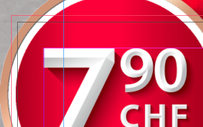
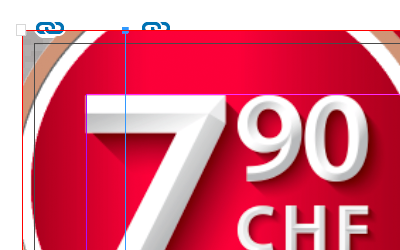
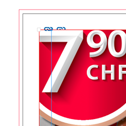
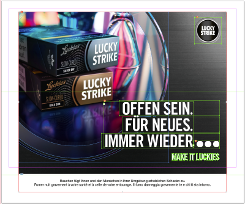
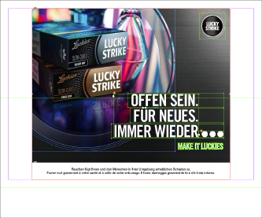
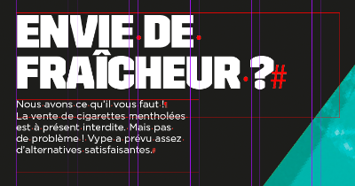
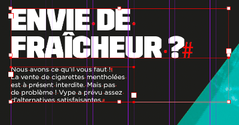
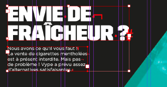
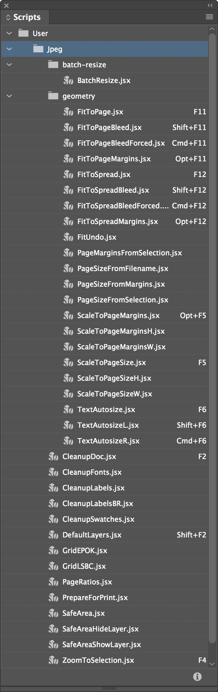

Colecție de scripturi InDesign pentru operații simple și repetitive: dimensionarea obiectelor la geometria paginii sau modificarea ei; crearea unor grile de poziționare pentru anumite branduri; "curățarea" documentului și crearea layerelor și culorilor speciale; pregătirea pentru tipar; un zoom îmbunătățit.

O bună parte dintre ele sunt gândite să fie rulate printr-un shortcut. O sugestie de configurare găsiți în secțiunea [Shortcuts](#shortcuts). Unele pot fi rulate în scriptul [`batch_convert.jsx`](https://creativepro.com/files/kahrel/indesign/batch_convert.html) de Peter Kahrel.

## Descriere

### DocCleanup/DocDefaults

Sunt două scripturi gândite să fie folosite împreună – unul "curăță", celălalt "pregătește terenul".

Mai întâi schimbă câteva setări după preferințele mele, după cum urmează:

> **Rulers:** Reset Zero Point \
> **Rulers Units:** Millimeters \
> **View:** Show Rulers \
> **View:** Show Frame Edges \
> **Document Intent:** Print \
> **Transparency Blend Space:** CMYK \
> **CMYK Profile:** ISO Coated v2 (ECI) \
> **RGB Profile:** sRGB IEC61966-2.1 \
> **Grids & Guides:** Show Guides \
> **Grids & Guides:** Unlock Guides \
> **Guides & Pasteboard: Margins:** H 150 mm, V 25 mm \
> **Guides & Pasteboard: Preview Background:** Light Gray \
> **Keyboard Increments: Cursor Key:** 0.2 mm \
> **Keyboard Increments: Size/Leading:** 0.5 pt \
> **Keyboard Increments: Baseline Shift:** 0.1 pt \
> **Keyboard Increments: Kerning/Tracking:** 5/1000 em \
> **Layers:** Ungroup Remembers Layers \
> **Layers:** Paste Remembers Layers \
> **Transform Reference Point:** Center \
> **Type Options:** Use Typographer's Quotes \
> **Type Options:** Apply Leading to Entire Paragraphs

După care:

* **DocCleanup** șterge culorile, layerele și paginile neutilizate, deblochează toate elementele, le resetează scalarea la 100%, șterge toate liniile de ghidaj.

* **DocDefaults** creează câteva culori speciale și layere, înlocuiește câteva fonturi lipsă sau nedorite și stabilește geometria paginii din numele fișierului.

  

  Scriptul detectează și combină câteva layere similare, după cum urmează:

  > **safe area**: _Visible, visible, Vizibil, vizibil, Vis. area, vis. area, visible area, Visible area_ \
  > **dielines**: _Cut, diecut, die cut, Die Cut, cut lines, stanze, Stanze, decoupe_ \
  > **varnish**: _UV, Varnish_ \
  > **HW**: _WHW, WH, wh, hw, Hw Logo_ \
  > **type**: _Type, TEXT, TEXTES, Text, text, txt, copy_ \
  > **artwork**: _Ebene 1, Calque 1, Artwork, AW, Layouts, Layout, layout, Layer\_lucru_ \
  > **bg**: _background, BACKGROUND, BG, HG, Hintergrund_

### CleanupFonts

Înlocuiește unele fonturi lipsă sau nedorite cu echivalentele lor. Deocamdată lista e definită în script, dar poate fi editată cu un editor text:

Font vechi | Font nou
--- | ---
Akzidenz Grotesk Bold | **AkzidenzGrotesk Bold**
Arial Bold | **Helvetica Neue Bold**
FoundryGridnik Regular | **Foundry Gridnik Regular**
FoundryGridnik Bold | **Foundry Gridnik Bold**
FoundryGridnik Medium | **Foundry Gridnik Medium**
Gotham Light Regular | **Gotham Light**
Gotham Book Regular | **Gotham Book**
Gotham Medium Regular | **Gotham Medium**
Gotham Bold Regular | **Gotham Bold**
Gotham Black Regular | **Gotham Black**
Helvetica Neue LT Std 65 Medium | **Helvetica Neue Medium**
Helvetica Neue LT Std 75 Bold | **Helvetica Neue Bold**
Trade Gothic LT Std Bold Condensed No. 20 | **Trade Gothic for LS Bold Condensed No. 20**
Trade Gothic LT Std Condensed No. 18 | **Trade Gothic for LS Condensed No. 18**

### CleanupLabels

Uneori se refolosesc obiecte care au o etichetă atașată _(Script Label)_, care pot crea probleme ulterior.

* **CleanupLabels** șterge toate etichetele dintr-un document.

* **CleanupLabelsBR** șterge doar etichetele folosite de scriptul `BatchResize`:
  > *alignL, alignR, alignT, alignB, alignTL, alignBL, alignTR, alignBR, alignC, alignCh, alignCv, fit, bleed*.

### CleanupSwatches

Convertește culorile de proces RGB la CMYK, elimină duplicatele, redenumește culorile CMYK după formula "C= M= Y= K=" și șterge culorile nefolosite.

<!--  -->

### Seria FitToPage/FitToSpread

Redimensionează unul sau mai multe obiecte selectate, fără să le scaleze. Frame-urile obișnuite sunt redimensionate pur și simplu. Pentru a nu le deforma, obiectele rotite, ovalurile, grupurile etc sunt incluse într-un _clipping frame_ și acesta e redimensionat. Dacă rulați un script a doua oară pe un astfel de obiect, îl va restaura.

* **FitToPage/Margins/Bleed** constrâng dimensiunile unui obiect la dimensiunile paginii, ale marginii sau ale bleedului paginii.

* **FitToSpread/Margins/Bleed** fac același lucru pentru paginile grupate într-un spread.

* **FitToPageBleedForced** și **FitToPageSpreadForced** redimensionează exact la bleedul paginii sau ale spreadului. Sunt utile, de exemplu, pentru imaginea de background.

* **FitUndo**: dacă doriți să restaurați toate obiectele simultan.

<!--  -->
<!--
Înainte | FitToPage | FitToPageMargins | FitToPageBleed
:---: | :---: | :---: | :---:
 |  |  | 
-->

### Seria ScaleToPage

Acestea lucrează, de asemenea, cu unul sau mai multe obiecte, dar le scalează proporțional, ca un bloc unitar.

* **ScaleToPageSize** și **ScaleToPageMargins** scalează la dimensiunile paginii sau marginii.

* Variantele **H** (height) și **W** (width) scalează la înălțimea, respectiv lățimea paginii sau marginii.

<!--  -->
<!--
Înainte | ScaleToPageSizeH | ScaleToPageMarginsH
:---: | :---: | :---:
 |  | 
-->

### Seria PageSize

Redimensionează paginile documentului în funcție de numele fișierului, de marginile paginii, sau de obiectele selectate.

* **PageSizeFromFilename** caută în numele fișierului perechi de numere de genul `000x000` (unde `000` înseamnă un grup de cel puțin o cifră, urmată sau nu de zecimale, și opțional de `mm` sau `cm`). Dacă găsește doar o pereche, aceasta va fi dimensiunea paginii. Dacă găsește două (de ex. `000x000_000x000`), perechea mai mare va fi dimensiunea paginii, iar perechea mai mică dimensiunea ariei vizibile. Dacă sunt urmate de o secvență de una sau două cifre, aceasta e considerată bleed.

  Exemplu:
  > VYPE_FR_MentholBan_Sticker_Vitrine_Phrase_**1400x400_700x137_5**mm.indd

* **PageSizeFromMargins** redimensionează fiecare pagină la marginile acesteia.

* **PageSizeFromSelection** redimensionează pagina curentă la obiectele selectate (similar cu **Artboards > Fit to Selected Art** din Illustrator).

### PageMarginsFromSelection

Setează marginile paginii la dimensiunile selecției.

### Seria TextAutosize

"Strâng" chenarul la text și setează dimensionarea automată, justificarea verticală și alinierea paragrafului:

* **TextAutosize**: Auto-Sizing: center; Vertical Justification: center; Paragraph: align center.

* **TextAutosizeL**: Auto-Sizing: top-left; Vertical Justification: top; Paragraph: align left.

* **TextAutosizeR**: Auto-Sizing: top-right; Vertical Justification: top; Paragraph: align right.

_Auto-Sizing Type_ va fi setat _Height and Width_ dacă textul are un singur rând. Dacă are mai multe rânduri, prima rulare îl va seta _Height Only_, a doua _Height and Width_ (caz în care trebuie avut grijă ca textul să fie rupt pe rânduri manual).

<!--  -->
<!--
Înainte | Prima rulare | A doua rulare
:---: | :---: | :---:
 |  | 
-->

### Seria Grid

Creează grile de poziționare pentru anumite branduri.

* **GridEPOK** setează marginile paginii și numărul de coloane conform grilei EPOK.

* **GridLSBC** setează marginile paginii și câteva linii de ghidaj conform ghidului Lucky Strike BC.

### Seria Print

Fac câteva pregătiri pentru export și pot fi rulate în `batch_convert.jsx`.

* **PrepareForPrint** ascunde layerul *safe area* și mută ștanțele de pe *dielines* pe spreaduri separate.

* **SafeArea** creează un frame de dimensiunea marginilor paginii pe *safe area*.

* **SafeAreaHideLayer** și **SafeAreaShowLayer** ascund sau afișează *safe area*.

Scripturile detectează layerele similare gen *visible*, *vizibil*, *vis. area* sau *diecut*, *die cut*, *cut lines*, *stanze*.

### ZoomToSelection

Asemănător cu **Fit Selection in Window** (⌥⌘=), dar cu câteva îmbunătățiri:

* aduce selecția puțin mai aproape;
* dacă cursorul e în text, face zoom la întreg cadrul;
* fără nimic selectat face vizibil întreg spreadul.

## Shortcuts

Script | Fn | Script | Fn | Script | Fn
:--- | ---: | :--- | ---: | :--- | ---:
**DocCleanup** | F2 | **DocDefaults** | ⌥F2
**FitToPage** | F11 | **FitToPageMargins** | ⌥F11 | **FitToPageBleed** | ⇧F11
||||| **FitToPageBleedForced** | ⌘F11
**FitToSpread** | F12 | **FitToSpreadMargins** | ⌥F12 | **FitToSpreadBleed** | ⇧F12
||||| **FitToSpreadBleedForced** | ⌘F12
**ScaleToPageSize** | F5 | **ScaleToPageMargins** | ⌥F5
**TextAutosize** | F6 | **TextAutosizeL** | ⌥F6 | **TextAutosizeR** | ⌘F6
**ZoomToSelection** | F4

<!--  -->

## Instalare

1. Deschideți Adobe InDesign.
2. Selectați **Window** > **Utilities** > **Scripts**.
3. În panoul _Scripts panel_, faceți clic dreapta pe **User** și alegeți **Reveal in Finder** sau **Reveal in Explorer** (PC).
4. Copiați fișierele în folderul **Scripts Panel**.

