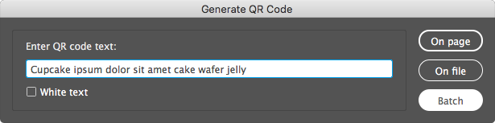

# Indentz

Colecție de scripturi InDesign pentru operații simple și repetitive. O bună parte dintre ele sunt gândite să fie rulate printr‑un shortcut (sugestii sub fiecare secțiune). Câteva pot fi rulate în scriptul [**`batch_convert.jsx`**](https://creativepro.com/files/kahrel/indesign/batch_convert.html) de Peter Kahrel.

## Descriere

### **Alignment/Proxy**

Facilitează alinierea obiectelor sau setarea punctului de referință pentru transformări folosind shortcuturi.

* **`AlignTo`** aliniază obiectele selectate la referința setării **Align To**:

  

* **`ToggleAlignTo.jsx`** comută alinierea între obiect, margini, pagină sau spread (rulați scriptul în mod repetat).

* **`ResetAlignTo.jsx`** o resetează la **Align to Selection**.

* **`SetRefPoint`** schimbă punctul de referință pentru transformări, similar cu selectarea pătrățelelor proxy în paleta **Transform**.

**Notă:** Ambele seturi ar trebui alocate tastaturii numerice.

<strong>Shortcuturi</strong>

Alignment | | | | | | | |
:- | -: | :- | -: | :- | -: | :- | -:
**AlignToTL.jsx** | Num7 | **AlignToT.jsx** | Num8 | **AlignToTR.jsx** | Num9 | **ToggleAlignTo.jsx** | Num0
**AlignToL.jsx** | Num4 | **AlignToC.jsx** | Num5 | **AlignToR.jsx**  | Num6 | **ResetAlignTo.jsx** | ⌃Num0
**AlignToBL.jsx** | Num1 | **AlignToB.jsx** | Num2 | **AlignToBR.jsx** | Num3

Proxy | | | | | |
:- | -: | :- | -: | :- | -:
**SetRefPointTL.jsx** | ⌃Num7 | **SetRefPointT.jsx** | ⌃Num8 | **SetRefPointTR.jsx** | ⌃Num9
**SetRefPointL.jsx** | ⌃Num4 | **SetRefPointC.jsx** | ⌃Num5 | **SetRefPointR.jsx** | ⌃Num6
**SetRefPointBL.jsx** | ⌃Num1 | **SetRefPointB.jsx** | ⌃Num2 | **SetRefPointBR.jsx** | ⌃Num3

### **Fitting**

Redimensionează obiectele selectate, fără să le scaleze. Chenarele obișnuite sunt redimensionate pur și simplu; obiectele rotite, ovalurile, grupurile etc sunt incluse într‑un container *(clipping frame)* și acesta e redimensionat.

* **`FitToPage`** și **`FitToSpread`**: dacă obiectul este mai mare decât pagina/spreadul/marginile/bleedul, va fi redus; dacă este mai mic dar intră într‑o zonă „snap” de 5%, va fi mărit.

  **`FitTo...Forced.jsx`** redimensionează exact la dimensiunile respective.

* **`TextAutosize.jsx`** „strânge” chenarul la text și îi setează dimensionarea automată. Controlați referința pentru dimensionarea automată setând **Paragraph Alignment** pentru axa orizontală și **Text Frame Options > Vertical Justification** pentru axa verticală:

  | |  |  | 
  :-: | :-: | :-: | :-:
   |  |  | 
   |  |  | 
   |  |  | 

  Dacă textul are un singur rând, **Auto‑Sizing Type** va fi setat *Height and width*. Dacă are mai multe rânduri, prima rulare îl va seta *Height only*, a doua *Height and width*.

<strong>Shortcuturi</strong>

FitToPage | | FitToSpread | | TextAutosize | |
:- | -: | :- | -: | :- | -:
**FitToPage.jsx** | F11 | **FitToSpread.jsx** | F12 | **TextAutosize.jsx** | F6
**FitToPageMargins.jsx** | ⌥F11 | **FitToSpreadMargins.jsx** | ⌥F12
**FitToPageBleed.jsx** | ⇧F11 | **FitToSpreadBleed.jsx** | ⇧F12
**FitToPageBleedForced.jsx** | ⇧⌘F11 | **FitToSpreadBleedForced.jsx** | ⇧⌘F12

### **Scaling**

Scalează proporțional obiectele selectate, ca un bloc unitar.

* **`ScaleToPageSize.jsx`** și **`ScaleToPageMargins.jsx`** scalează la dimensiunile paginii sau marginii.

* Variantele **`H`** (height) și **`W`** (width) scalează la înălțimea, respectiv lățimea paginii sau marginii.

<strong>Shortcuturi</strong>

Scale | |
:- | -:
**ScaleToPageSize.jsx** | F5
**ScaleToPageMargins.jsx** | ⌥F5

### **Print**

Fac câteva pregătiri pentru export și pot fi rulate în [**`batch_convert.jsx`**](https://creativepro.com/files/kahrel/indesign/batch_convert.html). Detectează straturi cu denumiri similare gen *visible*, *vizibil* pentru `safe area`, sau *diecut*, *die cut*, *cut lines*, *stanze* pentru `dielines`.

* **`PrepareForPrint.jsx`** ascunde stratul `safe area` și mută ștanțele și marcajele pentru alb și lac UV de pe `dielines` / `white` / `varnish` pe spreaduri separate.

* **`SafeArea.jsx`** creează un frame de dimensiunea marginilor paginii pe stratul `safe area`. Folosește culoarea `Safe area`, care dacă nu există va fi creată cu valoarea `C=0 M=100 Y=0 K=0`.

* **`SafeAreaHideLayer.jsx`** și **`SafeAreaShowLayer.jsx`** ascund sau afișează `safe area`.

### **Setup**

Sunt două seturi: unul legat de preferințele documentului, straturi, culori și fonturi, iar celălalt de dimensiunea și marginile paginii.

#### **Document**

* **`DefaultPrefs.jsx`** setează următoarele preferințe:

  > **Rulers:** Reset Zero Point \
  > **Rulers Units:** Millimeters \
  > **View:** Show Rulers \
  > **View:** Show Frame Edges \
  > **Document Intent:** Print \
  > **Transparency Blend Space:** CMYK \
  > **CMYK Profile:** ISO Coated v2 (ECI) \
  > **RGB Profile:** sRGB IEC61966-2.1 \
  > **Grids & Guides:** Show Guides \
  > **Grids & Guides:** Unlock Guides \
  > **Guides & Pasteboard: Margins:** H 150 mm, V 25 mm \
  > **Guides & Pasteboard: Preview Background:** Light Gray \
  > **Keyboard Increments: Cursor Key:** 0.2 mm \
  > **Keyboard Increments: Size/Leading:** 0.5 pt \
  > **Keyboard Increments: Baseline Shift:** 0.1 pt \
  > **Keyboard Increments: Kerning/Tracking:** 5/1000 em \
  > **Pages:** Allow Document Pages to Shuffle \
  > **Layers:** Ungroup Remembers Layers \
  > **Layers:** Paste Remembers Layers \
  > **Transform Reference Point:** Center \
  > **Type Options:** Use Typographer's Quotes \
  > **Type Options:** Apply Leading to Entire Paragraphs

* **`DefaultLayers.jsx`** creează un set de straturi, preluându‑le proprietățile din [**`layers.txt`**](../layers.txt), un fișier TSV *(tab‑separated values)* cu 6 coloane formatat în genul următor:

  Nume | Culoare | Vizibil | Printabil | Ordine | Variante
  :- | :-: | :-: | :-: | :-: | :-
  dielines | Magenta | TRUE | TRUE | top | cut, cut lines, decoupe, die, die cut, stanze
  template | Gray | FALSE | FALSE | bottom
  ... |

  > **Nume**: numele stratului \
  > **Culoare**: culoarea stratului (v. [**`UIColors.txt`**](UIColors.txt)) \
  > **Vizibil**: `TRUE` sau `FALSE` \
  > **Printabil**: `TRUE` sau `FALSE` \
  > **Ordine**: `top` sau `bottom` (deasupra sau sub straturile existente) \
  > **Variante**: o listă de straturi care vor fi combinate cu stratul de bază (case insensitive)

  
Prima linie (capul de tabel) și liniile care încep cu <code>&num;</code> sunt ignorate.  Dacă salvați o versiune a fișierului în directorul curent, acesta va avea prioritate față de cel standard.

  **Note:** **`layers.xlsx`** poate fi folosit pentru generarea fișierului TSV.

* **`DefaultSwatches.jsx`** creează un set de culori definite în [**`swatches.txt`**](../swatches.txt), un fișier TSV cu 3 coloane formatat în genul următor:

  Name | Model | Values
  :- | :-: | :-
  Rich Black | process | 60, 40, 40, 100
  Cut | spot | 0, 100, 0, 0
  ... |

  > **Name**: numele culorii \
  > **Model**: tipul culorii: `process` sau `spot` \
  > **Values**: o listă de 3 (RGB) sau 4 (CMYK) valori

  
Prima linie (capul de tabel) și liniile care încep cu <code>&num;</code> sunt ignorate.  Dacă salvați o versiune a fișierului în directorul curent, acesta va avea prioritate față de cel standard.

* **`CleanupSwatches.jsx`** convertește culorile RGB la CMYK, le redenumește după formula `C= M= Y= K=`, elimină duplicatele și le șterge pe cele nefolosite. Culorile spot rămân neschimbate.

* **`ReplaceFonts.jsx`** înlocuiește fonturi utilizând o listă de substituție, [**`fonts.txt`**](../fonts.txt), un fișier TSV cu 4 coloane formatat în genul următor:

  Font vechi | Stil | Font nou | Stil
  :- | :- | :- | :-
  Arial | Regular | Helvetica Neue | Regular
  Arial | Bold | Helvetica Neue | Bold
  ... |

  
Prima linie (capul de tabel) și liniile care încep cu <code>&num;</code> sunt ignorate.  Dacă salvați o versiune a fișierului în directorul curent, acesta va avea prioritate față de cel standard.

  **Notă:** Puteți utiliza **`ShowFonts.jsx`** din **Misc** pentru a obține o listă a fonturilor pentru copy‑paste.

* **`DocCleanup.jsx`** setează preferințe (rulează **`DefaultPrefs.jsx`**), șterge culorile, straturile și paginile neutilizate, deblochează toate elementele și le resetează scalarea la 100%.

* **`DocDefaults.jsx`** doar rulează **`DefaultPrefs.jsx`**, **`DefaultSwatches.jsx`**, **`DefaultLayers.jsx`**, **`ReplaceFonts.jsx`** și **`PageSizeFromFilename.jsx`**.

#### **Layout**

* **`PageMarginsFromSelection.jsx`** setează marginile paginii la dimensiunile selecției.

* **`PageSizeFromFilename.jsx`** setează dimensiunea și marginile paginii preluând informațiile din numele fișierului:

  Fișier | Dimensiune | Safe area | Bleed
  :- | :-: | :-: | :-:
  File1\_`1400x400`\_`700x137`\_`5`mm\_QR.indd | 1400x400 | 700x137 | 5
  File2\_`597x517`\_`577x500.5`\_`3`mm V4\_QR.indd | 597x517 | 577x500.5 | 3

  > Caută în numele fișierului perechi de numere de genul `000x000` (unde `000` înseamnă un grup de cel puțin o cifră, urmată sau nu de zecimale, și opțional de `mm` sau `cm`). Dacă găsește doar o pereche, e dimensiunea paginii. Dacă găsește două (de ex. `000x000_000x000`), perechea mai mare e dimensiunea paginii, perechea mai mică dimensiunea ariei vizibile. Dacă sunt urmate de o secvență de una sau două cifre, aceasta va fi bleed.

* **`PageSizeFromMargins.jsx`** redimensionează fiecare pagină la marginile acesteia.

* **`PageSizeFromSelection.jsx`** redimensionează pagina curentă la obiectele selectate (similar cu **Artboards > Fit to Selected Art** din Illustrator).

<strong>Shortcuturi</strong>

Setup | | | |
:- | -: | :- | -:
**DocCleanup.jsx** | F2 | **PageSizeFromFilename.jsx** | F3
**DocDefaults.jsx** | ⌥F2 | **PageSizeFromMargins.jsx** | ⌥F3
**CleanupSwatches.jsx** | ⇧F2 | **PageSizeFromSelection.jsx** | ⇧F3

### **Misc**

* **`CleanupLabels.jsx`**: uneori se refolosesc obiecte care au o etichetă atașată *(Script Label)*, și asta poate crea probleme ulterior. Scriptul șterge etichetele obiectelor selectate sau ale tuturor obiectelor din document dacă nu e selectat nimic.

* **`Clip.jsx`**: Pentru a manipula unele obiecte uneori e util să le inserăm temporar într‑un container *(clipping frame)*. Scriptul inserează obiectele selectate într‑un container sau le restaurează dacă sunt deja inserate.

  **`ClipUndo.jsx`** restaurează unul sau mai multe obiecte simultan.

* **`PageRatios.jsx`** calculează rația fiecărei pagini și o afișează în colțul din stânga sus, pe stratul `info`.

* **`PagesToFiles.jsx`** salvează paginile documentului activ în fișiere separate, cu un sufix configurabil.

* **`QR.jsx`** adaugă coduri QR în documentul activ sau creează fișiere separate într‑un subfolder numit `QR Codes`:

  

  * **On page** adaugă codul pe fiecare pagină, în colțul din stânga jos.

  * **On file** îl salvează într‑un fișier cu numele documentului activ și `_QR` adăugat la coadă.

  * **Batch** creează mai multe fișiere dintr‑un document TSV cu 2 coloane numit **`QR.txt`**, dacă e găsit în folderul documentului activ:

    Filename | Code
    :- | :-
    File 1 | CODE 1
    File 2 | CODE 2
    ... |

  **Notă:** Puteți insera `|` pentru împărțirea manuală a textului în mai multe rânduri.

* **`ShowFonts.jsx`** afișează toate fonturile utilizate în documentul curent (util pentru **`ReplaceFonts.jsx`**).

* **`ShowProfiles.jsx`** afișează toate profilele de culori disponibile (util când *credeți* că aveți instalat un profil de culoare).

* **`ShowProperties.jsx`** afișează proprietățile și metodele unui obiect selectat (util pentru depanare).

* **`TileAll.jsx`** invocă **Window > Arrange > Tile All Vertically** sau **Tile All Horizontally**, în funcție de orientarea paginii curente.

* **`ZoomToSelection.jsx`** e asemănător cu **Fit Selection in Window** (⌥⌘=), dar cu câteva îmbunătățiri:

  * aduce selecția puțin mai aproape;
  * dacă cursorul e în text, face zoom la întreg cadrul;
  * fără nimic selectat face vizibil întreg spreadul.

<strong>Shortcuturi</strong>

Misc | | | | | |
:- | -: | :- | -: | :- | -:
**Clip.jsx** | Num* | **TileAll.jsx** | ⇧F4 | **QR.jsx** | F9
**ClipUndo.jsx** | ⌃Num* | **ZoomToSelection.jsx** | F4

## Instalare

1. Deschideți **Window > Utilities > Scripts**.
2. Faceți clic dreapta pe folderul **User** și selectați **Reveal in Finder/Explorer**.
3. Copiați fișierele în acest folder.

## Licență

<!-- Părți din codul din acest repository se bazează pe postări de pe bloguri, postări de pe forumuri sau din tutoriale de Marc Autret, Dave Saunders, Peter Kahrel, Peter Werner, Richard Harrington și alții. -->

Codul este publicat sub licența MIT ([LICENSE.txt](LICENSE.txt)). \
Raportați o [problemă](https://github.com/pchiorean/Indentz/issues) pe Github dacă întâmpinați dificultăți sau aveți sugestii.

README-ro.md • 6 decembrie 2020
