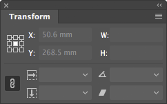
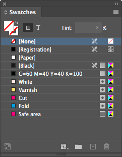
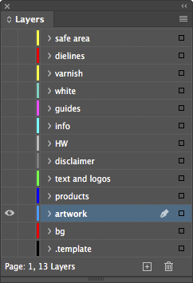

# Indentz

Colecție de scripturi InDesign pentru operații simple și repetitive. O bună parte dintre ele sunt gândite să fie rulate printr&#x2011;un shortcut (o sugestie de configurare găsiți în secțiunea [Shortcuts](#shortcuts)). Câteva pot fi rulate în scriptul [**`batch_convert.jsx`**](https://creativepro.com/files/kahrel/indesign/batch_convert.html) de Peter Kahrel.

## Descriere

### **AlignTo...** și **SetRefPointTo...**
 

**`AlignTo...`** aliniază obiectul selectat la referința definită de opțiunea **Align To**. **`ToggleAlignTo.jsx`** schimbă alinierea la obiect, margini, pagină sau spread (rulați scriptul în mod repetat). **`ResetAlignTo.jsx`** o resetează la **Align to Selection**.

**`SetRefPoint...`** schimbă punctul de referință pentru transformări, similar cu selectarea pătrățelelor proxy în paleta **Transform**.

Ambele seturi sunt gândite să fie alocate tastaturii numerice (v. [Shortcuts](#shortcuts)).

---

### **FitTo...**
Redimensionează unul sau mai multe obiecte selectate, fără să le scaleze. Frame&#x2011;urile obișnuite sunt redimensionate pur și simplu. Pentru a nu le deforma, obiectele rotite, ovalurile, grupurile etc sunt incluse într&#x2011;un *clipping frame* și acesta e redimensionat. Dacă rulați un script a doua oară pe un astfel de obiect, îl va restaura.

**`FitToPage...`** constrânge dimensiunile unui obiect la dimensiunile paginii, ale marginii sau ale bleedului paginii. **`FitToSpread...`** face același lucru pentru paginile grupate într&#x2011;un spread.

**`FitTo...Forced.jsx`** redimensionează exact la bleedul paginii sau ale spreadului (util, de exemplu, pentru imaginea de background).

**`FitUndo.jsx`** restaurează unul sau mai multe obiecte simultan.

### **ScaleTo...**
Acestea lucrează, de asemenea, cu unul sau mai multe obiecte, dar le scalează proporțional, ca un bloc unitar.

**`ScaleToPageSize.jsx`** și **`ScaleToPageMargins.jsx`** scalează la dimensiunile paginii sau marginii.

Variantele **`H`** (height) și **`W`** (width) scalează la înălțimea, respectiv lățimea paginii sau marginii.

### **PageSize...**
**`PageSizeFromFilename.jsx`** redimensionează paginile documentului în funcție de numele fișierului:

Fișier | Dimensiune | Safe area | Bleed
:--- | :---: | :---: | :---:
**Filename1\_`1400x400`\_`700x137`\_`5`mm\_QR.indd** | 1400x400 | 700x137 | 5
**Filename2\_`597x517`\_`577x500.5`\_`3`mm V4\_QR.indd** | 597x517 | 577x500.5 | 3

> 

Detalii

> Caută în numele fișierului perechi de numere de genul "000x000" (unde "000" înseamnă un grup de cel puțin o cifră, urmată sau nu de zecimale, și opțional de "mm" sau "cm"). Dacă găsește doar o pereche, aceasta va fi dimensiunea paginii. Dacă găsește două (de ex. "000x000_000x000"), perechea mai mare va fi dimensiunea paginii, iar perechea mai mică dimensiunea ariei vizibile. Dacă sunt urmate de o secvență de una sau două cifre, aceasta e considerată bleed.
> 

**`PageSizeFromMargins.jsx`** redimensionează fiecare pagină la marginile acesteia.

**`PageSizeFromSelection.jsx`** redimensionează pagina curentă la obiectele selectate (similar cu **Artboards > Fit to Selected Art** din Illustrator).

**`PageMarginsFromSelection.jsx`** setează marginile paginii la dimensiunile selecției.

### **TextAutosize**
"Strânge" chenarul la text și îi setează dimensionarea automată. Controlați referința pentru dimensionarea automată setând **Paragraph Alignment** pentru axa orizontală și **Text Frame Options > Vertical Justification** pentru axa verticală:

<!--
| |  |  | 
:---: | :---: | :---: | :---:
 |  |  | 
 |  |  | 
 |  |  | 
-->

<table>
<thead>
	<tr>
		<th style="text-align:center"></th>
		<th style="text-align:center"></th>
		<th style="text-align:center"></th>
		<th style="text-align:center"></th>
	</tr>
</thead>
<tbody>
	<tr>
		<th style="text-align:center"></th>
		<td style="text-align:center"></td>
		<td style="text-align:center"></td>
		<td style="text-align:center"></td>
	</tr>
	<tr>
		<th style="text-align:center"></th>
		<td style="text-align:center"></td>
		<td style="text-align:center"></td>
		<td style="text-align:center"></td>
	</tr>
	<tr>
		<th style="text-align:center"></th>
		<td style="text-align:center"></td>
		<td style="text-align:center"></td>
		<td style="text-align:center"></td>
	</tr>
</tbody>
</table>

Dacă textul are un singur rând, **Auto-Sizing Type** va fi setat *Height and width*. Dacă are mai multe rânduri, prima rulare îl va seta *Height only*, a doua *Height and width*.

---

### **CleanupFonts**
Înlocuiește fonturi pe baza unei liste de substituție. Lista este un fișier TSV *(tab-separated values)* cu 4 coloane, cu același nume ca scriptul ([**`CleanupFonts.txt`**](../cleanup/CleanupFonts.txt)). Prima linie (capul de tabel) și liniile care încep cu ";" sunt ignorate.

Puteți utiliza **`ShowFonts.jsx`** pentru a obține o listă a fonturilor pentru copy-paste în **`CleanupFonts.txt`**.

### **CleanupLabels**
Uneori se refolosesc obiecte care au o etichetă atașată *(Script Label)*, și asta poate crea probleme ulterior. **`CleanupLabels.jsx`** șterge toate etichetele din document (dacă nu e selectat nimic) sau doar din elementele selectate.

### **CleanupSwatches**
Convertește swatch&#x2011;urile RGB la CMYK, elimină duplicatele, le redenumește după formula "C= M= Y= K=" și le șterge pe cele nefolosite. Culorile spot rămân neschimbate.

### **DocCleanup** și **DocDefaults**
**`DocCleanup.jsx`** șterge culorile, layerele și paginile neutilizate, deblochează toate elementele, le resetează scalarea la 100% și șterge toate liniile de ghidaj.

**`DocDefaults.jsx`** creează câteva culori speciale și layere, înlocuiește câteva fonturi lipsă sau nedorite (rulează **`CleanupFonts.jsx`**), și stabilește geometria paginii din numele fișierului (rulează **`PageSizeFromFilename.jsx`**).

 

De asemenea, scriptul combină câteva layere:

Layer | Combinat cu
:--- | :---
Rahmen, Vis. area, Visible area, Visible, Vizibil | `safe area`
cut lines, Cut, decoupe, die cut, diecut, Stanz, Stanze | `dielines`
UV, Varnish | `varnish`
HW Logo, Logo HW, hw, WH, WHW | `HW`
Copy, Text, TEXT, TEXTES, TXT, Type | `text and logos`
Artwork, AW, Layer 1, Calque 1, Ebene 1, Elemente, Layout, Layouts | `artwork`
background, BACKGROUND, BG, HG, Hintergrund | `bg`

Ambele scripturi schimbă niște setări după preferințele mele.

> 

Detalii

>
> **Rulers:** Reset Zero Point \
> **Rulers Units:** Millimeters \
> **View:** Show Rulers \
> **View:** Show Frame Edges \
> **Document Intent:** Print \
> **Transparency Blend Space:** CMYK \
> **CMYK Profile:** ISO Coated v2 (ECI) \
> **RGB Profile:** sRGB IEC61966-2.1 \
> **Grids & Guides:** Show Guides \
> **Grids & Guides:** Unlock Guides \
> **Guides & Pasteboard: Margins:** H 150 mm, V 25 mm \
> **Guides & Pasteboard: Preview Background:** Light Gray \
> **Keyboard Increments: Cursor Key:** 0.2 mm \
> **Keyboard Increments: Size/Leading:** 0.5 pt \
> **Keyboard Increments: Baseline Shift:** 0.1 pt \
> **Keyboard Increments: Kerning/Tracking:** 5/1000 em \
> **Pages:** Allow Document Pages to Shuffle \
> **Layers:** Ungroup Remembers Layers \
> **Layers:** Paste Remembers Layers \
> **Transform Reference Point:** Center \
> **Type Options:** Use Typographer's Quotes \
> **Type Options:** Apply Leading to Entire Paragraphs
> 

---

### **Print**
Fac câteva pregătiri pentru export; pot fi rulate în [**`batch_convert.jsx`**](https://creativepro.com/files/kahrel/indesign/batch_convert.html). Detectează layere alternative gen *visible*, *vizibil*, *vis. area* pentru `safe area`, sau *diecut*, *die cut*, *cut lines*, *stanze* pentru `dielines`.

**`PrepareForPrint.jsx`** ascunde layerul `safe area` și mută ștanțele și marcajele pentru alb și lac UV de pe `dielines` / `white` / `varnish` pe spreaduri separate.

**`SafeArea.jsx`** creează un frame de dimensiunea marginilor paginii pe layerul `safe area`. Folosește swatch&#x2011;ul `Safe area`, care dacă nu există va fi creat cu valoarea "C=0 M=100 Y=0 K=0".

**`SafeAreaHideLayer.jsx`** și **`SafeAreaShowLayer.jsx`** ascund sau afișează `safe area`.

---

### **QR**
Adaugă un cod QR în colțul din stânga jos al fiecărei pagini sau îl salvează într&#x2011;un fișier separat. Are două moduri de operare, manual sau batch:

* **Manual:** Solicită codul și îl adaugă pe pagină (sau într&#x2011;un fișier separat).

* **Batch:** Dacă în același folder există un fișier numit **`QR.txt`**, scriptul va genera fișiere QR cu numele și codurile din acesta. Trebuie să fie un TSV *(tab-separated values)*; prima coloană e numele fișierului QR, a doua codul. Prima linie (antetul) e ignorată:

  Fișier QR | Cod QR
  :--- | :---
  **Filename1_1400x400_700x137_5mm_QR.indd** | FILE1 1400x400_700x137
  **Filename2_597x517_577x500.5_3mm V4_QR.indd** | FILE2 597x517_577x500.5 V4

Puteți insera "|" pentru împărțirea manuală a textului în mai multe rânduri.

---

### **ZoomToSelection**
Asemănător cu **Fit Selection in Window** (⌥⌘=), dar cu câteva îmbunătățiri:

* aduce selecția puțin mai aproape;
* dacă cursorul e în text, face zoom la întreg cadrul;
* fără nimic selectat face vizibil întreg spreadul.

---

### Diverse
**`Clip.jsx`** inserează obiectele selectate într-un *clipping frame* sau le restaurează dacă sunt deja inserate.

**`PageRatios.jsx`** calculează rația fiecărei pagini și o afișează în colțul din stânga sus (util pentru mastere).

**`ShowFonts.jsx`** afișează toate fonturile utilizate în documentul curent (util pentru **`CleanupFonts.jsx`**).

**`ShowProfiles.jsx`** afișează toate profilele de culori disponibile (util când *credeți* că aveți instalat un profil de culoare).

**`ShowProperties.jsx`** afișează proprietățile și metodele unui obiect selectat (util pentru depanare).

## Shortcut&#x2011;uri

Rularea unui script folosit frecvent din panoul **Scripts** este destul de neplăcută, deoarece trebuie de fiecare dată să îl găsiți, apoi să faceți dublu clic pe el. Puteți face asta instantaneu, atribuindu&#x2011;i o scurtătură din **Edit > Keyboard Shortcuts... > Product Area > Scripts**. Configurația mea este următoarea:

| Align                   |       | Proxy                   |       | Fit/Scale                        |       | Cleanup                   |      |
| :---------------------- | ----: | :---------------------- | ----: | :------------------------------- | ----: | :------------------------ | ---: |
| **`AlignToTL.jsx`**     |  Num7 | **`SetRefPointTL.jsx`** | ⌃Num7 | **`FitToPage.jsx`**              |   F11 | **`DocCleanup.jsx`**      |   F2 |
| **`AlignToL.jsx`**      |  Num4 | **`SetRefPointL.jsx`**  | ⌃Num4 | **`FitToPageMargins.jsx`**       |  ⌥F11 | **`DocDefaults.jsx`**     |  ⌥F2 |
| **`AlignToBL.jsx`**     |  Num1 | **`SetRefPointBL.jsx`** | ⌃Num1 | **`FitToPageBleed.jsx`**         |  ⇧F11 | **`CleanupSwatches.jsx`** |  ⇧F2 |
| **`AlignToT.jsx`**      |  Num8 | **`SetRefPointT.jsx`**  | ⌃Num8 | **`FitToPageBleedForced.jsx`**   | ⇧⌘F11 |                           |
| **`AlignToC.jsx`**      |  Num5 | **`SetRefPointC.jsx`**  | ⌃Num5 | **`FitToSpread.jsx`**            |   F12 | **Other**                 |   F9 |
| **`AlignToB.jsx`**      |  Num2 | **`SetRefPointB.jsx`**  | ⌃Num2 | **`FitToSpreadMargins.jsx`**     |  ⌥F12 | **`Clip.jsx`**            | Num* |
| **`AlignToTR.jsx`**     |  Num9 | **`SetRefPointTR.jsx`** | ⌃Num9 | **`FitToSpreadBleed.jsx`**       |  ⇧F12 | **`QR.jsx`**              |
| **`AlignToR.jsx`**      |  Num6 | **`SetRefPointR.jsx`**  | ⌃Num6 | **`FitToSpreadBleedForced.jsx`** | ⇧⌘F12 | **`ZoomToSelection.jsx`** |
| **`AlignToBR.jsx`**     |  Num3 | **`SetRefPointBR.jsx`** | ⌃Num3 | **`ScaleToPageSize.jsx`**        |    F5 |                           |
| **`ToggleAlignTo.jsx`** |  Num0 |                         |       | **`ScaleToPageMargins.jsx`**     |   ⌥F5 |                           |
| **`ResetAlignTo.jsx`**  | ⌃Num0 |                         |       | **`TextAutosize.jsx`**           |    F6 |                           |

## Instalare

1. Deschideți **Window > Utilities > Scripts**.
2. Faceți clic dreapta pe folderul **User** și selectați **Reveal in Finder/Explorer**.
3. Copiați fișierele în acest folder.

## Licență

<!-- Părți din codul din acest repository se bazează pe postări de pe bloguri, postări de pe forumuri sau din tutoriale de Marc Autret, Dave Saunders, Peter Kahrel, Peter Werner, Richard Harrington și alții. -->

Codul este publicat sub licența MIT ([LICENSE.txt](../LICENSE.txt)). Trimiteți&#x2011;mi un e&#x2011;mail la \<jpeg AT basement.ro\> sau [raportați o problemă](https://github.com/pchiorean/Indentz/issues) pe Github dacă întâmpinați probleme sau aveți sugestii.

README-ro.md • 29 septembrie 2020
