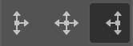

# Indentz

Colecție de scripturi InDesign pentru operații simple și repetitive: "curățarea" documentului, crearea unor layere și culori speciale, dimensionarea obiectelor la geometria paginii sau modificarea ei, pregătire pentru tipar, un zoom îmbunătățit.

O bună parte dintre ele sunt gândite să fie rulate printr-un shortcut. O sugestie de configurare găsiți în secțiunea [Shortcuts](#shortcuts). Câteva pot fi rulate în scriptul [**`batch_convert.jsx`**](https://creativepro.com/files/kahrel/indesign/batch_convert.html) de Peter Kahrel.

## Descriere

#### **`DocCleanup.jsx`** / **`DocDefaults.jsx`**

Sunt două scripturi gândite să fie folosite împreună – unul "curăță", celălalt "pregătește terenul".

Mai întâi schimbă câteva setări după preferințele mele:

> **Rulers:** Reset Zero Point \
> **Rulers Units:** Millimeters \
> **View:** Show Rulers \
> **View:** Show Frame Edges \
> **Document Intent:** Print \
> **Transparency Blend Space:** CMYK \
> **CMYK Profile:** ISO Coated v2 (ECI) \
> **RGB Profile:** sRGB IEC61966-2.1 \
> **Grids & Guides:** Show Guides \
> **Grids & Guides:** Unlock Guides \
> **Guides & Pasteboard: Margins:** H 150 mm, V 25 mm \
> **Guides & Pasteboard: Preview Background:** Light Gray \
> **Keyboard Increments: Cursor Key:** 0.2 mm \
> **Keyboard Increments: Size/Leading:** 0.5 pt \
> **Keyboard Increments: Baseline Shift:** 0.1 pt \
> **Keyboard Increments: Kerning/Tracking:** 5/1000 em \
> **Layers:** Ungroup Remembers Layers \
> **Layers:** Paste Remembers Layers \
> **Transform Reference Point:** Center \
> **Type Options:** Use Typographer's Quotes \
> **Type Options:** Apply Leading to Entire Paragraphs

După care:

* **`DocCleanup.jsx`** șterge culorile, layerele și paginile neutilizate, deblochează toate elementele, le resetează scalarea la 100%, șterge toate liniile de ghidaj.

* **`DocDefaults.jsx`** creează câteva culori speciale și layere, înlocuiește câteva fonturi lipsă sau nedorite și stabilește geometria paginii din numele fișierului.

  

  Scriptul combină câteva layere similare, după cum urmează:

  Layer | Combinat cu
  :--- | :---
  Rahmen, Vis. area, Visible area, Visible, Vizibil | `safe area`
  cut lines, Cut, decoupe, die cut, diecut, Stanz, Stanze | `dielines`
  UV, Varnish | `varnish`
  HW Logo, Logo HW, hw, WH, WHW | `HW`
  Copy, Text, TEXT, TEXTES, TXT, Type | `type`
  Artwork, AW, Layer 1, Calque 1, Ebene 1, Elemente, Layout, Layouts | `artwork`
  background, BACKGROUND, BG, HG, Hintergrund | `bg`

#### **`CleanupFonts.jsx`**

Înlocuiește unele fonturi lipsă sau nedorite cu echivalentele lor. Lista este un fișier TSV *(tab-separated values)* cu 4 coloane, cu același nume ca scriptul. Prima linie (antetul) este ignorată. Lista implicită este următoarea:

Nume vechi | Stil | Nume nou | Stil
:--- | :--- | :--- | :---
Akzidenz Grotesk | Bold | **AkzidenzGrotesk** | **Bold**
Arial | Bold | **Helvetica Neue** | **Bold**
FoundryGridnik | Regular | **Foundry Gridnik** | **Regular**
FoundryGridnik | Bold | **Foundry Gridnik** | **Bold**
FoundryGridnik | Medium | **Foundry Gridnik** | **Medium**
Gotham Light | Regular | **Gotham** | **Light**
Gotham Book | Regular | **Gotham** | **Book**
Gotham Medium | Regular | **Gotham** | **Medium**
Gotham Bold | Regular | **Gotham** | **Bold**
Gotham Black | Regular | **Gotham** | **Black**
Helvetica Neue LT Std | 65 Medium | **Helvetica Neue** | **Medium**
Helvetica Neue LT Std | 75 Bold | **Helvetica Neue** | **Bold**
Trade Gothic LT Std | Bold Condensed No. 20 | **Trade Gothic for LS** | **Bold Condensed No. 20**
Trade Gothic LT Std | Condensed No. 18 | **Trade Gothic for LS** | **Condensed No. 18**

Puteți utiliza **`ShowFonts.jsx`** pentru a obține o listă cu fonturile folosite (tab separated).

#### **`CleanupLabels.jsx`**

Uneori se refolosesc obiecte care au o etichetă atașată *(Script Label)*, și asta poate crea probleme ulterior. **CleanupLabels.jsx** șterge toate etichetele dintr-un document.

#### **`CleanupSwatches.jsx`**

Convertește culorile de proces RGB la CMYK, elimină duplicatele, redenumește culorile CMYK după formula "C= M= Y= K=" și șterge culorile nefolosite. Culorile spot rămân neschimbate.

#### Seria **`FitToPage`** / **`FitToSpread`**

Redimensionează unul sau mai multe obiecte selectate, fără să le scaleze. Frame-urile obișnuite sunt redimensionate pur și simplu. Pentru a nu le deforma, obiectele rotite, ovalurile, grupurile etc sunt incluse într-un *clipping frame* și acesta e redimensionat. Dacă rulați un script a doua oară pe un astfel de obiect, îl va restaura.

* **`FitToPage.jsx`** / **`FitToPageMargins.jsx`** / **`FitToPageBleed.jsx`** constrâng dimensiunile unui obiect la dimensiunile paginii, ale marginii sau ale bleedului paginii.

* **`FitToSpread.jsx`** / **`FitToSpreadMargins.jsx`** / **`FitToSpreadBleed.jsx`** fac același lucru pentru paginile grupate într-un spread.

* **`FitToPageBleedForced.jsx`** și **`FitToPageSpreadForced.jsx`** redimensionează exact la bleedul paginii sau ale spreadului. Sunt utile, de exemplu, pentru imaginea de background.

* **`FitUndo.jsx`**: dacă doriți să restaurați toate obiectele simultan.

#### Seria **`ScaleToPage`**

Acestea lucrează, de asemenea, cu unul sau mai multe obiecte, dar le scalează proporțional, ca un bloc unitar.

* **`ScaleToPageSize.jsx`** și **`ScaleToPageMargins.jsx`** scalează la dimensiunile paginii sau marginii.

* Variantele **`H`** (height) și **`W`** (width) scalează la înălțimea, respectiv lățimea paginii sau marginii.

#### Seria **`PageSize`**

Redimensionează paginile documentului în funcție de numele fișierului, de marginile paginii, sau de obiectele selectate.

* **`PageSizeFromFilename.jsx`** caută în numele fișierului perechi de numere de genul "000x000" (unde "000" înseamnă un grup de cel puțin o cifră, urmată sau nu de zecimale, și opțional de "mm" sau "cm"). Dacă găsește doar o pereche, aceasta va fi dimensiunea paginii. Dacă găsește două (de ex. "000x000_000x000"), perechea mai mare va fi dimensiunea paginii, iar perechea mai mică dimensiunea ariei vizibile. Dacă sunt urmate de o secvență de una sau două cifre, aceasta e considerată bleed.

  Exemple:
  > Filename1_**1400x400_700x137_5**mm.indd \
  > Filename2_**597x517_577x500.5_3**mm V4.indd

* **`PageSizeFromMargins.jsx`** redimensionează fiecare pagină la marginile acesteia.

* **`PageSizeFromSelection.jsx`** redimensionează pagina curentă la obiectele selectate (similar cu **Artboards > Fit to Selected Art** din Illustrator).

* **`PageMarginsFromSelection.jsx`** setează marginile paginii la dimensiunile selecției.

#### Seria **`TextAutosize`**

"Strâng" chenarul la text și setează dimensionarea automată și alinierea paragrafului la centru/stânga/dreapta. Setând **Vertical Justification** puteți controla unde va fi punctul de referință pentru dimensionarea automată pe axa verticală:

  **Vertical Justification** | **`TextAutosizeL.jsx`** | **`TextAutosize.jsx`** | **`TextAutosizeR.jsx`**
  :--- | :---: | :---: | :---:
  *Top* |  |  | 
  *Center* |  |  | 
  *Bottom* |  |  | 

**Auto-Sizing Type** va fi setat *Height and width* dacă textul are un singur rând. Dacă are mai multe rânduri, prima rulare îl va seta *Height only*, a doua *Height and width* (caz în care trebuie avut grijă ca rândurile să fie rupte manual).

#### Seria **Print**

Fac câteva pregătiri pentru export și pot fi rulate în **`batch_convert.jsx`**.

* **`PrepareForPrint.jsx`** face următoarele:
  * ascunde layerul `safe area`;
  * mută marcajele pentru lac UV de pe `varnish` pe spreaduri separate;
  * mută ștanțele de pe `dielines` pe spreaduri separate.

* **`SafeArea.jsx`** creează un frame de dimensiunea marginilor paginii pe layerul `safe area`. Culoarea lui este un swatch, `Safe area`, care dacă nu există deja va fi creat cu valoarea "C=0 M=100 Y=0 K=0".

* **`SafeAreaHideLayer.jsx`** și **`SafeAreaShowLayer.jsx`** ascund sau afișează `safe area`.

Scripturile detectează nume alternative gen `visible`, `vizibil`, `vis. area` pentru `safe area`, sau `diecut`, `die cut`, `cut lines`, `stanze` pentru `dielines`.

#### **`ZoomToSelection.jsx`**

Asemănător cu **Fit Selection in Window** (⌥⌘=), dar cu câteva îmbunătățiri:

* aduce selecția puțin mai aproape;
* dacă cursorul e în text, face zoom la întreg cadrul;
* fără nimic selectat face vizibil întreg spreadul.

#### Diverse

* **`PageRatios.jsx`** calculează rația fiecărei pagini și o afișează în colțul din stânga sus.

* **`QR.jsx`** adaugă un cod QR în colțul din stânga jos al fiecărei pagini sau îl salvează într-un fișier separat. Are două moduri de operare, batch sau manual:

  * **Batch:** dacă găsește un fișier numit `QR.txt` în același folder, îl procesează. Trebuie să fie un fișier TSV *(tab-separated values)*; prima coloană e numele fișierului, a doua codul QR. Prima linie (antetul) este ignorată:

    Fișier | @QR
    :--- | :---
    **`Filename1_1400x400_700x137_5mm_QR.indd`** | FILE1 1400x400_700x137
    **`Filename2_597x517_577x500.5_3mm V4_QR.indd`** | FILE2 597x517_577x500.5

  * **Manual:** în caz contrar, solicită codul și îl adaugă pe pagină sau într-un fișier separat.

* **`ShowFonts.jsx`** afișează toate fonturile utilizate în documentul curent.

* **`ShowProfiles.jsx`** afișează toate profilele de culori disponibile.

* **`ShowProperties.jsx`** afișează proprietățile și metodele unui obiect selectat (util pentru depanare).

## Shortcuts

Script | Fn | Script | Fn | Script | Fn
:--- | ---: | :--- | ---: | :--- | ---:
**`DocCleanup.jsx`** | F2 | **`DocDefaults.jsx`** | ⌥F2 | **`CleanupSwatches.jsx`** | ⇧F2
**`FitToPage.jsx`** | F11 | **`FitToPageMargins.jsx`** | ⌥F11 | **`FitToPageBleed.jsx`** | ⇧F11
||||| **`FitToPageBleedForced.jsx`** | ⇧⌘F11
**`FitToSpread.jsx`** | F12 | **`FitToSpreadMargins.jsx`** | ⌥F12 | **`FitToSpreadBleed.jsx`** | ⇧F12
||||| **`FitToSpreadBleedForced.jsx`** | ⇧⌘F12
**`ScaleToPageSize.jsx`** | F5 | **`ScaleToPageMargins.jsx`** | ⌥F5
**`TextAutosize.jsx`** | F6 | **`TextAutosizeL.jsx`** | ⌥F6 | **`TextAutosizeR.jsx`** | ⌘F6
**`ZoomToSelection.jsx`** | F4

## Instalare

1. Deschideți **Window > Utilities > Scripts**.
2. Faceți clic dreapta pe folderul **User** și selectați **Reveal in Finder/Explorer**.
3. Copiați fișierele în acest folder.

## Licență

O parte din codul din acest repository se bazează pe postări de pe bloguri, postări de pe forumuri sau din tutoriale de Dave Saunders, Marc Autret, Peter Werner, Richard Harrington și Peter Kahrel. Restul codului este publicat sub licența MIT ([LICENSE.txt](../LICENSE.txt)).

Vă rog să-mi trimiteți un e-mail la \<jpeg AT basement.ro\> sau [raportați o problemă pe Github](https://github.com/pchiorean/Indentz/issues) dacă întâmpinați probleme sau aveți sugestii.

README-ro.md • 2 august 2020, 11:05 (UTC).