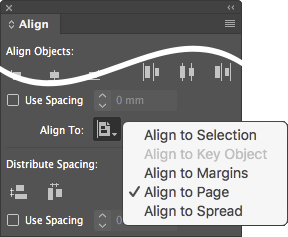
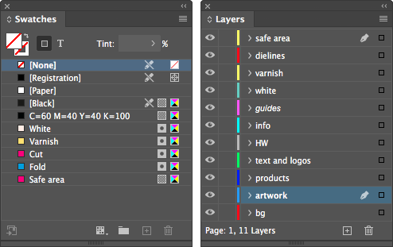

# Indentz

Collection of InDesign scripts for simple and repetitive tasks. Many are designed to be run through a shortcut (you can found a configuration suggestion in the [Shortcuts](#shortcuts) section). Some are intended to be run in the [**`batch_convert.jsx`**](https://creativepro.com/files/kahrel/indesign/batch_convert.html) script by Peter Kahrel.

## Description

### **AlignTo** series

Align selected object(s) to the top/bottom/left/right/center of the reference defined by the **Align To** setting. With **`ToggleAlignTo.jsx`** you can toggle the alignment to the item, margins, page or spread (just run it repeatedly). **`ResetAlignTo.jsx`** resets the setting to default.

The idea is to assign them to the numeric keypad for easy usage, otherwise it doesn't make much sense.

### **DocCleanup.jsx** / **DocDefaults.jsx**

These are two scripts meant to be used together – one "cleans", the other "prepares the ground".

First, they change several settings according to my preferences:

> **Rulers:** Reset Zero Point \
> **Rulers Units:** Millimeters \
> **View:** Show Rulers \
> **View:** Show Frame Edges \
> **Document Intent:** Print \
> **Transparency Blend Space:** CMYK \
> **CMYK Profile:** ISO Coated v2 (ECI) \
> **RGB Profile:** sRGB IEC61966-2.1 \
> **Grids & Guides:** Show Guides \
> **Grids & Guides:** Unlock Guides \
> **Guides & Pasteboard: Margins:** H 150 mm, V 25 mm \
> **Guides & Pasteboard: Preview Background:** Light Gray \
> **Keyboard Increments: Cursor Key:** 0.2 mm \
> **Keyboard Increments: Size/Leading:** 0.5 pt \
> **Keyboard Increments: Baseline Shift:** 0.1 pt \
> **Keyboard Increments: Kerning/Tracking:** 5/1000 em \
> **Pages:** Allow Document Pages to Shuffle \
> **Layers:** Ungroup Remembers Layers \
> **Layers:** Paste Remembers Layers \
> **Transform Reference Point:** Center \
> **Type Options:** Use Typographer's Quotes \
> **Type Options:** Apply Leading to Entire Paragraphs

After which:

* **`DocCleanup.jsx`** cleans up unused swatches/layers/pages, unlocks all items, resets their scaling to 100% & removes all guides.

* **`DocDefaults.jsx`** creates several swatches & layers, replaces some missing or unwanted fonts (it runs **`CleanupFonts.jsx`**), and sets the page geometry from the filename (it runs **`PageSizeFromFilename.jsx`**).

  

  The script also merges several similar layers, as follows:

  Layer | Merged to
  :--- | :---
  Rahmen, Vis. area, Visible area, Visible, Vizibil | `safe area`
  cut lines, Cut, decoupe, die cut, diecut, Stanz, Stanze | `dielines`
  UV, Varnish | `varnish`
  HW Logo, Logo HW, hw, WH, WHW | `HW`
  Copy, Text, TEXT, TEXTES, TXT, Type | `text and logos`
  Artwork, AW, Layer 1, Calque 1, Ebene 1, Elemente, Layout, Layouts | `artwork`
  background, BACKGROUND, BG, HG, Hintergrund | `bg`

### **CleanupFonts.jsx**

Replaces several missing or unwanted fonts with equivalents from a list. The list is a 4 column TSV *(tab-separated values)* file with the same name as the script ([**`CleanupFonts.txt`**](../cleanup/CleanupFonts.txt)). The first line (the header) is ignored.

You can use **`ShowFonts.jsx`** to get a tab delimited list of used fonts.

### **CleanupLabels.jsx**

Sometimes objects that have a label attached *(Script Label)* are reused, which may create problems later. **`CleanupLabels.jsx`** deletes labels from a document.

### **CleanupSwatches.jsx**

Converts RGB process colors to CMYK, removes duplicates, sets every name in "C= M= Y= K=" form and deletes unused swatches. Spot colors remain unchanged.

### **FitToPage** / **FitToSpread** series

Resize one or more selected objects, without scaling them. Ordinary frames are simply resized. In order not to deform them, rotated objects, ovals, groups, etc. are clipped in a frame and this is resized. If you run the script a second time on such an object, it will restore it.

* **`FitToPage.jsx`** / **`FitToPageMargins.jsx`** / **`FitToPageBleed.jsx`** constrain the size of an object to the size of the page, the page margins, or the page bleed.

* **`FitToSpread.jsx`** / **`FitToSpreadMargins.jsx`** / **`FitToSpreadBleed.jsx`** do the same for pages grouped in a spread.

* **`FitToPageBleedForced.jsx`** and **`FitToPageSpreadForced.jsx`** resize exactly to the page or the spread bleed. They are useful, for example, for the background image.

* **`FitUndo.jsx`**: if you want to restore all objects at once.

### **ScaleToPage** series

These also work with one or more objects, but scale them proportionally, as a block.

* **`ScaleToPageSize.jsx`** and **`ScaleToPageMargins.jsx`** scale to the page size or page margins.

* The **`H`** (height) and **`W`** (width) variants scale to the height or width of the page or page margins.

### **PageSize** series

Resize the pages of the document based on the file name, page margins, or selected objects.

* **`PageSizeFromFilename.jsx`** searches the file name for pairs of numbers like "000x000" (where "000" means a group of at least one digit, followed or not by decimals, and optionally by "mm" or "cm"). If only one pair is found, it will be the size of the page. If two are found (e.g., "000x000_000x000"), the larger pair will be the page size, the smaller pair the visible/safe area size. If followed by a one- or two-digit sequence, this is considered bleed.

  Examples:
  > Filename1_**1400x400_700x137_5**mm.indd \
  > Filename2_**597x517_577x500.5_3**mm V4.indd

* **`PageSizeFromMargins.jsx`** resizes each page to its margins.

* **`PageSizeFromSelection.jsx`** resizes the current page to the selected objects (similar to **Artboards > Fit to Selected Art** in Illustrator).

* **`PageMarginsFromSelection.jsx`** sets the page margins to the selected objects.

### **TextAutosize.jsx**

Fits the frame to the text and sets it to auto-size. You can control where the auto-sizing reference point will be by setting **Paragraph Alignment** for the horizontal axis, and **Vertical Justification** for the vertical axis:

  **Vertical Justification** | **¶ Align left** | **¶ Align center** | **¶ Align right**
  :--- | :---: | :---: | :---:
  *Top* |  |  | 
  *Center* |  |  | 
  *Bottom* |  |  | 

**Auto-Sizing Type** will be set to *Height and width* if the text has only one line. If it has multiple lines, the first run will set it to *Height only*, the second run to *Height and width* (in which case care must be taken that the lines are broken manually).

### **Print** series

These are making several preparations for export and can be run in **`batch_convert.jsx`**.

* **`PrepareForPrint.jsx`** does the following:
  * hides the `safe area` layer;
  * moves UV markings from `varnish` to separate spreads;
  * moves the dielines from `dielines` to separate spreads.

* **`SafeArea.jsx`** creates a frame the size of the page margins on the `safe area` layer. Its color is a swatch, `Safe area`, which if it does not already exist will be created with the value "C=0 M=100 Y=0 K=0".

* **`SafeAreaHideLayer.jsx`** and **`SafeAreaShowLayer.jsx`** hide or show `safe area`.

The scripts detect alternative layer names like `visible`, `vizibil`, `vis. area` for `safe area`, or `diecut`, `die cut`, `cut lines`, `stanze` for `dielines`.

### **QR.jsx**

Adds a QR code on the bottom left corner of each page, or saves it in a separate file. It has two operating modes, manually or batch:

* **Manually:** It asks for the QR text and adds the code on the page or in a separate file.

* **Batch:** If a file named `QR.txt` is found in the same folder, it reads the codes from it. It must be a 2 column TSV *(tab-separated values)* file; the first column is the filename, the second the QR code. The first line (the header) is ignored:

  Filename | @QR
  :--- | :---
  **`Filename1_1400x400_700x137_5mm_QR.indd`** | FILE1 1400x400_700x137
  **`Filename2_597x517_577x500.5_3mm V4_QR.indd`** | FILE2 597x517_577x500.5

You can use "|" for breaking the lines manually.

### **ZoomToSelection.jsx**

Similar to **Fit Selection in Window** (⌥⌘=), but with some improvements:

* brings the selection a little closer;
* if the cursor is in the text, zooms on the whole frame;
* without anything selected zooms on the spread.

### Miscellaneous

* **`PageRatios.jsx`** calculates the ratio of each page and displays it in the upper left corner.

* **`ShowFonts.jsx`** shows all fonts used in the current document.

* **`ShowProfiles.jsx`** shows all color profiles available to InDesign.

* **`ShowProperties.jsx`** shows properties and methods of a selected object (useful for debugging).

## Shortcuts

Script | Fn | Script | Fn | Script | Fn
:--- | ---: | :--- | ---: | :--- | ---:
**`AlignToTL.jsx`** | Num7 | **`AlignToT.jsx`** | Num8 | **`AlignToTR.jsx`** | Num9
**`AlignToL.jsx`** | Num4 | **`AlignToC.jsx`** | Num5 | **`AlignToR.jsx`** | Num6
**`AlignToBL.jsx`** | Num1 | **`AlignToB.jsx`** | Num2 | **`AlignToBR.jsx`** | Num3
**`ToggleAlignTo.jsx`** | Num0 | **`ResetAlignTo.jsx`** | ⌃Num0
**`DocCleanup.jsx`** | F2 | **`DocDefaults.jsx`** | ⌥F2 | **`CleanupSwatches.jsx`** | ⇧F2
**`FitToPage.jsx`** | F11 | **`FitToPageMargins.jsx`** | ⌥F11 | **`FitToPageBleed.jsx`** | ⇧F11
||||| **`FitToPageBleedForced.jsx`** | ⇧⌘F11
**`FitToSpread.jsx`** | F12 | **`FitToSpreadMargins.jsx`** | ⌥F12 | **`FitToSpreadBleed.jsx`** | ⇧F12
||||| **`FitToSpreadBleedForced.jsx`** | ⇧⌘F12
**`ScaleToPageSize.jsx`** | F5 | **`ScaleToPageMargins.jsx`** | ⌥F5
**`TextAutosize.jsx`** | F6 | **`QR.jsx`** | F9 | **`ZoomToSelection.jsx`** | F4

## Installation

1. Open **Window > Utilities > Scripts**.
2. Right-click on folder **User** and select **Reveal in Finder/Explorer**.
3. Copy files to this folder.

## License

Some of the code contained in this repository is based on blog posts, forum posts, or tutorials by Dave Saunders, Marc Autret, Peter Werner, Richard Harrington, and Peter Kahrel. The rest of the code is released under the MIT License (see [LICENSE.txt](../LICENSE.txt)).

Please send me an e-mail at \<jpeg AT basement.ro\> or [report an issue](https://github.com/pchiorean/Indentz/issues) on Github if you encounter problems or have any suggestions.

README.md • 18 August 2020.
