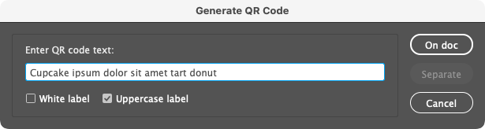

# Indentz

<small>[Cleanup](#cleanup) | [Layout](#layout) | [Align](#align) | [Fit](#fit) | [Scale](#scale) | [Proxy](#proxy) | [File](#file) | [Export](#export) | [View](#view) | [Miscellaneous](#miscellaneous) | [Install](#install) | [About](#about)</small>

This is a collection of InDesign scripts for various simple and repetitive tasks.

As an artworker, I often have to perform repeated, tedious, or time-consuming operations. Working from home during the Covid lockdown, I used the extra time learning the (now ancient) Extendscript 'art'. ;) At first, there were a couple of scripts I needed, but over time the collection grew. They are simple scripts adapted to my current workflow, and I tried to make them as generic as possible ([suggestions](https://github.com/pchiorean/Indentz/discussions) are welcome). I'm a big fan of shortcuts, so there are suggestions for Mac below (unfortunately they must be added manually from **Edit ‣ Keyboard Shortcuts ‣ Product Area ‣ Scripts**).

The code was developed and tested in Adobe InDesign CC 2020–2022 on Mac (but I mostly used [InDesign ExtendScript API 8.0](https://www.indesignjs.de/extendscriptAPI/indesign8/) for compatibility with CS6). I'm a graphic designer, not a programmer, so do expect oversights and bugs (please create an [issue](https://github.com/pchiorean/Indentz/issues) if you encounter one, though).

---

## Usage

### Cleanup

Defaults and cleanup.

#### **`DefaultPrefs`**
Sets some preferences for the current document.

<strong>Details</strong>

**Application:**
> **Preferences ‣ General:** Prevent Selection of Locked Objects\
> **Preferences ‣ Display Performance:** Preserve Object-Level Display Settings\
> **Preferences ‣ File Handling:** Always Save Preview Images with Documents\
> **View ‣ Screen Mode:** Normal\
> **View ‣ Grids & Guides:** Snap to Guides; Smart Guides\
> **Windows ‣ Layers:** Ungroup Remembers Layers; Paste Remembers Layers\
> **Windows ‣ Objects & Layout ‣ Transform:** Reference Point: Center; Adjust Stroke Weight when Scaling; Adjust Effects when Scaling\
> **Windows ‣ Output ‣ Preflight:** Off

**Document:**
> **Adjust Layout:** Off\
> **Document Intent:** Print\
> **Rulers:** Zero Point: Reset\
> **Preferences ‣ Type:** Use Typographer's Quotes; Apply Leading to Entire Paragraphs\
> **Preferences ‣ Units & Increments ‣ Keyboard Increments:** Cursor Key: 0.2 mm; Size/Leading: 0.5 pt; Baseline Shift: 0.1 pt; Kerning/Tracking: 5/1000 em\
> **Preferences ‣ Units & Increments ‣ Ruler Units:** Origin: Spread; Units: Millimeters\
> **Preferences ‣ Units & Increments ‣ Other Units:** Stroke: Points\
> **Preferences ‣ Grids:** Baseline Grid Color: R=230 G=230 B=230\
> **Preferences ‣ Guides & Pasteboard:** Preview Background Color: Light Gray\
> **Edit ‣ Transparency Blend Space:** Document CMYK\
> **Edit ‣ Color Settings ‣ Working Spaces**; RGB Profile: sRGB IEC61966-2.1; CMYK Profile: ISO Coated v2 (ECI), fallback to Coated FOGRA39 (ISO 12647-2:2004)\
> **View:** Show Rulers\
> **View ‣ Extras:** Show Frame Edges\
> **View ‣ Grids & Guides:** Show Guides; Unlock Guides; Snap to Guides\
> **Windows ‣ Color:** Fill: None; Stroke: None\
> **Windows ‣ Effects:** Blending Mode: Normal; Opacity: 100%\
> **Windows ‣ Output ‣ Attributes:** Nonprinting: Off\
> **Windows ‣ Pages:** Allow Document Pages to Shuffle\
> **Windows ‣ Type & Tables ‣ Paragraph:** Shading: Off

#### **`DefaultLayers`**
Adds a set of layers defined in a TSV data file named **`layers.tsv`** ([sample](samples/layers.tsv)) saved _locally_ (meaning the active document folder or its parent), or as a _global default_ (on the desktop, next to the script, or in **`Indentz`** root); local files and those starting with `_` take precedence:

| Name         | Color   | Visible | Printable | Order | Variants                                           |
|:-------------|:--------|:--------|:----------|:------|:---------------------------------------------------|
| **dielines** | Magenta | yes     | yes       | above | cut\*, decoupe, die, die\*cut, stanz\*             |
| **text**     | Green   |         |           |       | copy, headline\*, hl, text\*, txt, typ?            |
| **bg**       | Red     |         |           | below | back, \*background\*, bgg, fond, hg, hintergrund\* |
| **template** | Gray    | no      | no        | below |                                                    |
| ...          |         |         |           |       |                                                    |

> **Name**: Layer name\
> **Color**: Layer color (defaults to `Light Blue`; see [**`UIColors.txt`**](misc/UIColors.txt) for color names)\
> **Visible**: `yes` or `no` (defaults to `yes`)\
> **Printable**: `yes` or `no` (defaults to `yes`)\
> **Order**: `above` or `below` existing layers (defaults to `above`)\
> **Variants**: A list of layers that will be merged with the base layer; it's case insensitive and can take simple wildcards (`?` and `*`)

<strong>Additional features</strong>

A line may also contain a _statement_:

- `@includepath` `reference/path` – defines a folder to which subsequent relative paths will refer;
- `@include` `path/to/other.tsv` – includes another TSV file at this position; `path/to` may be an absolute path, one relative to the current data file, or a path relative to `reference/path` if defined;
- `@defaults` – includes the global data file;

There's also some non-standard stuff that will confuse Excel et al.:

- Blank lines and those starting with `#` (comments) are ignored;
- The fields can be visually aligned with spaces that will be removed at processing (I use [VS Code](https://code.visualstudio.com) and [Rainbow CSV](https://marketplace.visualstudio.com/items?itemName=mechatroner.rainbow-csv));
- A very long line can be broken into multiple lines with a backslash (`\`) added at the end of each segment.

#### **`DefaultSwatches`**
Adds a set of swatches defined in a TSV data file named **`swatches.tsv`** ([sample](samples/swatches.tsv)) saved _locally_ (meaning the active document folder or its parent), or as a _global default_ (on the desktop, next to the script, or in **`Indentz`** root); local files and those starting with `_` take precedence:

| Name           | Color Model | Color Space | Values       | Variants         |
|:---------------|:------------|:------------|:-------------|:-----------------|
| **Rich Black** | process     | cmyk        | 60 40 40 100 |                  |
| **RGB Grey**   | process     | rgb         | 128 128 128  |                  |
| **Cut**        | spot        | cmyk        | 0 100 0 0    | couper, die\*cut |
| ...            |             |             |              |                  |

> **Name**: Swatch name\
> **Color Model**: `process` or `spot` (defaults to `process`)\
> **Color Space**: `cmyk`, `rgb` or `lab` (defaults to `cmyk`)\
> **Values**: a list of numbers separated by space (` `), comma (`,`), pipe (`|`) or slash (`/`):
> - 3 values in 0–255 range for RGB
> - 4 values in 0–100 range for CMYK
> - 3 values in 0–100 (L), –128–127 (A and B) range for Lab
>
> **Variants**: a list of swatches that will be replaced by the base swatch; it's case insensitive and can take simple wildcards (`?` and `*`)

You can use [**`SwatchesSave`**](#swatchessave) to save a tab delimited list of swatches from any document.

<strong>Additional features</strong>

A line may also contain a _statement_:

- `@includepath` `reference/path` – defines a folder to which subsequent relative paths will refer;
- `@include` `path/to/other.tsv` – includes another TSV file at this position; `path/to` may be an absolute path, one relative to the current data file, or a path relative to `reference/path` if defined;
- `@defaults` – includes the global data file;

There's also some non-standard stuff that will confuse Excel et al.:

- Blank lines and those starting with `#` (comments) are ignored;
- The fields can be visually aligned with spaces that will be removed at processing (I use [VS Code](https://code.visualstudio.com) and [Rainbow CSV](https://marketplace.visualstudio.com/items?itemName=mechatroner.rainbow-csv));
- A very long line can be broken into multiple lines with a backslash (`\`) added at the end of each segment.

#### **`ReplaceFonts`**
Replaces document fonts using a TSV data file named **`fonts.tsv`** ([sample](samples/fonts.tsv)) saved _locally_ (meaning the active document folder or its parent), or as a _global default_ (on the desktop, next to the script, or in **`Indentz`** root); local files and those starting with `_` take precedence:

| Old font family | Style   | New font family    | Style   |
|:----------------|:--------|:-------------------|:--------|
| **Arial**       | Regular | **Helvetica Neue** | Regular |
| **Arial**       | Bold    | **Helvetica Neue** | Bold    |
| ...             |         |                    |         |

You can use [**`ShowFonts`**](#showfonts) from [**Miscellaneous**](#miscellaneous) to get a tab delimited list of document fonts for copy-pasting.

<strong>Additional features</strong>

A line may also contain a _statement_:

- `@includepath` `reference/path` – defines a folder to which subsequent relative paths will refer;
- `@include` `path/to/other.tsv` – includes another TSV file at this position; `path/to` may be an absolute path, one relative to the current data file, or a path relative to `reference/path` if defined;
- `@defaults` – includes the global data file;

There's also some non-standard stuff that will confuse Excel et al.:

- Blank lines and those starting with `#` (comments) are ignored;
- The fields can be visually aligned with spaces that will be removed at processing (I use [VS Code](https://code.visualstudio.com) and [Rainbow CSV](https://marketplace.visualstudio.com/items?itemName=mechatroner.rainbow-csv));
- A very long line can be broken into multiple lines with a backslash (`\`) added at the end of each segment.

#### **`ReplaceLinks`** <small>⌥F8</small>
Replaces document links using a TSV data file named **`links.tsv`** ([sample](samples/links.tsv)) saved _locally_ (meaning the active document folder or its parent), or as a _global default_ (on the desktop, next to the script, or in **`Indentz`** root); local files and those starting with `_` take precedence:

| Relink to                         | Document links              |
|:----------------------------------|:----------------------------|
| **/absolute/path/to/img1.psd**    | img1_lowres.jpg, img1-rgb.* |
| **img2.psd**                      | img2.*                      |
| **`@includepath` reference/path** |                             |
| **img3.psd**                      |                             |
| **subfolder/img4.psd**            |                             |
| ...                               |                             |

> **Relink to** (also see **Additional features** below):
> - An absolute path of the form `/absolute/path/to/img1.psd`;
> - A relative path which is:
>   - relative by default to the document `Links` folder (`img2.psd`);
>   - relative to `reference/path` defined by a previous `@includepath` statement (`img3.psd` and `subfolder/img4.psd`).
> 
> **Document links:**
> - If empty, the _name_ from the first column will be used (so that if it's in the document, it will be replaced);
> - One or more document link names; it's case insensitive and can take simple wildcards (`?` and `*`).

Quoting the paths is not required.

<strong>Additional features</strong>

A line may also contain a _statement_:

- `@includepath` `reference/path` – defines a folder to which subsequent relative paths will refer;
- `@include` `path/to/other.tsv` – includes another TSV file at this position; `path/to` may be an absolute path, one relative to the current data file, or a path relative to `reference/path` if defined;
- `@defaults` – includes the global data file;

There's also some non-standard stuff that will confuse Excel et al.:

- Blank lines and those starting with `#` (comments) are ignored;
- The fields can be visually aligned with spaces that will be removed at processing (I use [VS Code](https://code.visualstudio.com) and [Rainbow CSV](https://marketplace.visualstudio.com/items?itemName=mechatroner.rainbow-csv));
- A very long line can be broken into multiple lines with a backslash (`\`) added at the end of each segment.

#### **`ReplaceSnippets`** <small>⌥F6</small>
Replaces a list of text snippets using a TSV data file named **`snippets.tsv`** ([sample](samples/snippets.tsv)) saved _locally_ (meaning the active document folder or its parent), or as a _global default_ (on the desktop, next to the script, or in **`Indentz`** root); local files and those starting with `_` take precedence:

| Find what              | Change to                 | Case sensitive | Whole word | Scope |
|:-----------------------|:--------------------------|:---------------|:-----------|:------|
| English instructions   | Deutsche anleitung        | yes            | yes        |       |
| The sample is for free | Das Sample ist kostenlos  | yes            | yes        | _DE$  |
| The sample is for free | L'échantillon est gratuit | yes            | yes        | _FR$  |
| 12.06.22               | 13.11.2022                |                |            |       |
| ...                    |                           |                |            |       |

> **Find what**: Text to be replaced (you can use [special characters](https://helpx.adobe.com/indesign/using/find-change.html#metacharacters_for_searching))\
> **Change to**: The replacement text\
> **Case sensitive**: `yes` or `no` (defaults to `yes`)\
> **Whole word**: `yes` or `no` (defaults to `yes`)\
> **Scope**: Replacement will only be done if the file name matches the [regular expression](https://regex101.com)[^1] (case sensitive)

<strong>Additional features</strong>

A line may also contain a _statement_:

- `@includepath` `reference/path` – defines a folder to which subsequent relative paths will refer;
- `@include` `path/to/other.tsv` – includes another TSV file at this position; `path/to` may be an absolute path, one relative to the current data file, or a path relative to `reference/path` if defined;
- `@defaults` – includes the global data file;

There's also some non-standard stuff that will confuse Excel et al.:

- Blank lines and those starting with `#` (comments) are ignored;
- The fields can be visually aligned with spaces that will be removed at processing (I use [VS Code](https://code.visualstudio.com) and [Rainbow CSV](https://marketplace.visualstudio.com/items?itemName=mechatroner.rainbow-csv));
- A very long line can be broken into multiple lines with a backslash (`\`) added at the end of each segment.

#### **`DocCleanup`** <small>F2</small>
It runs [**`DefaultPrefs`**](#defaultprefs); deletes unused swatches, layers and spreads; unlocks all objects and resets their scaling to 100%; optionally deletes hidden objects; resets default transparency effects; converts empty text frames to generic frames and empty frames to graphic frames; sets tight pasteboard margins.

#### **`SwatchesCleanup`** <small>⇧F2</small>
Converts process RGB swatches to CMYK and renames them to 'C= M= Y= K=' format. It also deletes unused swatches and removes duplicates. Spot colors are not changed.

#### **`DumpLayers`**
Saves a TSV file (compatible with [**`DefaultLayers`**](#defaultlayers)) containing the names and properties of the current document layers.

#### **`DumpSwatches`**
Saves a TSV file (compatible with [**`DefaultSwatches`**](#defaultswatches)) containing the names and properties of the current document swatches.

---

### Layout

Document setup – page size, margins & columns, guides.

#### **`PageSizeFromFilename`** <small>F3</small>
Sets the size of the page and the margins/visible area, getting dimensions from the file name. It looks for pairs of numbers like `000x000` (where `000` means a group of at least one digit, followed or not by decimals, and optionally by `mm` or `cm`). If only one pair is found, it sets the size of the page. If two are found (e.g., `000x000_000x000`), the larger pair sets the page size, the smaller pair the visible area. If a one- or two-digit sequence follows, it sets the bleed. Example:

| Filename                                        | Total size | Visible area | Bleed |
|:------------------------------------------------|:-----------|:-------------|:------|
| **Document1\_315x55\.indd**                     | 315×55     | –            | –     |
| **Document2\_1400x400\_700x137mm\.indd**        | 1400×400   | 700×137      | –     |
| **Document3\_597x517\_577x500.5\_3mm V4\.indd** | 597×517    | 577×500.5    | 3     |

#### **`PageSizeFromMargins`**
Resizes the current page to its margins.

#### **`PageSizeFromSelection`** <small>⇧F3</small>
Resizes the page to the selected objects.

#### **`PageMarginsFromSelection`** <small>⌥F3</small>
Sets the page margins from the selected objects.

#### **`GuidesAdd`**
If any page objects are selected, it adds guides around them.

If nothing is selected, it adds guides on page edges and inner centers (that is, the page without margins); a second run deletes them.

#### **`GuidesDelete`**
Deletes all guides from the document.

---

### Align

Align page objects with ease using the numeric keypad.

#### **`ToggleAlignTo`** <small>Num0</small>
Toggles **Align To** between selection, margins, page or spread (just run it repeatedly):

#### **`ResetAlignTo`** <small>⌃Num0</small>
Resets **Align To** to default (**Align to Selection**).

#### **`AlignTo...`**
Use the numeric keypad to instantly align the selected object to the **Align To** selection.

<strong>Shortcuts</strong>

| Left              |  Key | Center           |  Key | Right             |  Key |
|:------------------|-----:|:-----------------|-----:|:------------------|-----:|
| **AlignToTL.jsx** | Num7 | **AlignToT.jsx** | Num8 | **AlignToTR.jsx** | Num9 |
| **AlignToL.jsx**  | Num4 | **AlignToC.jsx** | Num5 | **AlignToR.jsx**  | Num6 |
| **AlignToBL.jsx** | Num1 | **AlignToB.jsx** | Num2 | **AlignToBR.jsx** | Num3 |

---

### Fit

#### **`FitToPage...`** / **`FitToSpread...`**
These scripts reframe the selected objects to the page/spread or their margins/bleed by reducing the edges of objects or clipping frames that cross the target and extending ones that touch it or are very close (in a 1% snap zone).

Rectangular frames and orthogonal lines are directly resized; rotated objects, ovals, groups, etc. are inserted into a clipping frame that is resized.

**`FitTo...Forced`** bluntly reframes an object to the target.

<strong>Shortcuts</strong>

| Page                               |    Key | Spread                               |    Key |
|:-----------------------------------|-------:|:-------------------------------------|-------:|
| **FitToPage.jsx**                  |    F11 | **FitToSpread.jsx**                  |    F12 |
| **FitToPageMargins.jsx**           |   ⌥F11 | **FitToSpreadMargins.jsx**           |   ⌥F12 |
| **FitToPageVisibleArea.jsx**       |  ⌥⇧F11 | **FitToSpreadVisibleArea.jsx**       |  ⌥⇧F12 |
| **FitToPageBleed.jsx**             |   ⇧F11 | **FitToSpreadBleed.jsx**             |   ⇧F12 |
| **FitToPageForced.jsx**            |   ⌘F11 | **FitToSpreadForced.jsx**            |   ⌘F12 |
| **FitToPageMarginsForced.jsx**     |  ⌥⌘F11 | **FitToSpreadMarginsForced.jsx**     |  ⌥⌘F12 |
| **FitToPageVisibleAreaForced.jsx** | ⌥⇧⌘F11 | **FitToSpreadVisibleAreaForced.jsx** | ⌥⇧⌘F12 |
| **FitToPageBleedForced.jsx**       |  ⇧⌘F11 | **FitToSpreadBleedForced.jsx**       |  ⇧⌘F12 |

**Note:** `F11` page, `F12` spread; `⌥` margins, `⌥⇧` visible area, `⇧` bleed; `⌘` forced.

#### **`TextAutosize`** <small>F6</small>
Auto-sizes the selected text frames to their content. It's designed to be run repeatedly.

The level is increased from **None** to **Height Only** and from **Height Only** to **Height and Width** (single lines are always set **Height and Width**). The reference point is set by the first paragraph alignment and the text frame vertical justification:

| <small>Paragraph Alignment → ↓ Vertical Justification</small> |  |  |  |
| :-: | :-: | :-: | :-: |
|  |  |  |  |
|  |  |  |  |
|  |  |  |  |

**Note:** A second run will preserve the current auto-sizing if only the alignment is different.

---

### Scale

#### **`ScaleToPageSize`** / **`ScaleToPageMargins`** / **`ScaleToSpreadBleed`**
Scales the selected objects to the page size, page margins, or spread bleed. All objects are scaled together, as a group.

The **`ScaleTo...H`** and **`ScaleTo...W`** variants scale to the height or width of their target.

<strong>Shortcuts</strong>

| Page                     | Key | Page margins                |  Key | Spread bleed                |  Key |
|:-------------------------|----:|:----------------------------|-----:|:----------------------------|-----:|
| **ScaleToPageSize.jsx**  |  F5 | **ScaleToPageMargins.jsx**  |  ⌥F5 | **ScaleToSpreadBleed.jsx**  |  ⇧F5 |
| **ScaleToPageSizeH.jsx** | ⌃F5 | **ScaleToPageMarginsH.jsx** | ⌃⌥F5 | **ScaleToSpreadBleedH.jsx** | ⌃⇧F5 |

---

### Proxy

#### **`SetRefPoint...`**
Use the numeric keypad to set the reference point used for transformations (similar to clicking the little proxy squares in the **Control** palette):

<strong>Shortcuts</strong>

| Left                  |   Key | Center               |   Key | Right                 |   Key |
|:----------------------|------:|:---------------------|------:|:----------------------|------:|
| **SetRefPointTL.jsx** | ⌃Num7 | **SetRefPointT.jsx** | ⌃Num8 | **SetRefPointTR.jsx** | ⌃Num9 |
| **SetRefPointL.jsx**  | ⌃Num4 | **SetRefPointC.jsx** | ⌃Num5 | **SetRefPointR.jsx**  | ⌃Num6 |
| **SetRefPointBL.jsx** | ⌃Num1 | **SetRefPointB.jsx** | ⌃Num2 | **SetRefPointBR.jsx** | ⌃Num3 |

---

### File

#### **`FilesToSpreads`**
Combines the open documents, sorted alphabetically.

#### **`SpreadsToFiles`**
Saves each spread of the active document to a separate file.

If the file name has a suffix equal in length to the number of spreads, it will be used as the index list; for example a document with three spreads named **`Document_ABC.indd`** will be split into **`Document_A.indd`** / **`Document_B.indd`** / **`Document_C.indd`**; otherwise, the script will ask for an index list for naming files, like `-123`, where `-` is the separator and `123` is the index list.

The index will be placed where the first `#` is detected, or at the end of the file name.

#### **`LayersToSpreads`**
Moves all layers of the active document to separate spreads (the document must have a single spread).

You can use **`SpreadsToFiles`** to save them in separate documents.

---

### Export

#### **`QuickExport`** <small>⌃E</small>
Exports to PDF all opened documents or, with nothing opened, all documents from a folder.

For convenience, some export options can be easily changed from the preset settings: resolution, export as pages/spreads, include crop marks, page information, slug area, and you can set a custom bleed.

There are two export presets that can be used simultaneously or one at a time:

The text from the **Suffix** field will be appended to the exported file name (everything in the preset name after the last `_` will be autodetected as suffix).

If **Sort files by suffix into subfolders** is checked, subfolders will be created from the suffix (the text after `+` is ignored[^2]).

It can also run a JavaScript or AppleScript before exporting, e.g., one of the following:

#### **`MarkVisibleArea`**
Creates a frame the size of the page margins on the **visible area** layer. It will use the **Visible area** swatch, which will be created with the values R=255 G=180 B=0 if it doesn't exist.

#### **`PrepareForExport`**
Hides **covered areas**, **visible area**, **safety margins**, **safe area**, **segmentation**, **guides**, and all layers starting with either a dot or a hyphen; moves all page objects from **varnish**, **uv**, **foil**, **silver** and **white** to separate spreads.

#### **`ShowDNPLayers`** / **`HideDNPLayers`**
Shows or hides the following _do-not-print_ layers: **covered areas**, **visible area**, **\*vi?ib\***, **vis?\***, **safety margins**, **safe area**, **segmentation**, **rahmen** and **sicht\***, and all layers starting with either a dot or a hyphen.

---

### View

#### **`TileAll`** <small>⇧F4</small>
Invokes **Window ‣ Arrange ‣ Tile All Vertically** or **Tile All Horizontally**, depending on the current spread orientation.

#### **`ZoomToSelection`** <small>F4</small>
It resembles **Fit Selection in Window** **<small>(⌥⌘=)</small>**, but with some changes:

- Brings the selection a little closer[^3];
- If the cursor is in a text frame, zooms on the whole frame;
- Without anything selected zooms on the current spread.

#### **`ZoomToSpreads`** <small>⌥F4</small>
Zooms on the first 3 spreads.

---

### Miscellaneous

#### **`Clip`** <small>Num\*</small>
To handle some objects it is sometimes useful to temporarily insert them into a container (clipping frame). The script inserts the selected objects into a clipping frame or restores them if they are already clipped.

**Note:** It uses the clipboard, so make sure you don't lose anything important.

#### **`ClipUndo`** <small>⌃Num\*</small>
Releases one or several objects from their clipping frames (you can select any objects, it will only release the clipped ones). If nothing is selected, it will release all clipped objects.

#### **`LabelPage`**
Adds a custom label on the current page slug, on the **info** layer.

#### **`LabelPageRatios`**
Adds a label with the page aspect ratio, on the slug of each page, on the **info** layer.

#### **`LabelsCleanup`**
Sometimes objects that have a script label attached are reused, which may create problems later. The script deletes the labels of the selected objects or all objects in the document if nothing is selected.

#### **`QR`** <small>F9</small>

Adds a QR code on each spread of the active document or to separate PDF files[^4]:

The code looks like this:

|             On document             |             On file              |
|:-----------------------------------:|:--------------------------------:|
|  |  |

If the document name ends with a separator (space/dot/underline/hyphen) followed by a sequence of digits or letters equal to the number of spreads, the code of each spread will have the appropriate suffix; when separate files are generated, they will be named appropriately (e.g., for **`Document_ABC.indd`** with three spreads, **`Document_A_QR.pdf`**, **`Document_B_QR.pdf`** and **`Document_C_QR.pdf`** will be generated).

You can insert `|` for manually splitting the label into several lines.

#### **`QRBatch`** <small>⇧F9</small>
Does the same thing as **`QR`** but in a non-interactive way: retrieves a list of codes from a TSV data file named **`qr.tsv`** ([sample](samples/qr.tsv)) and adds them to existing documents or creates separate files (the suffix thing applies here as well):

| Filename           | Code   | On doc |
|:-------------------|:-------|:------:|
| **Document 1**     | Code 1 |   +    |
| **Document 2_ABC** | Code 2 |   +    |
| **Document 3_AC**  | Code 3 |        |
| ...                |        |        |

> **Filename**: document name\
> **Code**: any string\
> **On doc**: any string: on existing document; empty or missing: on separate file

The TSV file must be saved locally (in the active document folder); files starting with `_` take precedence. Blank lines and those starting with `#` are ignored (this will confuse Excel).

You can insert `|` for manually splitting the label into several lines.

#### **`ShowFonts`**
Shows all fonts used in the current document.

#### **`ShowProfiles`**
Shows all color profiles available to InDesign.

#### **`ShowProperties`** <small>F1</small>
Shows properties and methods of a selected object.

## Install
1. Clone or download from **Code ‣ Download ZIP**. The repository uses dynamically linked libraries from **`lib/`**, so the folder structure should be preserved; if you prefer stand-alone scripts, download the latest [release](https://github.com/pchiorean/Indentz/releases), where they are statically linked.
2. Open **Window ‣ Utilities ‣ Scripts**.
3. Right-click on folder **User** and select **Reveal in Finder/Explorer**.
4. Copy **Indentz** to this folder.

## About

All scripts are created by me unless otherwise noted.

© 2020-2022 Paul Chiorean \<jpeg AT basement.ro\>.\
The code is released under the MIT License (see [LICENSE.txt](LICENSE.txt)).

The code in this project would not have been possible without the InDesign ExtendScript API by [Theunis de Jong](http://jongware.mit.edu) and [Gregor Fellenz](https://www.indesignjs.de/extendscriptAPI/indesign-latest/), Mozilla's [MDN Web Docs](https://developer.mozilla.org/en-US/docs/Web/JavaScript/Reference/About), and also blog posts, forum posts, tutorials or code by [Marc Autret](https://www.indiscripts.com), [Dave Saunders](http://jsid.blogspot.com), [Peter Kahrel](https://creativepro.com/files/kahrel/indesignscripts.html), [Gregor Fellenz](https://github.com/grefel/indesignjs), [Marijan Tompa](https://indisnip.wordpress.com), [Richard Harrington](https://github.com/richardharrington/indesign-scripts) and many others.

<small>Last updated: October 24, 2022</small>

[^1]: For example, in **`Document_DE.indd`** 'The sample is for free' will be replaced with 'Das Sample ist kostenlos', and for **`Document_FR.indd`** with 'L'échantillon est gratuit'.
[^2]: For example, if the suffix is `print+diecut`, the document will be saved as **`Document_print+diecut.pdf`** in a subfolder named **`print`**.
[^3]: The variable `Z` from line 42 must be set to fit a square page at 90% of **Fit Page in Window**.
[^4]: The codes are used by a customer who needs to manage POS posters in multiple locations and languages.
