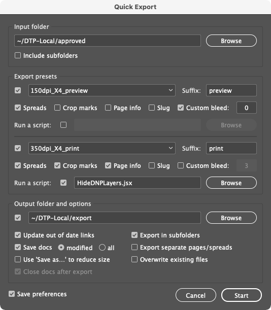

# Indentz

Collection of InDesign scripts for simple and repetitive tasks. Ideally, some of them should be invoked by a keyboard shortcut (**Edit ⏵ Keyboard Shortcuts... ⏵ Product Area ⏵ Scripts**; suggestions for macOS below each section).

---

###### [Alignment/Proxy](#alignmentproxy) | [Export](#export) | [File](#file) | [Fitting](#fitting) | [Scaling](#scaling) | [Setup](#setup) | [View](#view) | [Miscellaneous](#miscellaneous) | [Installation](#installation) | [About](#about)

---

## Description

### **Alignment/Proxy**

Make it easier to align objects or set the reference point for transformations using shortcuts.

* **`AlignTo...`** scripts align the selected object(s) to the **Align To** setting:

  

* **`ToggleAlignTo`** toggles the alignment between item, margins, page or spread (just run it repeatedly).

* **`ResetAlignTo`** resets the setting to **Align to Selection**.

* **`SetRefPoint...`** scripts change the reference point used for transformations (like clicking the little proxy squares in the **Transform** palette).

**Note:** This set is designed to be used with the numeric keypad.

<strong>Shortcuts</strong>

Alignment | | | | | | | |
:- | -: | :- | -: | :- | -: | :- | -:
**AlignToTL.jsx** | Num7 | **AlignToT.jsx** | Num8 | **AlignToTR.jsx** | Num9 | **ToggleAlignTo.jsx** | Num0
**AlignToL.jsx** | Num4 | **AlignToC.jsx** | Num5 | **AlignToR.jsx** | Num6 | **ResetAlignTo.jsx** | ⌃Num0
**AlignToBL.jsx** | Num1 | **AlignToB.jsx** | Num2 | **AlignToBR.jsx** | Num3

Proxy | | | | | |
:- | -: | :- | -: | :- | -:
**SetRefPointTL.jsx** | ⌃Num7 | **SetRefPointT.jsx** | ⌃Num8 | **SetRefPointTR.jsx** | ⌃Num9
**SetRefPointL.jsx** | ⌃Num4 | **SetRefPointC.jsx** | ⌃Num5 | **SetRefPointR.jsx** | ⌃Num6
**SetRefPointBL.jsx** | ⌃Num1 | **SetRefPointB.jsx** | ⌃Num2 | **SetRefPointBR.jsx** | ⌃Num3

---

### **Export**

* **`QuickExport`** exports to PDF all open documents or documents from a folder, with up to two configurable presets. With no documents open, you can select a folder for batch processing:

  

  The text from the **Suffix** field will be appended to the exported file name (it's autodetected if the preset ends with “_*suffix*”). If **Export in subfolders** is checked, the suffix (up to the first `+`) will also be used for the subfolder name.

  For convenience, some export options are directly accessible: export as pages/spreads, crop marks, page information, slug area; also, you can set a custom bleed.

  Optionally, it can run a JavaScript or AppleScript before exporting, e.g., one of the following:

* **`PrepareForExport`** hides the **visible area** layer and moves the dielines, white, foil and UV markings from **dielines** / **white** / **foil** / **varnish** layers to separate spreads.

* **`VisibleArea`** creates a frame the size of the page margins on the **visible area** layer. It uses the **Visible area** swatch, which if it does not exist will be created with the value “C=0 M=100 Y=0 K=0”.

* **`VisibleAreaHideLayer`** and **`VisibleAreaShowLayer`** hide or show the **visible area** layer.

**Note:** The scripts detect some alternative layers for **visible area** (**visible**, **vizibil**), **dielines** (**diecut**, **die cut**, **cut lines**, **stanze**) etc.

<strong>Shortcuts</strong>

Export | |
:- | -:
**QuickExport.jsx** | ⌃E

---

### **File**

* **`FilesToSpreads`** combines the open documents, sorted alphabetically.

* **`SpreadsToFiles`** saves each spread of the active document to a separate file. The suffix will be autodetected if the document name ends with a separator (space, dot, underscore or hyphen) followed by a sequence of digits or letters equal with the number of spreads (e.g., a document `file_ABC.indd` with three spreads will be split in `file_A.indd`, `file_B.indd` and `file_C.indd`).

---

### **Fitting**

Resize the selected objects, without scaling. Rectangular frames are simply resized; rotated objects, ovals, groups, etc. are inserted in a clipping frame that is resized.

* **`FitToPage...`** and **`FitToSpread...`**: if the selected object is larger than the target, it will be reduced; if it is smaller but inside a 1% “snap” area, it will be enlarged.

  **`FitTo...Forced`** resize exactly to the named dimensions.

* **`TextAutosize`** auto-sizes the text frame to the content from **None** to **Height Only** and from **Height Only** to **Height and Width** (single lines are always auto-sized **Height and Width**). The first paragraph's alignment sets the frame's horizontal alignment; **Text Frame Options ⏵ Vertical Justification** sets the vertical alignment:

  | |  |  | 
  :-: | :-: | :-: | :-:
   |  |  | 
   |  |  | 
   |  |  | 

<strong>Shortcuts</strong>

FitToPage | | FitToSpread | |
:- | -: | :- | -:
**FitToPage.jsx** | F11 | **FitToSpread.jsx** | F12
**FitToPageMargins.jsx** | ⌥F11 | **FitToSpreadMargins.jsx** | ⌥F12
**FitToPageVisibleArea.jsx** | ⌥⇧F11 | **FitToSpreadVisibleArea.jsx** | ⌥⇧F12
**FitToPageBleed.jsx** | ⇧F11 | **FitToSpreadBleed.jsx** | ⇧F12
**FitToPageForced.jsx** | ⌘F11 | **FitToSpreadForced.jsx** | ⌘F12
**FitToPageMarginsForced.jsx** | ⌥⌘F11 | **FitToSpreadMarginsForced.jsx** | ⌥⌘F12
**FitToPageVisibleAreaForced.jsx** | ⌥⇧⌘F11 | **FitToSpreadVisibleAreaForced.jsx** | ⌥⇧⌘F12
**FitToPageBleedForced.jsx** | ⇧⌘F11 | **FitToSpreadBleedForced.jsx** | ⇧⌘F12

**Note:** `F11` page, `F12` spread; `⌥` margins, `⌥⇧` visible area, `⇧` bleed; `⌘` forced.

TextAutosize | |
:- | -:
**TextAutosize.jsx** | F6

---

### **Scaling**

Scale the selected objects proportionally, as a block.

* **`ScaleToPageSize/PageMargins/SpreadBleed`** scale to the page size, page margins, or spread bleed.

* The **`...H`** (height) and **`...W`** (width) variants scale to the height or width of the corresponding bounds.

<strong>Shortcuts</strong>

Scaling | |
:- | -:
**ScaleToPageSize.jsx** | F5
**ScaleToPageSizeH.jsx** | ^F5
**ScaleToPageMargins.jsx** | ⌥F5
**ScaleToPageMarginsH.jsx** | ^⌥F5

---

### **Setup**

There are two sets: one related to document preferences, layers, swatches and fonts, the other to page size and margins.

#### **Document**

* **`DefaultPrefs`** sets some preferences.

  

<strong>Details</strong>

    > **Rulers:** Reset Zero Point \
    > **Rulers Units:** Millimeters \
    > **View:** Show Rulers \
    > **View:** Show Frame Edges \
    > **Document Intent:** Print \
    > **Transparency Blend Space:** CMYK \
    > **CMYK Profile:** ISO Coated v2 (ECI) \
    > **RGB Profile:** sRGB IEC61966-2.1 \
    > **Grids & Guides:** Show Guides \
    > **Grids & Guides:** Unlock Guides \
    > **Guides & Pasteboard: Preview Background:** Light Gray \
    > **Keyboard Increments: Cursor Key:** 0.2 mm \
    > **Keyboard Increments: Size/Leading:** 0.5 pt \
    > **Keyboard Increments: Baseline Shift:** 0.1 pt \
    > **Keyboard Increments: Kerning/Tracking:** 5/1000 em \
    > **Pages:** Allow Document Pages to Shuffle \
    > **Layers:** Ungroup Remembers Layers \
    > **Layers:** Paste Remembers Layers \
    > **Transform Reference Point:** Center \
    > **Type Options:** Use Typographer's Quotes \
    > **Type Options:** Apply Leading to Entire Paragraphs

  

* **`DefaultLayers`** adds a set of layers defined in a TSV *(tab‑separated values)* file named [**`layers.txt`**](../layers.txt):

  Name | Color | Visible | Printable | Order | Variants
  :- | :-: | :-: | :-: | :-: | :-
  **dielines** | Magenta | yes | yes | above | cut\*, decoupe, die, die\*cut, stanz\*
  **template** | Gray | no | no | below
  ... |

  > **Name**: layer name \
  > **Color**: layer color (see [**`UIColors.txt`**](UIColors.txt); default `Light Blue`) \
  > **Visible**: `yes` or `no` (default `yes`) \
  > **Printable**: `yes` or `no` (default `yes`) \
  > **Order**: `above` or `below` existing layers (default `above`) \
  > **Variants**: a list of layers that will be merged with the base layer (case insensitive; `*` and `?` wildcards accepted)

  Blank lines and those prefixed with `#` are ignored. You can use backslash (`\`) at the end of long lines to split them into multiple lines.

  The TSV file can be saved locally (in the current folder or the parent folder of the active document), or as a default (on the desktop or next to the running script). Local files and files starting with `_` take precedence. You can include another file by inserting **`@path/to/file.txt`** in the desired position, or the default file with **`@default`**.

* **`DefaultSwatches`** adds a set of swatches defined in a TSV file named [**`swatches.txt`**](../swatches.txt):

  Name | Color Model | Color Space | Values | Variants
  :- | :-: | :-: | :- | :-
  **Rich Black** | process | cmyk | 60 40 40 100
  **RGB Grey** | process | rgb | 128 128 128
  **Cut** | spot | cmyk | 0 100 0 0 | couper, diecut
  ... |

  > **Name**: swatch name \
  > **Color Model**: `process` or `spot` (default `process`) \
  > **Color Space**: `cmyk`, `rgb` or `lab` (default `cmyk`) \
  > **Values**: 3 values in 0–255 range for RGB; 4 values in 0–100 range for CMYK; 3 values in 0–100 (L), -128–127 (A and B) range for Lab \
  > **Variants**: a list of swatches that will be replaced by the base swatch (case insensitive; `*` and `?` wildcards accepted)

  Blank lines and those prefixed with `#` are ignored. You can use backslash (`\`) at the end of long lines to split them into multiple lines.

  The TSV file can be saved locally (in the current folder or the parent folder of the active document), or as a default (on the desktop or next to the running script). Local files and files starting with `_` take precedence. You can include another file by inserting **`@path/to/file.txt`** in the desired position, or the default file with **`@default`**.

* **`GuidesAdd`** adds guides on pages' edges and inner centers or selected objects' edges. (It's mostly a demo script, to be customized.)

* **`GuidesDelete`** deletes all guides from the document.

* **`ReplaceFonts`** substitute fonts from a list defined in a TSV file named [**`fonts.txt`**](../fonts.txt):

  Old font | Style | New font | Style
  :- | :- | :- | :-
  **Arial** | Regular | **Helvetica Neue** | Regular
  **Arial** | Bold | **Helvetica Neue** | Bold
  ... |

  You can use **`ShowFonts`** from **Miscellaneous** to get a tab delimited list of document fonts for copy‑pasting.

  Blank lines and those prefixed with `#` are ignored. You can use backslash (`\`) at the end of long lines to split them into multiple lines.

  The TSV file can be saved locally (in the current folder or the parent folder of the active document), or as a default (on the desktop or next to the running script). Local files and files starting with `_` take precedence. You can include another file by inserting **`@path/to/file.txt`** in the desired position, or the default file with **`@default`**.

* **`ReplaceLinks`** replaces document links from a list defined in a TSV file named [**`links.txt`**](../links.txt):

  New link | Old links
  :- | :-
  **link1.psd** | link1.jpg
  **path/to/link2.psd** | link2.jpg, link2.png
  ... |

  Blank lines and those prefixed with `#` are ignored. You can use backslash (`\`) at the end of long lines to split them into multiple lines.

  The TSV file can be saved locally (in the current folder or the parent folder of the active document), or as a default (on the desktop or next to the running script). Local files and files starting with `_` take precedence. You can include another file by inserting **`@path/to/file.txt`** in the desired position, or the default file with **`@default`**.

* **`SwatchesSave`** saves document's swatches to a TSV file compatible with **`DefaultSwatches`**.

* **`SwatchesCleanup`** converts process RGB swatches to CMYK, renames them to “C= M= Y= K=” form, removes duplicates and deletes unused. Spot colors are not changed.

* **`DocDefaults`** runs **`DefaultPrefs`**, **`DefaultSwatches`**, **`DefaultLayers`**, **`ReplaceFonts`**, **`ReplaceLinks`**, **`PageSizeFromFilename`** and sets loose pasteboard margins.

* **`DocCleanup`** runs **`DefaultPrefs`**, cleans up unused swatches, layers and pages, unlocks all items, deletes hidden items, resets scaling to 100%, converts empty text frames to generic frames and sets tight pasteboard margins.

---

#### **Layout**

* **`PageMarginsFromSelection`** sets the page margins to the selected objects.

* **`PageSizeFromFilename`** sets the size of the pages and the visible area, retrieving the information from the filename:

  Filename | Total size | Visible area | Bleed
  :- | :-: | :-: | :-:
  File1\_`1400x400`\_`700x137`\_`5`mm\.indd | 1400x400 | 700x137 | 5
  File2\_`597x517`\_`577x500.5`\_`3`mm V4\.indd | 597x517 | 577x500.5 | 3

  > It searches for pairs of numbers like `000x000` (where `000` means a group of at least one digit, followed or not by decimals, and optionally by `mm` or `cm`). If only one pair is found, it's the size of the page. If two are found (e.g., `000x000_000x000`), the larger pair it's the page size, the smaller pair the visible area. If followed by a one- or two‑digit sequence, this will be bleed.

* **`PageSizeFromMargins`** resizes the current page to its margins.

* **`PageSizeFromSelection`** resizes the page to the selected objects (similar to **Artboards ⏵ Fit to Selected Art** in Illustrator).

<strong>Shortcuts</strong>

Setup | | | |
:- | -: | :- | -:
**DocCleanup.jsx** | F2 | **PageSizeFromFilename.jsx** | F3
**DocDefaults.jsx** | ⌥F2 | **PageMarginsFromSelection.jsx** | ⌥F3
**CleanupSwatches.jsx** | ⇧F2 | **PageSizeFromSelection.jsx** | ⇧F3

---

### **View**

* **`TileAll`** invokes **Window ⏵ Arrange ⏵ Tile All Vertically** or **Tile All Horizontally**, depending on the current spread orientation.

* **`ZoomToSelection`** resembles **Fit Selection in Window** (⌥⌘=), but with some improvements:

  * brings the selection a little closer;
  * if the cursor is in the text, zooms on the whole frame;
  * without anything selected zooms on the current spread.

* **`ZoomToSpreads`** zooms on the first 3 spreads.

<strong>Shortcuts</strong>

View | |
:- | -:
**TileAll.jsx** | ⇧F4
**ZoomToSelection.jsx** | F4
**ZoomToSpreads.jsx** | ⌥F4

---

### **Miscellaneous**

* **`ClearLabels`**: Sometimes objects that have a label attached *(Script Label)* are reused, which may create problems later. The script deletes the labels of the selected objects or all objects in the document if nothing is selected.

* **`Clip`**: To handle some objects it is sometimes useful to temporarily insert them into a container *(clipping frame)*. The script inserts selected objects in a clipping frame or restores them if already clipped. It uses the clipboard, so make sure you don't lose anything important.

  **`ClipUndo`** restores one or several clipped objects at once.

* **`HW`** labels “HW” selected objects and adds a bottom guide on each page, at 10% of the height of the visible area.

* **`LabelPage`** adds a custom label on the current page slug, on the **info** layer.

* **`LabelPageRatios`** adds on the slug of each page a label with its aspect ratio, on the **info** layer.

* **`QR`** adds a QR code on each page of the active document or a separate file with the same name and the suffix “_QR”.

  **`QRBatch`** retrieves a list of codes from a TSV file named **`qr.txt`** and adds them to existing documents or creates separate files:

  Filename | Code | Doc
  :- | :- | :-:
  File 1 | Code 1 | +
  File 2 | Code 2 |
  ... |

  > **Filename**: document name \
  > **Code**: any string \
  > **Doc**: any string: on existing document; empty or missing: on separate file

  **Note:** You can insert “|” for manually splitting the text into several lines.

* **`ShowFonts`** shows all fonts used in the current document.

* **`ShowProfiles`** shows all color profiles available to InDesign.

* **`ShowProperties`** shows properties and methods of a selected object.

<strong>Shortcuts</strong>

Miscellaneous | | | | | |
:- | -: | :- | -: | :- | -:
**Clip.jsx** | Num* | **QR.jsx** | F9 | **HW.jsx** | ⇧F10
**ClipUndo.jsx** | ⌃Num* | **QRBatch.jsx** | ⇧F9 | **ShowProperties.jsx** | F1

---

## Installation

1. Open **Window ⏵ Utilities ⏵ Scripts**.
2. Right‑click on folder **User** and select **Reveal in Finder/Explorer**.
3. Copy files to this folder.

---

## About

I'm a graphic designer, not a programmer, and I created this project to simplify some monotonous tasks, so please bear with me if some things are not state-of-the-art. Feedback or suggestions are welcome.

I mostly used InDesign ExtendScript API 8.0 (compatible with InDesign CS6); I haven't checked the scripts in versions older than CC 2020. Also, I only tested them occasionally on Windows.

The code in this project would not have been possible without the InDesign ExtendScript API by [Theunis de Jong](http://jongware.mit.edu) and [Gregor Fellenz](https://www.indesignjs.de/extendscriptAPI/indesign-latest/), Mozilla's [MDN Web Docs](https://developer.mozilla.org/en-US/docs/Web/JavaScript/Reference/About), also blog posts, forum posts, tutorials or code by [Marc Autret](https://www.indiscripts.com), [Dave Saunders](http://jsid.blogspot.com), [Peter Kahrel](https://creativepro.com/files/kahrel/indesignscripts.html), [Gregor Fellenz](https://github.com/grefel/indesignjs), [Marijan Tompa](https://indisnip.wordpress.com), [Richard Harrington](https://github.com/richardharrington/indesign-scripts) and many others.

© 2020-2021 Paul Chiorean \<jpeg AT basement.ro\>. \
The code is released under the MIT License (see [LICENSE.txt](LICENSE.txt)).

README.md • October 29, 2021
