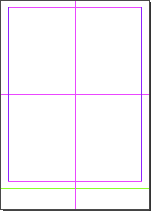
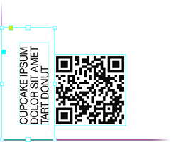

# Indentz

This is a collection of InDesign scripts that I use to improve my DTP workflow, which often involves repetitive, tedious, or time-consuming operations. The scripts are not designed for long documents with flowing text, because I usually work with single-page documents. With few exceptions, these are simple scripts, with minimal interaction, and, apart from warnings, do their job silently. I use a series of [keyboard shortcuts](https://creativepro.com/assigning-keyboard-shortcuts-scripts/) to run them (suggestions below). The code is tested in Adobe InDesign CC 2020–2024 on Mac.

I'm a graphic designer, not a programmer (I started doing this at the beginning of the Covid-19 pandemic), so be prepared for bugs and oversights (please create an [issue](https://github.com/pchiorean/Indentz/issues) if you encounter one, though!).

## Preamble

Most scripts require at least one open document, and some require at least one object to be selected.

**Data files:** Several scripts get their input from external TSV files, first looking for a _local_ one (in the current folder or the parent folder of the active document), then a _default_ one (on the desktop, next to the running script, or in the **Indentz** root). They also match local files starting with `_`, which take precedence.

These TSV data files can have several non-standard features that will confuse Excel et al.:

- Blank lines are ignored; everything after a `#` is ignored (comments);
- The fields can be visually aligned with spaces that will be ignored at processing (I use [VS Code](https://code.visualstudio.com) with [Rainbow CSV](https://marketplace.visualstudio.com/items?itemName=mechatroner.rainbow-csv) when creating/editing TSVs);
- A very long line can be broken into multiple lines with a backslash (`\`) added at the end of each segment.
- A line may also be a directive:
  - **`@includepath`** `base/path/` – sets a base path for subsequent **`@include`** directives with relative paths; the path may be absolute or relative (if relative, it's always to the data file folder);
  - **`@include`** `path/to/another.tsv` – includes another TSV file at this position; the path may be absolute or relative (if relative and a `base/path/` was not already defined, it also defaults to the data file folder);
  - **`@defaults`** – includes the _default_ data file (see above).

**Visible area** or **Safety area:** These are frames that I use to visually mark the visible part of a layout or its safety/type area; several scripts take them into account for some actions. The frames can be created manually (named **\<visible area\>** or **\<safety area\>**), or can be automatically generated from the document name or page margins (more details below). The **Export** section contains scripts that can show or hide these frames.

**Libs:** Many scripts use dynamically linked functions from **`lib/`**, which means that the folder structure should be preserved after downloading the repository. If you download [releases](https://github.com/pchiorean/Indentz/releases), which are statically linked, you can use any script stand-alone[^1].

Because there are quite a lot of files, I've sorted them into groups related to their target: the document; pages or spreads; objects on page; the application environment.

## Document

_Scripts that work at the document level._

### Assets

_Layers, swatches, fonts, links etc._

#### **`AddLayers.jsx`**

Adds a set of layers defined in a 7-columns [TSV data file](#tsv) named **`layers.tsv`** ([sample](samples/layers.tsv)):

| Name              | Color      | Visible | Printable | Locked | Order  | Variants                                           |
|:------------------|:-----------|:--------|:----------|:-------|:-------|:---------------------------------------------------|
| **.visible area** | Yellow     | yes     | yes       | yes    | above  | nicht sicht\*, rahmen, sicht\*, \*vi?ib\*          |
| **dielines**      | Magenta    | yes     | yes       | yes    | above  | cut\*, decoupe, die, die\*cut, stanz\*             |
| **text**          | Green      |         |           |        |        | copy, headline\*, hl, text\*, txt, typ?            |
| **artwork**       | Light Blue | no      | yes       |        | above  | aw, design, element?, layout\*                     |
| **bg**            | Red        |         |           |        | below  | back, \*background\*, bgg, fond, hg, hintergrund\* |
| **.reference**    | Black      | no      | no        | yes    | bottom | refer\*, template, vorlage                         |
| ...               |            |         |           |        |        |                                                    |

**Legend:**

- **Name**: Layer name;
- **Color**: Layer color (defaults to `Light Blue`);
- **Visible**: `yes` or `no` (defaults to `yes`);
- **Printable**: `yes` or `no` (defaults to `yes`);
- **Locked**: `yes` or `no` (defaults to `yes`);
- **Order**: `above` or `below` existing layers, or `top`/`bottom` (defaults to `above`);
- **Variants**: A list of layers separated by commas that will be merged with the base layer; it's case insensitive and can take simple wildcards (`?` for exactly one character and `*` for zero or more characters).

_Tip:_ The script will display a report if run while holding down the **Ctrl** key.

#### **`AddSwatches.jsx`**

Adds a set of swatches defined in a 5-columns [TSV data file](#tsv) named **`swatches.tsv`** ([sample](samples/swatches.tsv)):

| Name             | Color Model | Color Space | Values       | Variants              |
|:-----------------|:------------|:------------|:-------------|:----------------------|
| **Rich Black**   | process     | cmyk        | 60 40 40 100 |                       |
| **RGB Grey**     | process     | rgb         | 128 128 128  |                       |
| **Cut**          | spot        | cmyk        | 0 100 0 0    | couper, die\*cut      |
| **Visible area** | spot        | rgb         | 255 180 0    | safe\*area, vis\*mark |
| ...              |             |             |              |                       |

**Legend:**

- **Name**: Swatch name;
- **Color Model**: `process` or `spot` (defaults to `process`);
- **Color Space**: `cmyk`, `rgb` or `lab` (defaults to `cmyk`);
- **Values**: a list of numbers separated by space (` `), comma (`,`), pipe (`|`) or slash (`/`):
  - 3 values in 0–255 range for RGB;
  - 4 values in 0–100 range for CMYK;
  - 3 values in 0–100 (L), –128–127 (A and B) range for Lab.
- **Variants**: a list of swatches separated by commas that will be replaced by the base swatch; it's case insensitive and can take simple wildcards (`?` for exactly one character and `*` for zero or more characters).

_Tip:_ The script will display a report if run while holding down the **Ctrl** key.

_Tip:_ You can use [**`DumpSwatches.jsx`**](#dumpswatchesjsx) to save a tab delimited list of swatches from the active document.

#### **`ReplaceFonts.jsx`**

Replaces document fonts using a 4-columns [TSV data file](#tsv) named **`fonts.tsv`** ([sample](samples/fonts.tsv)):

| Old font family | Style   | New font family    | Style   |
|:----------------|:--------|:-------------------|:--------|
| **Arial**       | Regular | **Helvetica Neue** | Regular |
| **Arial**       | Bold    | **Helvetica Neue** | Bold    |
| ...             |         |                    |         |

_Tip:_ The script will display a report if run while holding down the **Ctrl** key.

_Tip:_ You can use [**`ShowFonts.jsx`**](#showfontsjsx) from [**Miscellaneous**](#miscellaneous) to get a tab delimited list of document fonts.

#### **`ReplaceLinks.jsx`**

Replaces document links using a 2-columns [TSV data file](#tsv) named **`links.tsv`** ([sample](samples/links.tsv)):

| Relink to                       | Links                        |
|:--------------------------------|:-----------------------------|
| **/absolute/path/to/img1.psd**  | img1_lowres.jpg, img1-rgb.\* |
| **img2.psd**                    | img2.\*                      |
| **`@includepath` `base/path/`** |                              |
| **img3.psd**                    |                              |
| **subfolder/img4.psd**          |                              |
| ...                             |                              |

**Legend:**

- **Relink to:**
  - An absolute path of the form `/absolute/path/to/img1.psd`;
  - A relative path which is:
    - relative by default to the document **`Links`** folder (e.g., `img2.psd`);
    - relative to the `base/path/` defined by a previous **`@includepath`** directive (e.g., `img3.psd` and `subfolder/img4.psd`).
- **Links:** A list of file names separated by commas, that if present in the document, will be replaced with the link from the first column; it's case insensitive and can take simple wildcards (`?` for exactly one character and `*` for zero or more characters). The script will also automatically match the _file names_ from the first column, so **Links** can be empty – e.g., if `img4.psd` appears in the document, it will be replaced by the one in `subfolder/` (which is actually `base/path/subfolder/`, because the **`@includepath`** above it redefines the base path).

_Note:_ If a file name contains commas you must quote it.

_Tip:_ The script will display a report if run while holding down the **Ctrl** key.

_Tip:_ You can use [**`DumpLinks.jsx`**](#dumplinksjsx) to save a list of links from the active document.

_Suggested shortcut:_ `⌥F8`

#### **`ReplaceTextSnippets.jsx`**

Replaces a list of text snippets using a 5-columns [TSV data file](#tsv) named **`snippets.tsv`** ([sample](samples/snippets.tsv)):

| Find what              | Change to                 | Case sensitive | Whole word | Scope |
|:-----------------------|:--------------------------|:---------------|:-----------|:------|
| English instructions   | Deutsche anleitung        | yes            | yes        |       |
| The sample is for free | Das Sample ist kostenlos  | yes            | yes        | _DE?$ |
| The sample is for free | L'échantillon est gratuit | yes            | yes        | _FR?$ |
| 12.06.22               | 13.11.2022                |                |            |       |
| ...                    |                           |                |            |       |

**Legend:**

- **Find what**: Text to be replaced (you can use [special characters](https://helpx.adobe.com/indesign/using/find-change.html#metacharacters_for_searching));
- **Change to**: The replacement text;
- **Case sensitive**: `yes` or `no` (defaults to `yes`);
- **Whole word**: `yes` or `no` (defaults to `yes`);
- **Scope**: Replacement will only be done if the document name matches the [regular expression](https://regex101.com) (case sensitive).

**Example:** 'The sample is for free' will be replaced with 'Das Sample ist kostenlos' in **`Document_DE.indd`**, and with 'L'échantillon est gratuit' in **`Document_FR.indd`**.

_Tip:_ The script will display a report if run while holding down the **Ctrl** key.

_Suggested shortcut:_ `⌥F6`

#### **`ResetLayers.jsx`**

Resets the visible/printable/locked state of the document layers using the same data file used by [**`AddLayers.jsx`**](#addlayersjsx).

#### **`DumpLayers.jsx`**

Saves a TSV file (compatible with [**`AddLayers.jsx`**](#addlayersjsx)) containing the names and properties of the active document layers.

#### **`DumpLinks.jsx`**

Saves a TSV file (compatible with [**`ReplaceLinks.jsx`**](#replacelinksjsx)) containing the links of the active document.

#### **`DumpSwatches.jsx`**

Saves a TSV file (compatible with [**`AddSwatches.jsx`**](#addswatchesjsx)) containing the names and properties of the active document swatches.

---

### Export

_Document export and related._

#### **`QuickExport.jsx`**

For a long time, I exported documents to PDF with [Batch Convert](https://creativepro.com/files/kahrel/indesign/batch_convert.html), Peter Kahrel's 'Swiss army knife', but I needed a tool tailored to my specific needs. My workflow requires frequent changes to export settings, and I wanted direct access to some of them (the native export dialog has quite a few tabs and options!). There are two selectable workflows, with the options grouped into several categories. I'm only reviewing the ones that aren't self-explanatory:

**Source folder:** By default, all open documents will be exported. If nothing is open, this option allows you to select a folder as the source.

**Workflow:** Active workflow(s) and their labels. At least a workflow must be active.

**Preset options:** After selecting an Adobe PDF Preset you can easily override some of its options.

**Document actions:**
- **Skip do-not-print layers** will not export layers with names beginning with a dot or a hyphen (e.g., **.safety area**); you can also define a custom list with **Edit list**.

- **Run a script** will run a JavaScript or AppleScript before exporting – e.g., one of the other scripts from this section.

**Output options:**
- **Export in a custom folder:** By default the files are exported in the same folder as the source document, but you can choose a custom one.

- **Add a suffix:** This string will be appended to the name of the exported files.\
  _Tip:_ A preset can be 'paired' with a suffix by adding it to its name after the _last_ underscore – e.g., when you select the preset `X4_350dpi_39L300_print`, the suffix will be automatically changed to `print`.

- **Sort files into subfolders by suffix**: Files will be exported in a subfolder named after the suffix, up to the first `+` character – e.g., for a suffix `print` the PDF will be exported as `print/Document_print.pdf`, and for `print+diecut` as `print/Document_print+diecut.pdf`.

- **Sort files into subfolders by date**: Files will be exported in a subfolder named `MM.DD` (current month/day).

- **Overwrite existing files:** The files will be overwritten if the destination is the same. If unchecked, the files will get unique names by incrementing their index – for example, we'll export as `Document_preview3.pdf` if there is already a `Document_preview2.pdf` in the export folder or its subfolders.

**Source update:**
- **Save modified documents:** Will update source documents after export – e.g., if you want to preserve changes made by a script.

- **Use 'Save as...' to reduce size:** This is useful for reducing the size of documents that have been modified many times (with each regular save the document grows with the latest changes).

**Global options:**
- **Upgrade [Converted] documents**: Will upgrade documents from previous versions of InDesign.

_Tip:_ The settings are saved every time you run the script, but if you keep the **Opt/Alt** key pressed while clicking **Start**, they will not be updated for the current session.

_Suggested shortcut:_ `⌃E`

#### **`PrepareForExport.jsx`**

Hides all layers starting with either a dot or a hyphen, plus a hard-coded list of _do-not-print_ layers (see above). Additionally, it moves all page objects from **varnish**, **uv**, **foil**, **silver** and **white** to separate spreads and labels the spreads.

_Tip:_ The script is designed to be run with [**`QuickExport.jsx`**](#quickexportjsx).

#### **`ShowDNPLayers.jsx`** and **`HideDNPLayers.jsx`**
Shows or hides all layers starting with either a dot or a hyphen, plus a hard-coded list of _do-not-print_ layers:

- **covered area\***
- **visible area, rahmen, sicht\*, \*vi\?ib\***
- **safe\*area, safe\*margins, segmentation**
- **fold, falz**
- **guides, grid, masuratori**

_Tip:_ The scripts are designed to be run with [**`QuickExport.jsx`**](#quickexportjsx).

---

### Housekeeping

_Defaults and cleanup._

#### **`DefaultPrefs.jsx`**

Sets some preferences for the active document. You should customize them to your workflow by editing the script (unfortunately the preferences are scattered in so many places that it's difficult to guide you).

_Note:_ Many scripts in this collection assume these settings as defaults because they suit my environment – e.g., is possible to try to scale a locked object (or guide) and the script will fail (see **Prevent Selection of Locked Objects**).

<strong>Click here for details</strong>

**Application:**
> **Preferences ‣ General:** Prevent Selection of Locked Objects\
> **Preferences ‣ Display Performance:** Preserve Object-Level Display Settings\
> **Preferences ‣ File Handling:** Always Save Preview Images with Documents\
> **View ‣ Screen Mode:** Normal\
> **View ‣ Grids & Guides:** Snap to Guides; Smart Guides\
> **Windows ‣ Layers:** Ungroup Remembers Layers; Paste Remembers Layers\
> **Windows ‣ Objects & Layout ‣ Transform:** Reference Point: Center; Adjust Stroke Weight when Scaling; Adjust Effects when Scaling\
> **Windows ‣ Output ‣ Preflight:** Off

**Document:**
> **Adjust Layout:** Off\
> **Document Intent:** Print\
> **Rulers:** Zero Point: Reset\
> **Preferences ‣ Type:** Use Typographer's Quotes; Apply Leading to Entire Paragraphs\
> **Preferences ‣ Units & Increments ‣ Keyboard Increments:** Cursor Key: 0.2 mm; Size/Leading: 0.5 pt; Baseline Shift: 0.1 pt; Kerning/Tracking: 5/1000 em\
> **Preferences ‣ Units & Increments ‣ Ruler Units:** Origin: Spread; Units: Millimeters\
> **Preferences ‣ Units & Increments ‣ Other Units:** Stroke: Points\
> **Preferences ‣ Grids:** Baseline Grid Color: R=230 G=230 B=230\
> **Preferences ‣ Guides & Pasteboard:** Preview Background Color: Light Gray\
> **Edit ‣ Transparency Blend Space:** Document CMYK\
> **View:** Show Rulers\
> **View ‣ Extras:** Show Frame Edges\
> **View ‣ Grids & Guides:** Show Guides; Unlock Guides; Snap to Guides\
> **Windows ‣ Color:** Fill: None; Stroke: None\
> **Windows ‣ Effects:** Blending Mode: Normal; Opacity: 100%\
> **Windows ‣ Output ‣ Attributes:** Nonprinting: Off\
> **Windows ‣ Pages:** Allow Document Pages to Shuffle\
> **Windows ‣ Text Wrap:** No text wrap\
> **Windows ‣ Type & Tables ‣ Paragraph:** Shading: Off

#### **`DocCleanup.jsx`**

Performs a sequence of actions designed to bring the document to an approximately 'clean' state:

- Sets some preferences (it runs [**`DefaultPrefs.jsx`**](#defaultprefsjsx));
- Unlocks all objects and resets their scaling to 100%;
- Deletes hidden objects (after confirmation);
- Deletes empty frames (after confirmation);
- Deletes unused swatches, layers and spreads;
- Converts empty text frames to generic frames;
- Converts empty frames to graphic frames;
- Resets default transparency effects;
- Resets the visible/printable/locked status of layers;
- Hides 'invisible' characters;
- Turns off URLs auto-updating;
- Sets the pasteboard margins.

_Suggested shortcut:_ `F2`

#### **`RemoveScriptLabels.jsx`**

Sometimes objects that have a script label attached are reused, which may create problems later. The script deletes the labels of the selected objects, or all objects in the document if nothing is selected.

#### **`RemoveStyles.jsx`**

Unnaplies paragraph/character/object styles from the selected objects, or all objects in the document if nothing is selected.

_Tip:_ The script will display a report if run while holding down the **Ctrl** key.

#### **`SwatchesCleanup.jsx`**

Converts process RGB swatches to CMYK and renames them to 'C= M= Y= K=' format. It also deletes unused swatches and removes duplicates. Spot colors are not changed.

It contains code written by Marc Autret, Dave Saunders and others.

_Suggested shortcut:_ `⇧F2`

---

## Page

_Scripts that work at the page/spread level._

### Guides

_Guides, labels and markings._

#### **`GuidesAdd.jsx`**

If any page objects are selected, we add guides around them.

If nothing is selected, guides are added to the page edges and the middle of the page margins. A second run deletes the guides.

_Tip:_ If **Opt** is also pressed, we'll use spread guides.

#### **`GuidesDelete.jsx`**

Deletes all guides from the document.

#### **`LabelPage.jsx`**

Adds a custom label on the current page slug, on the **info** layer (Helvetica Regular 6 pt, fill **Registration**, stroke **Paper** 0.4 pt).

**Example:**

#### **`LabelPageRatios.jsx`**

Adds on the slug of each page a label with the page size ratio, _visible area_ ratio (if defined), and page margins ratio.

#### **`MarkSafetyArea.jsx`**

Creates a frame around the page margins that visually marks the _safety area_ of a page. It's a stroked frame named **\<safety area\>** on the **.safety area** layer. It will use an existing **Safety area** swatch, or will create one with the values R=0 G=180 B=255.

_Tip:_ This script is designed to be run with [**`QuickExport.jsx`**](#quickexportjsx).

#### **`MarkVisibleArea.jsx`**

Creates a frame around the page margins that visually marks the _visible area_ of a page. It's a stroked frame named **\<visible area\>** on the **.visible area** layer. It will use an existing **Visible area** swatch, or will create one with the values R=255 G=180 B=0.

_Tip:_ This script is designed to be run with [**`QuickExport.jsx`**](#quickexportjsx).

---

### Layout

_Page size and margins._

#### **`PageMarginsFromScriptName.jsx`**

Sets the page margins and optionally a reserved area on the bottom, getting the values from the script name, in percentages of the _visible area_ or page size:

It's designed to be duplicated and renamed to customize the values, using one or two numbers separated by the `HW` keyword: the first number defines the page margins, the second one, if found, is the bottom area. `HW` can be omitted (meaning 0%), or used without a number (meaning the default 10%).

**Example:**

| Script name       | Margins | Bottom area |
|:------------------|:--------|:------------|
| **MG4.jsx**       |    4%   |      –      |
| **MG5HW.jsx**     |    5%   |     10%     |
| **MG5\_HW10.jsx** |    5%   |     10%     |

#### **`PageMarginsFromSelection.jsx`**

Sets the current page margins from the selected objects.

_Suggested shortcut:_ `⌥F3`

#### **`PageSizeFromFilename.jsx`**

Sets the size of the page, the margins and the bleed, getting the values from the document name. It also creates a frame around the page margins that visually marks the _visible area_ of a page: a stroked frame named **\<visible area\>** on the **.visible area** layer; it will use an existing **Visible area** swatch, or will create one with the values R=255 G=180 B=0.

It works with file names structured like this:

    <Name>_<Total size WxH>[_<Visible area WxH>][_<Bleed>].indd

`WxH` are pairs of numbers like `000x000` (where `000` means a group of at least one digit, followed or not by decimals, and optionally by `mm` or `cm`). The first pair found defines the size of the page. If a second pair is found, it defines the _visible area_. If a one- or two-digit sequence follows, it defines the bleed. The script is somewhat tolerant regarding spaces and extra stuff.

**Example:**

| File name                                       | Total size | Visible area | Bleed |
|:------------------------------------------------|:-----------|:-------------|:------|
| **Document1\_315x55\.indd**                     | 315×55     | –            | –     |
| **Document2\_1400x400\_700x137mm\.indd**        | 1400×400   | 700×137      | –     |
| **Document3\_597x517\_577x500.5\_3mm V4\.indd** | 597×517    | 577×500.5    | 3     |

_Note:_ Dimensions are always in millimeters.

_Suggested shortcut:_ `F3`

#### **`PageSizeFromMargins.jsx`**

Resizes the current page to its margins.

#### **`PageSizeFromSelection.jsx`**

Resizes the current page to the selected objects.

_Suggested shortcut:_ `⇧F3`

---

### Spreads

_Juggling layers and spreads._

#### **`JoinDocs.jsx`**

Combines the open documents, sorted alphabetically.

#### **`LayersToSpreads.jsx`**

Moves all layers of the active document to separate spreads (the document must have a single spread).

#### **`SplitDocBySpreads.jsx`**

Saves each spread of the active document to a separate file.

If the document name ends with a _separator_ (space/dot/underline/hyphen) followed by a sequence of digits or letters equal to the number of spreads, each saved spread will have the letter corresponding to its index appended to its name – e.g., a document with three spreads named `Document_ABC.indd` will be split into `Document_A.indd`, `Document_B.indd` and `Document_C.indd`. If a sequence is not autodetected, the script will prompt you for one.

_Tip:_ By default the index will be appended at the end, but you can use a `#` in the document name to place the index at that particular position.

#### **`SplitSpreadsByLayers.jsx`**

Splits or joins the active document spreads using a list of predefined layers.

It essentially allows for splitting a single spread into multiple language-specific spreads or combining multiple language-specific spreads into a single spread.

The default layers are **DE**, **FR**, **IT**; edit the variable `layers` to customize them to your needs.

---

## Object

_Scripts that work at the object level._

### Align

_Align objects using the numeric keypad._

#### **`AlignTo*.jsx`**

Use the numeric keypad to align the selected objects, with a single keystroke, to the **Align To** setting (see below).

<em>Suggested shortcuts</em>

| Left              |    Key | Center           |    Key | Right             |    Key |
|:------------------|-------:|:-----------------|-------:|:------------------|-------:|
| **AlignToTL.jsx** | `Num7` | **AlignToT.jsx** | `Num8` | **AlignToTR.jsx** | `Num9` |
| **AlignToL.jsx**  | `Num4` | **AlignToC.jsx** | `Num5` | **AlignToR.jsx**  | `Num6` |
| **AlignToBL.jsx** | `Num1` | **AlignToB.jsx** | `Num2` | **AlignToBR.jsx** | `Num3` |

#### **`ToggleAlignTo.jsx`**

Toggles **Align To** between selection, margins, page, or spread (just run it repeatedly):

_Suggested shortcut:_ `Num0`

#### **`ResetAlignTo.jsx`**

Resets **Align To** to default (**Align to Selection**).

_Suggested shortcut:_ `⌃Num0`

---

### Clipping

_Insert or remove objects from clipping frames._

#### **`Clip.jsx`**

The script inserts the selected objects into a _clipping frame_ or, if already clipped, restores them.

_Warning:_ It uses the clipboard, so make sure you don't lose anything important.

_Suggested shortcut:_ `Num*`

#### **`ClipRelease.jsx`**

Releases one or several objects from their _clipping frames_. If nothing is selected, it will release all clipped objects from the current spread.

_Suggested shortcut:_ `⌃Num*`

---

### Fitting

_Reframe objects to a target area._

#### **`FitTo*.jsx`**

These scripts reframe the selected objects to the target area specified in the script name (page/spread or their margins, bleed, or _visible area_).

**Example:** Running **`FitToPageBleed.jsx`** with the following frames selected will extend the yellow one and will shrink the red one to the page bleed:

The reframing is done by:

- _Extending_ the edges that touch or are very close to a trigger zone (which is either the target or the _visible area_). By default this snap zone is 1% of the _visible area_[^2];

- _Shrinking_ the edges that hang outside the target area.

_Note:_ Rectangular frames and straight lines are simply reframed; rotated objects, ovals, groups etc., are first inserted into a _clipping frame_. Only clipped objects, straight frames and lines are extended. Frames with an embedded object are only extended to the limits of that object.

The **`*Forced.jsx`** variants simply reframe the objects to the target area.

<em>Suggested shortcuts</em>

| Page                               |      Key | Spread                               |      Key |
|:-----------------------------------|---------:|:-------------------------------------|---------:|
| **FitToPage.jsx**                  |    `F11` | **FitToSpread.jsx**                  |    `F12` |
| **FitToPageMargins.jsx**           |   `⌥F11` | **FitToSpreadMargins.jsx**           |   `⌥F12` |
| **FitToPageVisibleArea.jsx**       |  `⌥⇧F11` | **FitToSpreadVisibleArea.jsx**       |  `⌥⇧F12` |
| **FitToPageBleed.jsx**             |   `⇧F11` | **FitToSpreadBleed.jsx**             |   `⇧F12` |
| **FitToPageForced.jsx**            |   `⌘F11` | **FitToSpreadForced.jsx**            |   `⌘F12` |
| **FitToPageMarginsForced.jsx**     |  `⌥⌘F11` | **FitToSpreadMarginsForced.jsx**     |  `⌥⌘F12` |
| **FitToPageVisibleAreaForced.jsx** | `⌥⇧⌘F11` | **FitToSpreadVisibleAreaForced.jsx** | `⌥⇧⌘F12` |
| **FitToPageBleedForced.jsx**       |  `⇧⌘F11` | **FitToSpreadBleedForced.jsx**       |  `⇧⌘F12` |

_Note:_ `F11` page, `F12` spread; `⌥` margins, `⌥⇧` visible area, `⇧` bleed; `⌘` forced.

#### **`TextAutosize.jsx`**

Auto-sizes the selected text frames to their content.

It's designed to be run repeatedly. Each run increases the level with one step (from **None** to **Height Only**, from **Height Only** to **Height and Width**), except single lines, which are always set **Height and Width**. The reference point is set by the first paragraph's alignment and the text frame's vertical justification:

| <small>Paragraph Alignment → ↓ Vertical Justification</small> |  |  |  |
| :-: | :-: | :-: | :-: |
|  |  |  |  |
|  |  |  |  |
|  |  |  |  |

_Tip:_ A second run will preserve the current auto-sizing if you only change the alignment.

_Suggested shortcut:_ `F6`

---

### Proxy

_Set the reference point used for transformations._

#### **`SetRefPoint*.jsx`**

Use the numeric keypad to set the reference point used for transformations (similar to clicking the little proxy squares in the **Control** palette):

<em>Suggested shortcuts</em>

| Left                  |     Key | Center               |     Key | Right                 |     Key |
|:----------------------|--------:|:---------------------|--------:|:----------------------|--------:|
| **SetRefPointTL.jsx** | `⌃Num7` | **SetRefPointT.jsx** | `⌃Num8` | **SetRefPointTR.jsx** | `⌃Num9` |
| **SetRefPointL.jsx**  | `⌃Num4` | **SetRefPointC.jsx** | `⌃Num5` | **SetRefPointR.jsx**  | `⌃Num6` |
| **SetRefPointBL.jsx** | `⌃Num1` | **SetRefPointB.jsx** | `⌃Num2` | **SetRefPointBR.jsx** | `⌃Num3` |

---

### Scaling

_Scale selected objects to a target area._

#### **`ScaleTo*.jsx`**

Scale the selected objects to the target area specified in the script name (page size, page margins or spread bleed). Objects are scaled together, as a group.

**`*H.jsx`** and **`*W.jsx`** variants scale to the height or width of their target.

<em>Suggested shortcuts</em>

| Page                     |   Key | Page margins                |    Key | Spread bleed                |    Key |
|:-------------------------|------:|:----------------------------|-------:|:----------------------------|-------:|
| **ScaleToPageSize.jsx**  |  `F5` | **ScaleToPageMargins.jsx**  |  `⌥F5` | **ScaleToSpreadBleed.jsx**  |  `⇧F5` |
| **ScaleToPageSizeH.jsx** | `⌃F5` | **ScaleToPageMarginsH.jsx** | `⌃⌥F5` | **ScaleToSpreadBleedH.jsx** | `⌃⇧F5` |

---

### Other

#### **`OffsetPaths.jsx`**

This is a slightly modified version of [**OffsetPath**](https://creativepro.com/indesign-cad-tool/) by Olav Martin Kvern, which uses a clever method to create paths around selected objects at a custom offset distance:

> When you apply a Contour-type text wrap to an object, you’re creating a path around that object—and you can specify an offset distance. The text wrap path is accessible via scripting. That means that we could apply a text wrap with a given offset, then capture the path and path points of that path, turn off text wrap, and then create a new path from those geometric coordinates.

I fixed some bugs, added a default value, an option to join contours, and undo support.

---

## Application

_Scripts that operate at the application environment._

### Zoom

#### **`TileAll.jsx`**

Invokes **Window ‣ Arrange ‣ Tile All Vertically**, **Tile All Horizontally**, or **Tile**, depending on the current spread orientation.

_Suggested shortcut:_ `⇧F4`

#### **`ZoomTo300Percent.jsx`**

Zooms current layout window to 300%.

_Suggested shortcut:_ `⌘3`

#### **`ZoomToSelection.jsx`**

It resembles **Fit Selection in Window** (`⌥⌘=`), but:

- It brings the selection a little closer;
- If the cursor is in a text frame, zooms on the whole frame;
- Without anything selected zooms on the current spread.

_Note:_ It's really a hack and it assumes that **UI Sizing** is set to **Small**.

_Suggested shortcut:_ `F4`

#### **`ZoomToSpreads.jsx`**

Zooms on the first 3 spreads.

_Suggested shortcut:_ `⌥F4`

---

## Miscellaneous

#### **`EAN.jsx`**

This script is inspired by [**EAN Barcode Generator**](https://github.com/smorodsky/ean-barcode-generator) by Konstantin Smorodsky, that generates a document with barcodes from a list provided by the user. Occasionally, I work on flyers where I have dozens of barcodes to fill in, and I got tired of manually placing, scaling, and rotating each one, so I 'borrowed' the part that generates the barcode and made this script to automate the operations.

You can enter a single code or a list (enter 8 or 13 digits for the code; if you have an add-on, add a hyphen and another 2 or 5 digits).

It has two modes of operation:

- When nothing is selected, it creates a new document with a barcode on each page, like the original script.

- When multiple objects are selected, the barcodes are inserted sequentially into them. If only one code is provided, all objects get it.

_Suggested shortcut:_ `⌥F9`

#### **`QR.jsx`**

Adds a QR code on each spread of the active document (outside _visible area_, if possible), or to separate PDF files:

|             On document             |             On file              |
|:-----------------------------------:|:--------------------------------:|
|  |  |

If the document name ends with a separator (space/dot/underline/hyphen) followed by a sequence of digits or letters equal to the number of spreads (a _suffix_), the letter corresponding to the spread index will be appended to each code/file.

**Example:** For a document with three spreads named **`Document_ABC.indd`**, the script will generate **`Document_A_QR.pdf`**, **`Document_B_QR.pdf`** and **`Document_C_QR.pdf`**.

_Tip:_ You can use `|` for manually splitting the label into several lines.

_Suggested shortcut:_ `F9`

#### **`QRBatch.jsx`**

Does the same thing as **`QR`** but in a non-interactive way: retrieves a list of codes from a TSV data file named **`qr.tsv`** ([sample](samples/qr.tsv)) and adds them to existing documents, or creates separate files (the suffix thingy applies here as well):

| File name          | Code   | On doc |
|:-------------------|:-------|:------:|
| **Document 1**     | Code 1 |   +    |
| **Document 2_ABC** | Code 2 |   +    |
| **Document 3_AC**  | Code 3 |        |
| ...                |        |        |

**Legend:**

- **File name**: document name;
- **Code**: any string;
- **On doc**: any string: on existing document; empty or missing: on separate file.

The TSV file must be saved locally (in the active document folder); files starting with `_` take precedence.\
Blank lines are ignored; everything after a `#` (comments) is ignored.

_Tip:_ You can use `|` for manually splitting the label into several lines.

_Suggested shortcut:_ `⇧F9`

#### **`ShowFonts.jsx`**

Shows all fonts used in the active document.

#### **`ShowProfiles.jsx`**

Shows all color profiles available to InDesign.

#### **`ShowProperties.jsx`**

Shows properties and methods of a selected object for debugging purposes.

Inspired by [**showProps()**](https://github.com/grefel/indesignjs/blob/version2/Allgemeine_Skripte/EigenschaftenAnzeigen.jsx) by Gregor Fellenz and [**pub.inspect()**](https://github.com/basiljs/basil.js/blob/23b60f16f3088ae9df624d6d9a52a890114fcae0/src/includes/environment.js#L722) from basil.js.

_Suggested shortcut:_ `F1`

## Install

1. Clone or download from **Code ‣ Download ZIP**, or download the [latest release](https://github.com/pchiorean/Indentz/releases).
2. In InDesign open **Window ‣ Utilities ‣ Scripts**.
3. Right-click on folder **User** and select **Reveal in Finder/Explorer**.
4. Copy **Indentz** to this folder.

## Acknowledgements

The code in this project would not have been possible without the InDesign ExtendScript API by [Theunis de Jong](https://community.adobe.com/t5/indesign-discussions/theunis-de-jong-1966-2020/td-p/11653669) and [Gregor Fellenz](https://www.indesignjs.de/extendscriptAPI/indesign-latest/), Mozilla's [MDN Web Docs](https://developer.mozilla.org/en-US/docs/Web/JavaScript/Reference/About), and also blog posts, forum posts, tutorials, or code samples by [Marc Autret](https://www.indiscripts.com), [Dave Saunders](http://jsid.blogspot.com), [Peter Kahrel](https://creativepro.com/files/kahrel/indesignscripts.html), [Gregor Fellenz](https://github.com/grefel), [Marijan Tompa](https://indisnip.wordpress.com), [Richard Harrington](https://github.com/richardharrington/indesign-scripts), [Konstantin Smorodsky](https://github.com/smorodsky), [Olav Martin Kvern](https://www.linkedin.com/in/olav-kvern-9827071/) and many others. Some scripts are not originally created by me; credit is given in these cases.

Special thanks to Adrian Frigioiu and others for bug reports and feedback.

## License

© 2020-2024 Paul Chiorean \<jpeg@basement.ro\>.\
The code is released under the [MIT License](LICENSE.txt).

Last updated: June 27, 2024

[^1]: Releases may be a little old. The latest version is in the [dev](https://github.com/pchiorean/Indentz/tree/dev) branch, which is what I actually use daily, so it's kind of tested, but… beware. ;)

[^2]: The value is configurable by editing the constant `SNAP_PCT` from `fitTo()`.
