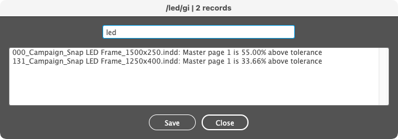

## Helper functions

### dbg([type], [context], message)

| Parameters | Type                 | Description |
| ---------- | -------------------- | ----------- |
| [type]     | `string`             | A single character string: <ul> <li>`+` appends `MESSAGE` to the previous line;</li> <li>`I`, `W`, `E`, `F`, `M`, `N`, `T` or space outputs `[INFO]`, `[WARN]`, `[ERR]`, `[FAIL]`, `[MARK]`, `[NOTE]`, `[TODO]` or spacer. (Looks great with [Pragmata Pro Liga](https://fsd.it/shop/fonts/pragmatapro/).)</li> </ul> *(Optional.)* |
| [context]  | `string`             | A string enclosed in `<` `>`. *(Optional.)* |
| message    | `string`             | A comma-separated list of message parts (`part1`, `part2`, `part3`, ...). |

Appends a debugging line to a file saved on the desktop with the name of the running script (e.g. `active-script.log`).

```
2021-07-31 18:48:02.609 [INFO] ParseIF :: Open data file: 'test.txt' | Records: 14 | Layouts: 0
└─────────────────────┘ └────┘ └────────┘ └────────────────────────┘   └─────────┘   └────────┘
       typestamp         type   context         message part1             part2         part3
```

If no arguments are given, it just appends an empty line.

#### Example

```js
dbg('i', '<ParseIF>', 'Open data file: \'' + decodeURI(dataFile.name) + '\'');
// <snip>
if (errors.length === 0) dbg('+', 'Records: ' + data.length, 'Layouts: ' + layouts.length);
```


---

### fitTo(items, [scope], [target], [forced])

| Parameters | Type                       | Default | Description                                                               |
| ---------- | -------------------------- | ------- | ------------------------------------------------------------------------- |
| items      | `pageItem` \| `pageItem[]` |         | A page item, or an array of page items to be reframed.                    |
| [scope]    | `string`                   | `page`  | `page` or `spread`. *(Optional.)*                                         |
| [target]   | `string`                   | `size`  | `size`, `margins`, `visible` or `bleed`. *(Optional.)*                    |
| [forced]   | `boolean`                  | `false` | When `true` it just reframes the object without any checks. *(Optional.)* |

Reframes the given items to the page/spread's (`scope`) size/margins/visible area/bleed (`target`). If an item is larger than the target, it will be reduced; if it is smaller but inside a 1% 'snap' area, it will be enlarged. Rectangular frames are simply reframed; rotated items, ovals, groups, etc. are inserted in a clipping frame that is reframed.

**Note:** 'Visible area' is an area marked by one or more frames named `<visible area>` or labeled `visible area`. If margins or visible area are undefined, they fallback to page/spread size.

#### Example

```js
fitTo(doc.selection, 'page', 'bleed'); // Fits the selected objects to the page bleed
```

or

```js
app.doScript(
    "fitTo(doc.selection, 'page', 'bleed')",
    ScriptLanguage.JAVASCRIPT, undefined,
    UndoModes.ENTIRE_SCRIPT, 'Fit to page bleed'
);
```

---

### getBounds(page) ⇒ `object`

| Parameters | Type     | Description      |
| ---------- | -------- | ---------------- |
| page       | `object` | The target page. |

Returns an object containing the geometric bounds of `page`, its parent spread, and miscellaneous page boxes, using the current measurement units:

```js
{
    page: {
        size:    [ top, left, bottom, right ],
        margins: [ t, l, b, r ],
        visible: [ t, l, b, r ],
        bleed:   [ t, l, b, r ]
    },
    spread: {
        size:    [ t, l, b, r ],
        margins: [ t, l, b, r ],
        visible: [ t, l, b, r ],
        bleed:   [ t, l, b, r ]
    }
};
```

**Note:** 'Visible area' is an area marked by one or more frames named `<visible area>` or labeled `visible area`. If margins or visible area are undefined, they fallback to page/spread size.

#### Example

```js
var pageSize      = getBounds(page).page.size;      // [ 0,0,297,210 ]
var spreadMargins = getBounds(page).spread.margins; // [ 20,20,277,400 ] (20 mm margins)
```

or

```js
var bounds = getBounds(page);
var scope  = 'spread';
var target = 'margins';

bounds.page.size;      // [ 0,0,297,210 ]
bounds.spread.margins; // [ 20,20,277,400 ]
bounds[scope][target]; // [ 20,20,277,400 ]
```

---

### getScriptsFolder() ⇒ `'path/to/folder/'` | `undefined`

Detects the user scripts folder searching for the 'Scripts Panel' string in `$.includePath`, returning a string with the path followed by '/', or `undefined`.

#### Example

```js
$.evalFile(File(getScriptsFolder() + 'script.jsxinc'));
```

---

### isInArray(searchValue, array, [caseSensitive]) ⇒ `Boolean`

| Parameters      | Type      | Default | Description                                                                         |
| --------------- | --------- | ------- | ----------------------------------------------------------------------------------- |
| searchValue     | `string`  |         | String to be matched.                                                               |
| array           | `array`   |         | An array of strings; wildcards: `*` (zero or more characters), `?` (any character). |
| [caseSensitive] | `boolean` | `false` | If `true` the search is case sensitive. *(Optional.)*                               |

Matches the string `searchValue` against elements of `array`, using wildcards and case sensitivity. Returns `true` for match, `false` for no match.

#### Example

```js
var searchValue = 'codes';
var array = [ 'bar*code*', 'code*', 'EAN*' ];
isInArray(searchValue, array) // True: matches 2nd array element
```

---

### getDataFile(dataFile, [skipLocal]) ⇒ `File` | `undefined`

| Parameters  | Type      | Default | Description                         |
| ----------- | --------- | ------- | ----------------------------------- |
| dataFile    | `string`  |         | A tab-separated-values file (name). |
| [skipLocal] | `boolean` | false   | If `true`, don't search locally.    |

Returns the first occurrence of `dataFile`, first searching for a local one (in the current folder or the parent folder of the active document), then a default one (on the desktop or next to the running script). It also matches local files starting with `_`, which take precedence:

- Local file:

  1. `current/folder/_dataFile` or `dataFile`
  2. `current/folder/../_dataFile` or `dataFile`

- Default file:

  3. `~/Desktop/dataFile`
  4. `script/folder/dataFile`
  5. `script/folder/../dataFile`

---

### parseDataFile(dataFile, [flgR]) ⇒ `object`

| Parameters | Type      | Default | Description                                     |
| ---------- | --------- | ------- | ----------------------------------------------- |
| dataFile   | `File`    |         | A tab-separated-values file (object).           |
| [flgR]     | `boolean` | `false` | Internal flag for recursive calls (`@include`). |

Reads a TSV (tab-separated-values) file, validates the data (the provided function is just a stub) and returns an object containing found records and errors:

```js
{
    records: [ {}, {}, ... ],
    errors:  { info: [], warn: [], fail: [] }
};
```

Blank lines and those prefixed with `#` are ignored. You can split a very long line into multiple lines with a backslash (`\`) added at the end of each segment.

Use `@path/to/include.txt` to include records from another file or `@default` for default data file (see `getDataFile()`).

#### Example

```js
// @include 'GetDataFile.jsxinc';
// @include 'Report.jsxinc';

var file, data;
if (!(file = getDataFile('data.txt'))) { alert('No data file found.'); exit(); }
data = parseDataFile(file);
if (data.errors.fail.length > 0) { report(data.errors.fail, decodeURI(file.getRelativeURI(doc.filePath))); exit(); }
if (data.records.length === 0) exit();
```

Given a file `data.txt`:

```
Name        Color         Visible    Printable
dielines    Magenta       no         yes
# guides    Grid Green    yes        no
artwork     Light Blue    yes        yes
            Red           yes        yes
```

it will return an object like this:

```js
{
    records: [
        {
            name:        'dielines'
            color:       UIColors.MAGENTA
            isVisible:   false
            isPrintable: true
        },
        {
            name:        'artwork'
            color:       UIColors.LIGHT_BLUE
            isVisible:   true
            isPrintable: true
        }
    ],
    errors: {
        info: [],
        warn: [ 'Line 5: Missing layer name.' ],
        fail: []
    }
}
```

---

### ProgressBar

Creates a dual progress bar palette.

#### var pb = new ProgressBar(title, maxValue, [maxWidth])

| Parameters | Type       | Description                                 |
| ---------- | ---------- | ------------------------------------------- |
| title      | `string`   | Palette title (a counter will be appended). |
| maxValue   | `number`   | Number of steps for the main progress bar.  |
| [maxWidth] | `number`   | Maximum message length (characters).        |

Initializes and shows the palette. On creation you can set it's width to accomodate a given message length (if omitted, no message is shown, aka mini mode). The secondary progress bar is by default hidden.

#### pb.update(value, [message])

| Parameters | Type       | Description                                                         |
| ---------- | ---------- | ------------------------------------------------------------------- |
| value      | `number`   | New value of the main progress bar.                                 |
| [message]  | `string`   | Message; if omitted, the previous message is cleared. *(Optional.)* |

Updates the main progress bar and the message, and hides the secondary progress bar.

#### [pb.update2(value2, maxValue2)] *(Optional)*

| Parameters | Type       | Description                                     |
| ---------- | ---------- | ----------------------------------------------- |
| value2     | `number`   | New value of the secondary progress bar.        |
| maxValue2  | `number`   | Number of steps for the secondary progress bar. |

Updates the secondary progress bar. You must set the maximum number of steps (the progress bar is not shown if the max value is less then 2).

#### pb.close()

Closes the progress bar.

#### Example

```js
var progress = new ProgressBar('Progress bar demo', 100, 50);
progress.update(25, 'Progress bar value is 25.');
progress.update2(2, 3);
```


```js
var progress = new ProgressBar('Progress bar demo', 100);
progress.update(25);
progress.update2(2, 3);
```


---

### replaceLink(oldLinks, newLink) ⇒ `Boolean`

| Parameters | Type                   | Description                                            |
| ---------- | ---------------------- | ------------------------------------------------------ |
| oldLinks   | `string` \| `string[]` | A link name, or an array of link names to be replaced. |
| newLink    | `string`               | New link name (if same folder), or full link path.     |

Replaces a link or a list of links with a different one. A selection limits the scope. Returns `true` if a replacement was made, `false` if not.

#### Example

```js
replaceLink('link1.jpg', 'link1.psd'); // Both links are in the same folder
replaceLink('link1.jpg', 'path/to/link1.psd');
replaceLink([ 'link1.jpg', 'link1.png' ], 'link1.psd');
```

---

### replaceSwatch(oldNames, newName, [newValues]) ⇒ `Boolean`

| Parameters  | Type                   | Description                                                |
| ----------- | ---------------------- | ---------------------------------------------------------- |
| oldNames    | `string` \| `string[]` | A swatch name, or an array of swatch names to be replaced. |
| newName     | `string`               | New swatch name.                                           |
| [newValues] | `number[]`             | Array of 4 values in 0-100 range (CMYK).                   |

Replaces a swatch or a list of swatches with a different one. The new swatch is created only if values (CMYK) are provided and it doesn't already exist. Returns `true` if a replacement was made, `false` if not.

#### Example

```js
replaceSwatch('Red', 'Blue'); // 'Blue' it's supposed to exist
replaceSwatch('Red', 'Blue', [ 100, 70, 0, 0 ]); // 'Blue' will be created if it doesn't exist
replaceSwatch([ 'Red', 'C=0 M=100 Y=100 K=0' ], 'Blue', [ 100, 70, 0, 0 ]);
```
---

### replaceText(findWhat, changeTo, [wholeWord]) ⇒ `Boolean`

| Parameters  | Type      | Default | Description                      |
| ----------- | --------- | ------- | -------------------------------- |
| findWhat    | `string`  |         | Text to be replaced.             |
| changeTo    | `string`  |         | New text.                        |
| [wholeWord] | `boolean` | `true`  | Match whole words. *(Optional.)* |

Replaces a text with another. Unicode characters must be escaped. Returns `true` if a replacement was made, `false` if not.

#### Example

```js
replaceText('11.10.', '13.12.2021');
replaceText('\\\\', '\u000A', false); // Replace '\\' with Forced Line Break
```

---

### report(message, title, [showFilter], [showCompact])

| Parameters    | Type                   | Default | Description |
| ------------- | ---------------------- | ------- | ----------- |
| message       | `string` \| `string[]` |         | Message to be displayed. Can be a string or a strings array. |
| [title]       | `string`               | `''`    | Dialog title. *(Optional.)* |
| [showFilter]  | `boolean`              | `false` | If `true` it shows a filtering field; wildcards: `?` (any character), space and `*` (AND), `|` (OR). *(Optional.)* |
| [showCompact] | `boolean`              | `false` | If `true` duplicates are removed and the message is sorted. *(Optional.)* |

Displays a message in a scrollable list with optional filtering and/or compact mode.
Inspired by [this](http://web.archive.org/web/20100807190517/http://forums.adobe.com/message/2869250#2869250) snippet by Peter Kahrel.

#### Example

```js
report(message, 'Sample alert');
```


```js
report(message, 'Sample alert', true);
```


