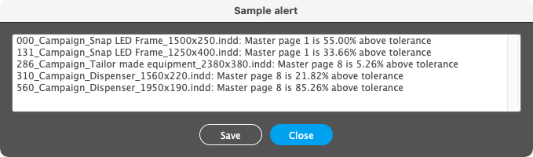

# Helper functions

### addGuide(_target, [layer], HorV, location, [label], [type]_)

Adds a custom ruler guide. I use it to make grids for several brands, for which I have a hard time remembering the properties of the different guide lines. With the `preset` parameter I standardize guide types: symmetry axes, sections and subsections, product alignment and so on.

##### Parameters:

|Name|Type|Default|Description|
|:--:|:--:|:--:|--|
|`target`|`object`||A `Document`, `Spread`, `Page` or a `MasterSpread`.|
|`[layer]`|`layer`|`activeLayer`|A target layer; defaults to the active layer. *(Optional.)*|
|`HorV`|`string`||If the string begins with `v`, the guide is vertical, else horizontal.|
|`location`|`number`||The location at which to place the guide relative to the current ruler zero point.|
|`[label]`|`string`||The label of the guide. *(Optional.)*|
|`[preset]`|`number`||A customized set of properties, see source. *(Optional.)*|

---

### log(_message_)

Appends a debugging line to a file saved on the desktop with the name of the running script (e.g., `active-script.log`), containing a timestamp, a stack trace, and a message. Without arguments, it just appends an empty line. It's a crude, but effective tool.

##### Parameters:

|Name|Type|Description|
|:--:|:--:|--|
|`message`|`string`|A list of messages (`part1`, `part2`, `part3`, etc.) that will be appended to the timestamp and the stack trace; you can append them to the previous line using `+` as the first part (or an empty string to skip the separator).|

##### Example:

```js
log('Data file: \'' + decodeURI(dataFile.name) + '\'');
// <snip>
log('+', 'Records: ' + data.length, 'Layouts: ' + layouts.length);
```

```
2021-07-31 18:48:02.609 main::parseDataFile:: Data file: 'test.tsv' | Records: 14 | Layouts: 2
└─────────────────────┘ └───────────────────┘ └───────────────────┘   └─────────┘   └────────┘
       typestamp                stack             message part1          part2         part3
```

---

### fitTo(_items, [scope], [target], [forced]_)

Reframes the given items to the page/spread's (`scope`) size/margins/visible area/bleed (`target`). If an item is larger than the target, it will be reduced; if it is smaller but inside a 1% 'snap' area, it will be enlarged. Rectangular frames are simply reframed; rotated items, ovals, groups, etc. are inserted in a clipping frame that is reframed.

**Note:** 'Visible area' is an area marked by one or more frames named `<visible area>` or labeled `visible area`. If margins or visible area are undefined, they fallback to page/spread size.

##### Parameters:

|Name|Type|Default|Description|
|:--:|:--:|:--:|--|
|`items`|`pageItem` \| `pageItem[]`||A page item, or an array of page items to be reframed.|
|`[scope]`|`string`|`page`|`page` or `spread`. *(Optional.)*|
|`[target]`|`string`|`size`|`size`, `margins`, `visible` or `bleed`. *(Optional.)*|
|`[forced]`|`boolean`|`false`|When `true` it just reframes the object without any checks. *(Optional.)*|

##### Example:

```js
fitTo(doc.selection, 'page', 'bleed'); // Fits the selected objects to the page bleed
```

or

```js
app.doScript(
    "fitTo(doc.selection, 'page', 'bleed')",
    ScriptLanguage.JAVASCRIPT, undefined,
    UndoModes.ENTIRE_SCRIPT, 'Fit to page bleed'
);
```

---

### getBounds(_page_) ⇒ \{Object\}

Computes miscellaneous page boxes of a document page.

##### Parameters:

|Name|Type|Description|
|:--:|:--:|--|
|`page`|`object`|The target page.|

##### Returns:

An object containing the geometric bounds of `page` and its parent spread, and of their margins, visible area and bleed, using the current measurement units:

```js
{
    page: {
        size:    [ t, l, b, r ], // page bounds
        margins: [ t, l, b, r ], // margins bounds
        visible: [ t, l, b, r ], // visible area bounds
        bleed:   [ t, l, b, r ]  // bleed bounds
    },
    spread: { // the same, but for the parent spread
        size:    [ t, l, b, r ],
        margins: [ t, l, b, r ],
        visible: [ t, l, b, r ],
        bleed:   [ t, l, b, r ]
    }
};
```

**Note:** 'Visible area' is an area marked by one or more frames named `<visible area>` or labeled `visible area`. If margins or visible area are undefined, they fallback to page/spread size.

##### Example:

```js
var pageSize      = getBounds(page).page.size;      // [ 0, 0, 297, 210 ]
var spreadMargins = getBounds(page).spread.margins; // [ 20, 20, 277, 400 ] (20 mm margins)
```

or

```js
var bounds = getBounds(page);
var scope  = 'spread';
var target = 'margins';

bounds.page.size;      // [ 0, 0, 297, 210 ]
bounds.spread.margins; // [ 20, 20, 277, 400 ]
bounds[scope][target]; // [ 20, 20, 277, 400 ]
```

---

### getDropShadow(_item_) ⇒ \{Object\}

Gets a page item's drop shadow properties.

##### Parameters:

|Name|Type|Description|
|:--:|:--:|--|
|`item`|`pageItem`|The page item from which we take properties.|

##### Returns:

The page item's drop shadow properties (`item.transparencySettings.dropShadowSettings`).

---

### setDropShadow(_item, set_)

Sets a page item's drop shadow properties from a set saved with `getDropShadow()`.

##### Parameters:

|Name|Type|Description|
|:--:|:--:|--|
|`item`|`pageItem`|The page item to which we apply properties.|
|`set`|`object`|A previously saved `transparencySettings.dropShadowSettings` properties set.|

##### Example:

```js
var shadow = getDropShadow(item1);
setDropShadow(item2, shadow);
```

---

### getPageItem(_name, target, [layer]_) ⇒ \{PageItem\} | undefined

Gets a page item by name, optionally from a layer.

##### Parameters:

|Name|Type|Description|
|:--:|:--:|--|
|`name`|`string`|The name of the page item to search.|
|`target`|`object`|A `Document`, `Spread`, `Page` or a `MasterSpread`.|
|`[layer]`|`layer`|Only look for objects from this layer. *(Optional.)*|

##### Returns:

The first page item with the specified `name`, optionally from the specified `layer`.

---

### getScriptsFolder() ⇒ 'path/to/folder/' | undefined

Detects the user scripts folder searching for the string 'Scripts Panel' in `$.includePath`, returning a string with the path followed by '/', or `undefined`.

##### Example:

```js
$.evalFile(File(getScriptsFolder() + 'script.jsxinc'));
```

---

### isInArray(_searchValue, array, [caseSensitive]_) ⇒ Boolean

Matches a string against elements of an array, using wildcards and case sensitivity.

##### Parameters:

|Name|Type|Default|Description|
|:--:|:--:|:--:|--|
|`searchValue`|`string`||String to be matched.|
|`array`|`array`||An array of strings with optional wildcards: `*` (zero or more characters), `?` (any character).|
|`[caseSensitive]`|`boolean`|`false`|If `true` the search is case sensitive. *(Optional.)*|

##### Returns:

Returns `true` for match, `false` for no match.

##### Example:

```js
var searchValue = 'codes';
var array = [ 'bar*code*', 'code*', 'EAN*' ];
isInArray(searchValue, array) // True: matches 2nd array element
```

---

### moveToLayer(_item, layer, [position]_)

Moves an item to another layer, optionally sending it to the front or back.

##### Parameters:

|Name|Type|Description|
|:--:|:--:|--|
|`item`|`pageItem`|The page item to be moved.|
|`layer`|`object`|The target layer.|
|`[position]`|`string`|`front`/`top` or `back`/`bottom`: Sends the item to the front or back of its layer. *(Optional.)*|


---

### parseDataFile(_dataFile_) ⇒ \{Object\}

Reads a TSV (tab-separated-values) file.

##### Parameters:

|Name|Type|Default|Description|
|:--:|:--:|:--:|--|
|`dataFile`|`File`||A tab-separated-values file (object).|
|`[defaultName]`|`string|string[]`||Default data file name, or an array of file names (used for `@defaults`).|

The parser has some non-standard features:

- A line may contain a _statement_:

  - `@includepath` `reference/path` – defines a folder to which subsequent relative paths will refer;
  - `@include` `path/to/other.tsv` – includes another TSV file at this position; `path/to` may be an absolute path, one relative to the current data file, or a path relative to `reference/path` if defined;
  - `@defaults` – includes the global data file (see `getDataFile()` below);

- Blank lines and those starting with `#` (comments) are ignored;
- The fields can be visually aligned with spaces that will be removed at processing (I use [VS Code](https://code.visualstudio.com) and [Rainbow CSV](https://marketplace.visualstudio.com/items?itemName=mechatroner.rainbow-csv));
- A very long line can be broken into multiple lines with a backslash (`\`) added at the end of each segment.

##### Returns:

An object containing the records found (strings) and parsing errors, built from the main file plus all included files, structured as follows:

```js
{
    header: [],
    data: [
        { record: [], source: [] },
        ...
    ],
    errors: []
}
```

##### Example:

```js
var file;
var parsed = { header: [], data: [], errors: [] };
var data = { records: [], errors: [] };

if (!(file = getDataFile('data.tsv'))) { alert('No data file found.'); exit(); }

// Parse data file
parsed = parseDataFile(file, 'data.tsv');
if (parsed.errors.length > 0) { report(parsed.errors); exit(); }

// Build native objects
for (var i = 0; i < parsed.data.length; i++) {
    checkRecord(parsed.data[i].record);
}
if (data.errors.length > 0) { report(data.errors); exit(); }

// Main processing
for (var i = 0; i < data.records.length; i++) {
    // doStuff(data.records[i]);
}

function checkRecord(/*array*/record) {
    var tmpData = {};
    tmpData.source = parsed.data[i].source.join(':');
    tmpData.name = record[0];
    tmpData.color = record[1] ? getUIColor(record[1]) : UIColors.LIGHT_BLUE;
    tmpData.isVisible = record[2] ? (record[2].toLowerCase() === 'yes') : true;
    tmpData.isPrintable = record[3] ? (record[3].toLowerCase() === 'yes') : true;

    if (tmpData.name.length === 0) stat(data.status, tmpData.source + ':1', 'Missing layer name.', -1);
    if (data.status.fail.length > 0) return false;
    return tmpData;
}

```

Given a file `data.tsv`:

```csv
Name        Color         Visible    Printable
dielines    Magenta       no         yes
# guides    Grid Green    yes        no
artwork     Light Blue    yes        yes
            Red           yes        yes
@include path/to/another.tsv
```

and `another.tsv`:

```csv
Name        Color         Visible    Printable
.reference  Black         no         no
@include missing.tsv
```

it will return an object like this:

```js
{
    header: [ "Name", "Color", "Visible", "Printable" ],
    data: [
        {
            record: [ "dielines", "Magenta", "no", "yes" ],
            source: [ "data.tsv", 2 ]
        },
            record: [ "artwork", "Light Blue", "yes", "yes" ],
            source: [ "data.tsv", 4 ]
        },
            record: [ "", "Red", "yes", "yes" ],
            source: [ "data.tsv", 5 ]
        },
            record: [ ".reference", "Black", "no", "no" ],
            source: [ "path/to/another.tsv", 2 ]
        }
    ],
    errors: [ "path/to/another.tsv:3 :: 'missing.tsv' not found." ]
}
```

See, for example, `DefaultLayers.jsx` for an actual implementation.

There are some additional functions in this file, one being:

### getDataFile(_dataFile, [skipLocal]_) ⇒ \{File\} | undefined

Gets the first occurrence of a file from a list of predefined folders.

##### Parameters:

|Name|Type|Default|Description|
|:--:|:--:|:--:|--|
|`dataFile`|`string`||A tab-separated-values file (name).|
|`[skipLocal]`|`boolean`|false|If `true`, don't search locally. *(Optional.)*|

##### Returns:

The first occurrence of `dataFile`, first searching for a local one (in the current folder or the parent folder of the active document), then a default one (on the desktop or next to the running script). It also matches local files starting with `_`, which take precedence:

- Local file:

  1. `current/folder/_dataFile` or `dataFile`
  2. `current/folder/../_dataFile` or `dataFile`

- Default file:

  3. `~/Desktop/dataFile`
  4. `script/folder/dataFile`
  5. `script/folder/../dataFile`

---

### progressBar

Creates a palette with two progress bars and a message; the second bar may be used for microsteps (optional).

#### var pb = new ProgressBar(_title, maxValue, [maxWidth]_)

Initializes the palette. On creation you can set it's width to accomodate a given message length; if omitted, no message is shown (aka mini mode). The secondary progress bar is hidden by default.

##### Parameters:

|Name|Type|Description|
|:--:|:--:|--|
|`title`|`string`|Palette title.|
|`maxValue`|`number`|Number of steps for the main progress bar.|
|`[maxWidth]`|`number`|Maximum message length (characters). *(Optional.)*|

#### pb.msg(_[message]_) *(Optional)*

Updates the message. If omitted, the previous message is cleared.

##### Parameters:

|Name|Type|Description|
|:--:|:--:|--|
|`[message]`|`string`|Message. *(Optional.)*|

#### pb.update()

Increases the value of the main progress bar and updates the counter (not shown in mini mode). Also resets & hides the secondary progress bar.

#### pb.init2(_maxValue2_) *(Optional)*

Sets the number of steps for the secondary progress bar (shown only if the number is greater than 2).

##### Parameters:

|Name|Type|Description|
|:--:|:--:|--|
|`maxValue2`|`number`|Number of steps for the secondary progress bar.|

#### pb.update2() *(Optional)*

Increases the value of the secondary progress bar.

#### pb.close()

Closes the progress bar.

##### Example:

```js
var steps = 100;
var steps2 = 10;
var progressBar = new ProgressBar('Dual progress bar demo', steps, 50);
for (var i = 0; i < steps; i++) {
	progressBar.update();
	progressBar.init2(steps2);
	for (var j = 0; j < steps2; j++) {
		progressBar.update2();
		progressBar.msg('Main value is ' + (i+1) + '. Secondary value is ' + (j+1) + '/' + steps2 + '.');
		if (i === 24 && j === 5) $.sleep(2500);
	}
}
progressBar.close();
```

\
\


---

### replaceLink(_oldLinks, newLink_) ⇒ Boolean

Replaces a link or a list of links with a different one. A selection limits the scope.

##### Parameters:

|Name|Type|Description|
|:--:|:--:|--|
|`oldLinks`|`string` \| `string[]`|A link name, or an array of link names to be replaced.|
|`newLink`|`string`|New link name (if same folder), or full link path.|

##### Returns:

Returns `true` if a replacement was made, `false` if not.

##### Example:

```js
replaceLink('link1.jpg', 'link1.psd'); // Both links are in the same folder
replaceLink('link1.jpg', 'path/to/link1.psd');
replaceLink([ 'link1.jpg', 'link1.png' ], 'link1.psd');
```

---

### replaceSwatch(_oldNames, newName, [newValues]_) ⇒ Boolean

Replaces a swatch or a list of swatches with a different one. The new swatch is created only if values (CMYK) are provided and it doesn't already exist.

##### Parameters:

|Name|Type|Description|
|:--:|:--:|--|
|`oldNames`|`string` \| `string[]`|A swatch name, or an array of swatch names to be replaced.|
|`newName`|`string`|New swatch name.|
|`[newValues]`|`number[]`|Array of 4 values in 0-100 range (CMYK).|

##### Returns:

Returns `true` if a replacement was made, `false` if not.

##### Example:

```js
replaceSwatch('Red', 'Blue'); // 'Blue' it's supposed to exist
replaceSwatch('Red', 'Blue', [ 100, 70, 0, 0 ]); // 'Blue' will be created if it doesn't exist
replaceSwatch([ 'Red', 'C=0 M=100 Y=100 K=0' ], 'Blue', [ 100, 70, 0, 0 ]);
```

---

### replaceText(_findWhat, changeTo, [wholeWord]_) ⇒ Boolean

Replaces a text with another.

##### Parameters:

|Name|Type|Default|Description|
|:--:|:--:|:--:|--|
|`findWhat`|`string`||Text to be replaced.|
|`changeTo`|`string`||New text.|
|`[wholeWord]`|`boolean`|`true` |Match whole words. *(Optional.)*|

##### Returns:

Returns `true` if a replacement was made, `false` if not.

##### Example:

```js
replaceText('11.10.', '13.12.2021');
replaceText('\\\\', '\u000A', false); // Replace '\\' with Forced Line Break
```

---

### report(_message, title, [showFilter], [showCompact]_)

Displays a message in a scrollable list with optional filtering and/or compact mode.
Inspired by [this](http://web.archive.org/web/20100807190517/http://forums.adobe.com/message/2869250#2869250) snippet by Peter Kahrel.

##### Parameters:

|Name|Type|Default|Description|
|:--:|:--:|:--:|--|
|`message`|`string` \| `string[]`||Message to be displayed. Can be a string or a strings array.|
|`[title]`|`string`|`''`|Dialog title. *(Optional.)*|
|`[showFilter]`|`boolean` \| `'auto'`|`false`|If `true` it shows a filter field; `auto` shows it automatically if there are more than 20 lines; optional wildcards: `?` (any character), space and `*` (AND), `|` (OR). *(Optional.)*|
|`[showCompact]`|`boolean`|`false`|If `true` duplicates are removed and the message is sorted. *(Optional.)*|

##### Example:

```js
report(message, 'Sample alert');
```



```js
report(message, 'Sample alert', true);
```


